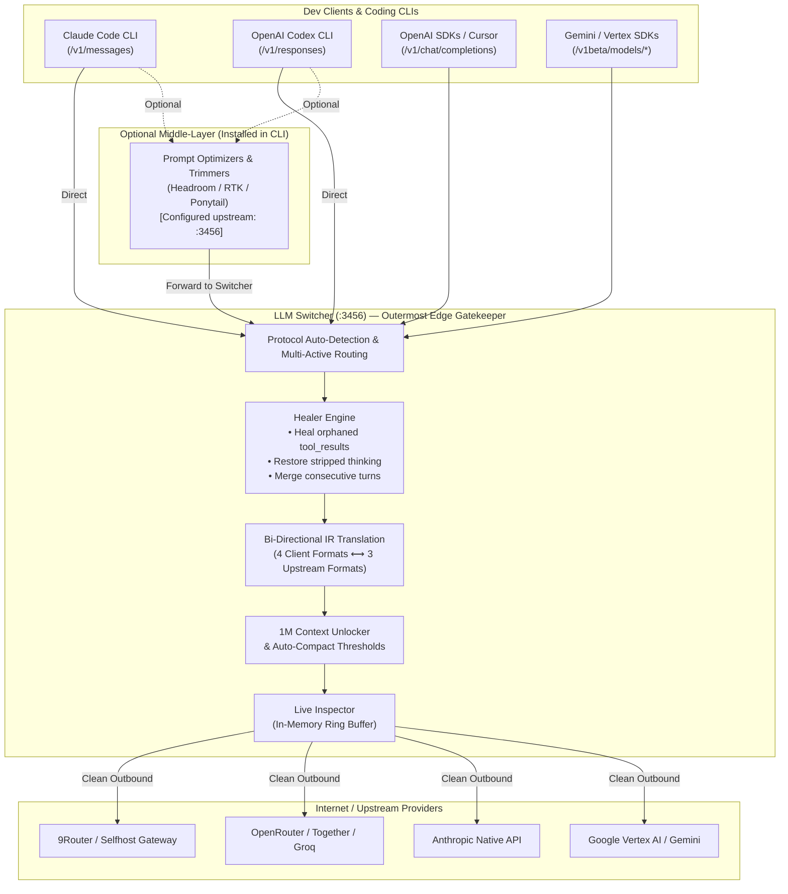
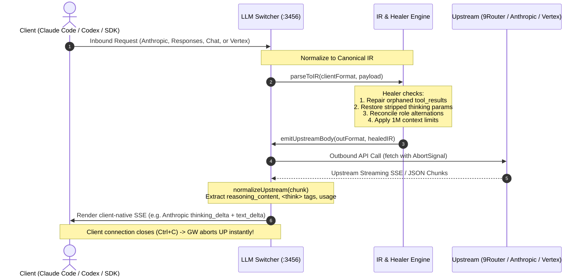
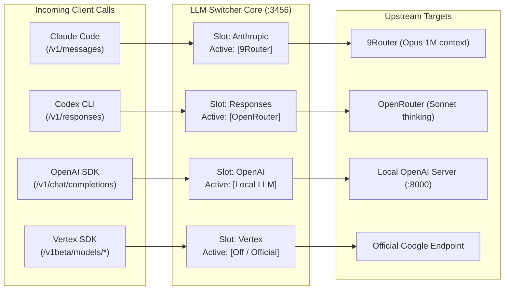

# LLM Switcher

<p align="center">
  <b>Zero-dependency, multi-protocol edge gateway & provider switcher</b><br>
  Seamlessly bridge <b>Claude Code</b>, <b>Codex</b>, OpenAI, and Gemini SDKs to any upstream LLM API.<br>
  Full bi-directional protocol conversion, 1M context unlock, thinking protocol extraction, and edge message healing.
</p>

<p align="center">
  <b>English</b> • <a href="README.vi.md">Tiếng Việt</a>
</p>

<p align="center">
  
  
  
  
  
</p>

---

> ### 🎯 The Core Problem: Why Generic Proxies Cripple Your AI Coding Tools
>
> Every LLM provider uses a **subtly or drastically different API response standard**:
> - **Anthropic** requires dedicated `thinking` blocks (`thinking_delta` + `signature_delta`), strict alternating turn rules, and typed `tool_use` input schemas.
> - **OpenAI** streams reasoning as `reasoning_content` delta chunks or `reasoning_details[]`, and formats tools as `tool_calls` with JSON string arguments.
> - **Google Vertex AI** places reasoning in `candidates[0].content.parts[{thought: true, text, thoughtSignature}]` and tool arguments as raw objects.
> - **Open-source models (DeepSeek, Qwen, GLM)** often dump chain-of-thought directly into `content` or duplicate fields under conflicting keys.
>
> **When coding tools like Claude Code or Codex receive non-native or partially converted responses, they don't just look wrong — the agent's performance degrades catastrophically:**
> 1. **Lost Chain-of-Thought:** If Claude Code does not receive native `thinking_delta` blocks, it **completely misses the model's internal reasoning**. The agent acts prematurely, skips architectural planning, and produces buggy code.
> 2. **Broken Tool Execution:** Mismatched stop reasons (`tool_calls` vs `tool_use`) and split argument chunks cause tool execution failures and infinite retries.
> 3. **Token & Cache Miscounting:** Non-standard usage accounting breaks prompt cache alignment and premature context compaction.
>
> Developers often blame the model for "getting dumber" when in reality **their proxy mangled the response protocol.**
>
> ### 🛡️ The Solution: Zero-Loss Native Emulation (Subscription-Grade Quality)
>
> **LLM Switcher solves this by acting as a high-precision, zero-loss protocol emulator.**
>
> It normalizes whatever your upstream provider emits (9Router, OpenRouter, Vertex, DeepSeek) and re-synthesizes it into the **exact native event stream the client agent was built to consume**:
> - **Claude Code** receives 100% genuine Anthropic SSE events (`message_start` ➔ `thinking_delta` ➔ `signature_delta` ➔ `content_block_start: tool_use` ➔ `message_delta`), performing **identically to an official Anthropic subscription**.
> - **Codex** receives 100% genuine Responses API events (`response.created` ➔ `output_text.delta` ➔ `function_call` ➔ `response.completed`).
>
> **You get the freedom and cost savings of 3rd-party APIs while maintaining 100% official subscription-grade agent intelligence.**

---

> ### 💡 Design Philosophy: The Client-Side Edge Companion to 9Router
>
> **LLM Switcher intentionally does NOT implement multi-account pooling, key rotation, quota tracking, or provider load balancing.**
>
> That heavy lifting belongs to server-side AI routing gateways like **[9Router](https://github.com/decolua/9router)**, which handle centralized account rotation, rate-limit retries, and quota management far more reliably and securely at the server layer.
>
> **LLM Switcher is specifically engineered as the optimal client-side edge extension to pair with 9Router (or similar gateways):**
> - **At the Local Workstation (LLM Switcher):** Translates coding tool protocols (Claude Code `/v1/messages`, Codex `/v1/responses`, Vertex `/v1beta/...`, OpenAI Chat), injects 1M context windows, manages local multi-CLI profiles, and runs the Healer Engine to fix mangled payloads from local prompt compressors (RTK, Headroom, Ponytail).
> - **At the Server Gateway (9Router):** Manages account pools, API key rotation, load balancing, billing quotas, and global provider failover.
>
> This clean division of responsibility keeps LLM Switcher **ultra-lightweight, zero-dependency, and bloat-free** while giving you an unbeatable developer setup.

---

## Architecture & Workflow

LLM Switcher sits locally on your workstation (`127.0.0.1:3456`). It acts as the **outermost edge gatekeeper** before requests leave for the internet.

### 1. End-to-End System Topology



---

### 2. Bi-Directional IR (Intermediate Representation) Pipeline



---

### 3. Multi-Active CLI Independent Routing

You can run **multiple active profiles concurrently** — one profile dedicated to each CLI, without collision:



---

## Core Features

- **Zero-Dependency Architecture:** Built 100% on Node.js standard libraries (`http`, `fs`, `os`, `path`, `fetch`). No npm dependencies, no bundled runtime bloat, cold-start under 50ms.
- **Bi-Directional Protocol Conversion:**
  - **4 Client Inbound Formats:** Anthropic Messages, OpenAI Chat Completions, Codex Responses API, Vertex `generateContent`.
  - **3 Upstream Outbound Formats:** OpenAI Chat, Anthropic Native, Vertex Native.
- **Multi-Active CLI Routing:** Run Claude Code on Profile A, Codex on Profile B, and Cursor on Profile C simultaneously on a single gateway instance.
- **Deep Thinking & Reasoning Extraction:** Tested on 48 live response combinations. Accurately extracts `reasoning_content`, `<think>` tags, Vertex `thought` parts, and signatures into native `thinking_delta` blocks.
- **Edge Healer Engine (Anti-Collision for Token Optimizers):**
  - Fixes orphaned `tool_result` blocks caused by aggressive prompt pruners (RTK, Headroom, Ponytail) before sending to Anthropic/OpenAI upstream.
  - Automatically restores thinking parameters if an intermediary tool stripped them.
  - Merges consecutive same-role turns to enforce strict alternating turn requirements.
- **1M Context Window Unlocker:** Follows the profile's `model1M` map per tier: every tier marked 1M gets `ANTHROPIC_DEFAULT_<TIER>_MODEL=<tier>[1m]` (so `/model sonnet`, tier switches and subagents keep 1M, while unmarked tiers stay at 200K), plus auto-compact at `900000`, with built-in visual risk warnings for unsupported models.
- **Zero Config Mutation:** Never writes endpoints or keys into `~/.claude/settings.json` (it removes only values it wrote itself: `ANTHROPIC_BASE_URL` for its own port and `ANTHROPIC_DEFAULT_<TIER>_MODEL=<tier>[1m]`). Uses launcher flags and environment injection to prevent annoying provider warning banners.
- **Live Request / Response Inspector:** Built-in dashboard tab displaying real-time requests, latency, token consumption, prompt previews, and thinking blocks.
- **Native Background Service:** Install and run as an OS background daemon on Windows (Task Scheduler), macOS (launchd), or Linux (systemd).

---

## Changes in this update

- The desktop dashboard now uses a compact developer-tool layout. It has clearer route controls, keyboard-accessible tabs, labeled model fields, and no decorative emoji.
- Codex profiles now use three documented roles: `main`, `review`, and `subagent`.
- The Codex shim passes official configuration overrides for `model`, `review_model`, `agents.default_subagent_model`, `model_context_window`, and `model_auto_compact_token_limit`.
- Legacy profile keys remain readable. An explicit empty role now clears its legacy fallback.
- Claude Opus model IDs use version-independent reasoning detection.

The Codex shim no longer relies on `CODEX_MODEL`, `CODEX_MAX_CONTEXT_TOKENS`, or `CODEX_AUTO_COMPACT_WINDOW`. Codex does not document these environment variables. See the official [configuration reference](https://developers.openai.com/codex/config-reference/) and [advanced configuration guide](https://developers.openai.com/codex/config-advanced/).

---

## Quick Start

### 1. Requirements
- Node.js 18+ installed on your system.
- No `npm install` needed!

### 2. Setup Configuration
Clone this repository and create your local configuration:
```bash
git clone https://github.com/louisphamdev/llm-switcher.git
cd llm-switcher

# Copy example config (config.json is git-ignored for safety)
cp config.example.json config.json
```

Edit `config.json` with your provider base URLs and API keys.

### 3. Start the Gateway
```bash
# Start in foreground or background
node switch.mjs on

# Or run directly:
node proxy.mjs
```

The repository ships two launchers for the same script: `switch` for Linux and macOS,
`switch.cmd` for Windows. Put the repository directory on PATH and `switch <command>`
works the same on all three. Platform differences, and the two features that are not
available everywhere, are in [📖 `docs/cross-platform.md`](docs/cross-platform.md).

Open the Web Dashboard at: **[http://127.0.0.1:3456/ui](http://127.0.0.1:3456/ui)**

---

## CLI Integration

### Universal Environment Loader (`env.cmd` / `env.sh`)

Every time you switch profiles, LLM Switcher writes ready-to-use environment loaders:

- **Windows (Command Prompt / PowerShell wrapper):**
  ```cmd
  call "path\to\llm-switcher\env.cmd"
  ```
- **macOS / Linux (Bash / Zsh):**
  ```bash
  source "path/to/llm-switcher/env.sh"
  ```

---

### Claude Code Setup (Windows)

1. Create a quick wrapper in your PATH (e.g. `cc-switch.cmd`):
   ```cmd
   @echo off
   node "path\to\llm-switcher\switch.mjs" %*
   ```

2. Patch your global Claude Code launcher (`claude.cmd` in your npm global directory):
   ```cmd
   SETLOCAL EnableDelayedExpansion
   IF EXIST "path\to\llm-switcher\active.flag" (
     SET "ANTHROPIC_BASE_URL=http://127.0.0.1:3456"
     SET "CLAUDE_CODE_DISABLE_UNKNOWN_MODEL_WINDOW_ENFORCEMENT=1"
   )
   IF EXIST "path\to\llm-switcher\1m.flag" (
     SET /P M1M=<"path\to\llm-switcher\1m.flag"
     IF "!M1M!"=="" SET "M1M=opus[1m]"
     SET "ANTHROPIC_MODEL=!M1M!"
     SET "CLAUDE_CODE_AUTO_COMPACT_WINDOW=900000"
   )
   ```
   > `SETLOCAL EnableDelayedExpansion` is required for `!M1M!`. npm rewrites `claude.cmd` on every update, so prefer a separate wrapper that runs `call "path\to\llm-switcher\env.cmd"` and then `claude %*`. Only `env.cmd` / `env.sh` carry the per-tier `ANTHROPIC_DEFAULT_<TIER>_MODEL=<tier>[1m]` variables.

---

### Codex-first setup

Install the generated shim, put its directory first in `PATH`, and activate a Codex-compatible profile:

```bash
switch shim install
export PATH="$HOME/.llm-switcher/bin:$PATH"   # Bash or Zsh
switch codex <profile>
switch shim status
codex
```

On Windows, add `%USERPROFILE%\.llm-switcher\bin` before the real Codex directory in `PATH`. Open a new terminal after the change.

The shim does not edit `~/.codex/config.toml`. When the gateway is active, it passes these official command-line overrides to the real Codex binary:

| Profile role | Codex configuration key | Name the CLI receives |
|---|---|---|
| `main` | `model` | `publicModels[0]` |
| `review` | `review_model` | `publicModels[1]` |
| `subagent` | `agents.default_subagent_model` | `publicModels[2]` |

**Codex never receives an internal name.** The slot aliases `main`, `review` and `subagent` stay inside the gateway. The CLI receives the official model names from `publicModels`, and `mapModel` resolves each one back to its slot. Set `codexRoles` in the profile when you want a different pairing than the order of that list.

The shim also passes `model_catalog_json`. That file is generated from `publicModels` on every profile change, and the `/model` picker reads it. The picker never calls `/v1/models`. `/v1/models` serves the same entries, and each window follows `model1M` for its slot.

It also passes `openai_base_url` for local routing. If 1M context is enabled for `main`, it passes `model_context_window=1000000` and `model_auto_compact_token_limit=900000`. Command-line overrides have higher precedence than user and project configuration. Re-run `switch shim install` after upgrading an older checkout.

### Blindfold mode (optional)

A base URL override makes Codex print one line on its own `/model` screen:

```
base URL is overridden to http://127.0.0.1:3456/v1. Selecting models may not be supported or work properly.
```

Blindfold mode removes that line. Codex keeps its official endpoint, and the switcher intercepts the network hop instead. It needs no administrator rights, no certificate in a system trust store, and no change to `~/.codex/config.toml`.

```bash
bash blindfold/make-certs.sh chatgpt.com   # once
# then set "blindfold": true in the Codex profile
switch codex <profile>                     # the gateway starts the interceptor
```

The gateway owns the interceptor: it starts it at boot and after every change, and `switch off` stops it. If the certificates are missing, or another process holds the gateway or interceptor port, `switch` refuses the activation and writes no file.

Read [📖 `docs/codex-blindfold.md`](docs/codex-blindfold.md) before you turn it on. The guide explains the interception scope, the risk of holding a private CA, and how to go back. It opens with three diagrams:

- [Request routing](docs/diagrams/blindfold-request-routing.html) — one request, from CONNECT to the provider
- [Model name resolution](docs/diagrams/codex-model-name-resolution.html) — which name the CLI sees, and where it resolves
- [Lifecycle under switch](docs/diagrams/blindfold-switch-lifecycle.html) — activation, refusal, and shutdown

---

## Co-existence with Token Optimizers (RTK, Headroom, Ponytail)

If you use prompt-trimming tools like **Headroom**, **Ponytail**, or **RTK (Rust Token Killer)**:
1. Configure your CLI (Claude Code / Codex) to point to the optimizer proxy (e.g. `http://127.0.0.1:8787`).
2. Configure that optimizer's upstream endpoint to point to **LLM Switcher** (`http://127.0.0.1:3456`).
3. **LLM Switcher** serves as the protective final gateway before the internet:
   - **Repairs Broken Schemas:** Fixes orphaned `tool_result` turns and consecutive same-role turns caused by aggressive history pruning.
   - **Restores Stripped Thinking:** Detects reasoning models and restores thinking parameters if an optimizer stripped them to save tokens.
   - **Enforces 1M Context Windows:** Injects local 1M context flags and auto-compact thresholds.
   - **Converts Protocols:** Bridges 2-way traffic to your target upstream (9Router, OpenRouter, Vertex, etc.).

### Interoperability Test Report & Benchmark

| Failure Scenario Caused by Optimizers | Direct Upstream (Without Switcher) | Through LLM Switcher (Healer Engine) |
|---|---|---|
| **Orphaned `tool_result` turn** (Headroom prunes tool_use turn) | ❌ **HTTP 400 Crash**: `tool_use_id does not correspond to any tool_use` | ✅ **HTTP 200 OK**: Heals orphaned result into contextual text block |
| **Consecutive `user` turns** (Optimizer drops assistant turns) | ❌ **HTTP 400 Crash**: `roles must alternate` | ✅ **HTTP 200 OK**: Merges consecutive turns seamlessly |
| **Stripped `thinking` parameters** (Optimizer removes reasoning) | ⚠️ **Degraded AI**: Reasoning disabled, shallow single-liners | ✅ **HTTP 200 OK**: Automatically restores thinking budget |
| **Orphaned `tool` role in Chat API** | ❌ **HTTP 400 Crash**: `tool role must respond to tool_calls` | ✅ **HTTP 200 OK**: Converts orphaned tool into user context |
| **Custom optimizer headers** (`x-rtk-*`, `traceparent`) | ⚠️ Connection dropped / unrecognized header warnings | ✅ **HTTP 200 OK**: Clean transparent header passthrough |

Run the automated verification suites:
```bash
# Offline (mock upstream, no API key needed): protocol conversion, healer, streaming, security
npm test

# Live (requires a running gateway and a real upstream; consumes tokens)
node tests/live-optimizer-interop.mjs
```

See the full research report in [📖 `docs/TOKEN-OPTIMIZER-INTEROP.md`](docs/TOKEN-OPTIMIZER-INTEROP.md).

---

## Agent Skill & MCP Server Integration

To guarantee that AI coding agents (Claude Code, Cursor, Windsurf, Opencode) and spawned sub-processes **never bypass LLM Switcher**, this repository provides two control-plane assets:

### 1. The Agent Skill (`skills/llm-switcher/SKILL.md`)
A standardized Agent Skill teaching the LLM:
- **Mandatory routing:** All LLM traffic and token compression tools (Headroom, RTK, Ponytail) MUST target `http://127.0.0.1:3456`.
- **Zero-mutation policy:** Prohibits the agent from editing `~/.claude/settings.json` directly.
- **Sub-process safety:** Automatically sources `env.cmd` or `env.sh` when launching sub-agents.

Install globally for Opencode / Claude:
```bash
# For Opencode:
cp -r skills/llm-switcher ~/.config/opencode/skills/

# For Claude Code:
cp -r skills/llm-switcher ~/.claude/skills/
```

### 2. The MCP Server (`mcp.mjs`)
A zero-dependency Model Context Protocol (MCP) server communicating over `stdio`:
- `switcher_status`: Read live active profiles and 1M flags.
- `switcher_audit`: Audit the environment to detect rogue direct outbound calls or unrouted token compressors.
- `switcher_switch_profile`: Programmatically switch a CLI's active profile.
- `switcher_recent_logs`: Inspect recent request logs, token usage, and thinking extraction.

Add to your MCP configuration (e.g. `opencode.jsonc`, `claude_desktop_config.json`, or Cursor):
```json
"mcp": {
  "llm-switcher": {
    "type": "local",
    "command": ["node", "path/to/llm-switcher/mcp.mjs"],
    "enabled": true
  }
}
```

---

## CLI Reference

```bash
switch ui                      # Open the Web UI dashboard in your browser
switch status                  # Display status for all active CLI targets
switch doctor                  # Audit environment, settings & routing
switch on [profile]            # Start the gateway and activate a profile for all compatible targets
switch <profile>               # Activate profile for all compatible targets
switch claude <profile>        # Set active profile specifically for Claude Code
switch codex <profile>         # Set active profile specifically for Codex
switch openai <profile>        # Set active profile specifically for OpenAI Chat
switch vertex <profile>        # Set active profile specifically for Vertex / Gemini
switch port <number>           # Change the gateway port (restarts it if running)
switch service install         # Install OS background autostart service (Windows / macOS / Linux)
switch service uninstall       # Remove background autostart service
switch shim install            # Route new Claude and Codex sessions through the gateway
switch shim status             # Verify shims + detect running sessions that bypass the gateway
switch shim uninstall          # Remove the launcher shims
switch off [target]            # Deactivate gateway (or specific target) and restore official
```

The service runs without your shell. `switch service install` therefore copies `CLAUDE_CONFIG_DIR`, `LLM_SWITCHER_CONFIG`, `LLM_SWITCHER_STATE_DIR` and `LLM_SWITCHER_BLINDFOLD_CERTS` into the systemd unit or the launchd plist when they are set. The Windows task cannot carry them; set them as User environment variables instead. If the installed definition differs from the new one, for example after a hand edit, the old file is kept as `<file>.bak`. On Windows the task is created from an XML definition, so paths with spaces need no extra quoting and the task has no run-time limit. This Windows path is not tested on Windows yet.

### Resumed sessions & the shim (important)

`switch on` writes `env.sh` / `env.cmd` and deliberately **removes** proxy variables from
`~/.claude/settings.json` — that keeps Claude Code from showing its "custom API" banner.
The side effect: a CLI started from a shell that never sourced `env.sh` has **no**
`ANTHROPIC_BASE_URL`, so it talks to the provider directly and skips the gateway
(no Healer, no 1M unlock, no pooled quota). `claude --resume` in a fresh terminal is the
classic case.

The shim closes that hole. It installs tiny wrappers in `~/.llm-switcher/bin` that source
`env.sh` and then `exec` the real binary:

```bash
switch shim install
export PATH="$HOME/.llm-switcher/bin:$PATH"   # add to ~/.zshrc or ~/.bashrc
switch shim status                            # verify
```

Behaviour:

- **Gateway ON** → the wrapper injects the env, so every invocation (including `--resume`)
  is routed through the gateway.
- For Codex, the wrapper also passes the documented model-role and context settings with
  `--config`. It does not depend on unsupported `CODEX_*` variables.
- **Gateway OFF** (no `active.flag`) → the wrapper is fully transparent and runs the real
  binary untouched; it never forces routing.
- The real binary is located with the shim directory stripped from `PATH`, so it can never
  call itself recursively. If no real binary is found it exits `127` with a clear message
  instead of failing silently.
- `settings.json` is left alone, so **no warning banner** appears.

`switch on` installs the shims automatically and warns when `PATH` still needs the export
line. `switch doctor` and `switch shim status` additionally scan running `claude`/`codex`
processes and flag any that lack `ANTHROPIC_BASE_URL` — those sessions must be quit and
re-opened from a shell where the shim is on `PATH`.

---

## Configuration Schema (`config.json`)

```jsonc
{
  "port": 3456,
  "activeProfile": "9router",
  "activeProfiles": {
    "anthropic": "9router",          // Active profile for Claude Code (/v1/messages)
    "responses": "codex-profile",    // Active profile for Codex (/v1/responses)
    "openai-chat": "9router",        // Active profile for OpenAI Chat
    "vertex": "gemini-profile"       // Active profile for Vertex / Gemini
  },
  "profiles": {
    "9router": {
      "name": "9Router Cloud",
      "mode": "convert",             // hybrid | convert | direct
      "inFormat": "auto",            // auto | anthropic | openai-chat | responses | vertex
      "outFormat": "openai-chat",    // openai-chat | anthropic | vertex
      "thinkingMode": "auto",        // auto | native | off (see Advanced Options)
      "baseURL": "https://api.9router.com/v1",
      "apiKey": "sk-...",
      "defaultModels": {
        "opus": "ag/claude-opus-4-6-thinking",
        "sonnet": "ag/gemini-3.7-flash",
        "haiku": "ag/gemini-3.6-flash-medium",
        "fable": "ag/gemini-3.8-flash"
      },
      "model1M": {
        "opus": true,
        "sonnet": true,
        "haiku": false,
        "fable": true
      }
    }
  },
  "debug": false
}
```

---

## Advanced Options

| Option | Description |
|---|---|
| `LLM_SWITCHER_CONFIG=/path/config.json` | Use a config file outside the repo (the proxy, `switch` and `mcp.mjs` all honour it). |
| `--port <n>` / `LLM_SWITCHER_PORT` | Override the listening port (priority: flag > env > `config.port`). |
| `x-llm-profile: <key>` header (alias `x-profile`) or `?profile=<key>` | Route a single request through a specific profile. An unknown key returns HTTP 400 instead of silently falling back. |
| `profile.thinkingMode` | `auto` (default, for gateways like 9Router): restore stripped thinking, inject a `<think>` guide for non-reasoning models, send `thinking` + `reasoning_effort`. `native` (strict OpenAI APIs): send only `reasoning_effort` when the client asks, never touch the prompt, use `max_completion_tokens`. `off`: never send reasoning parameters. |
| `profile.endpoints.countTokens` | Override the Anthropic `count_tokens` URL. |
| `profile.endpoints` | Override upstream URLs per format: `{ "openai-chat": "...", "anthropic": "...", "vertex": "https://.../models/{model}:{action}" }`. |
| `CLAUDE_CONFIG_DIR` | Respected when locating Claude Code's `settings.json`. |

## Security Model

- The gateway binds to `127.0.0.1` only and rejects requests whose `Host` is not a loopback name (DNS-rebinding protection) or whose `Origin` is not the dashboard itself (CSRF protection).
- The admin API (`/api/*`) requires the `x-llm-switcher-token` header. The gateway creates the token in `admin.token`, next to `config.json`, with mode 0600. `switch ui` opens the dashboard with this token, and the MCP server reads the file. `/v1/*` and `/health` need no token.
- API keys are never sent to the browser: `/api/status` returns redacted profiles and the dashboard keeps the stored key unless you type a new one. The stored key is used only with the stored `baseURL` of that profile.
- Client credentials such as `x-api-key`, `authorization` or `x-goog-api-key` are **not** forwarded to upstreams. Other `x-*` headers, `traceparent` and `tracestate` pass through. The gateway drops its own control headers (`x-profile`, `x-llm-profile`) and the network identity headers (`x-forwarded-*`, `x-real-ip`).
- `config.json` is written atomically with mode 0600. `~/.claude/settings.json` is rewritten only to remove values that the switcher wrote itself. `ANTHROPIC_AUTH_TOKEN`, `*_MODEL_NAME` and your own model or URL values stay, and `switch` prints the name of every value it removes.

## Compatibility Notes

- **Direct Anthropic passthrough:** valid requests are forwarded byte-for-byte (thinking signatures, `cache_control`, documents stay intact). Malformed ones are repaired in place by a native Anthropic healer: orphaned `tool_result` → text, missing `tool_result` → placeholder, results moved to the start of the user turn.
- **Thinking signatures:** thinking blocks produced by conversion carry a gateway signature (`reasoning-sig`, or a foreign signature prefixed with `lsw1.`). They are stripped before a request reaches Anthropic. If that leaves an in-progress tool loop without the thinking block Anthropic requires, thinking is disabled for that single request instead of failing.
- **Codex tools:** `custom`/freeform tools (e.g. `apply_patch` with its Lark grammar), `namespace` tools and `local_shell` are exposed to upstreams as function tools and converted back to `custom_tool_call` / namespaced `function_call` / `local_shell_call` items. Hosted tools (`web_search`, `file_search`, `tool_search`, image generation) execute on OpenAI's servers, so other upstreams cannot provide them and they are omitted.
- **Gemini 3 thought signatures:** signatures returned with function calls are cached in memory by tool call id (last 5,000 calls) and replayed on the matching `functionCall` part, including through Gemini's OpenAI-compatible `extra_content`. After a gateway restart, unknown calls in the current turn get Google's documented `skip_thought_signature_validator` value, which Google notes may reduce quality.
- **`/v1/messages/count_tokens`:** exact when the active Claude Code profile uses a native Anthropic upstream; otherwise an estimate (other providers have no equivalent endpoint).

## Research & Protocol Matrices

Detailed response research and live-tested format matrices are documented in:
- 📖 [`docs/LLM-RESPONSE-MATRIX.md`](docs/LLM-RESPONSE-MATRIX.md) — 48 live sample variations across 8 model families.
- 📊 [`docs/response-matrix.json`](docs/response-matrix.json) — Machine-readable response signature schema.

---

## License

MIT © 2026 LLM Switcher Contributors.
