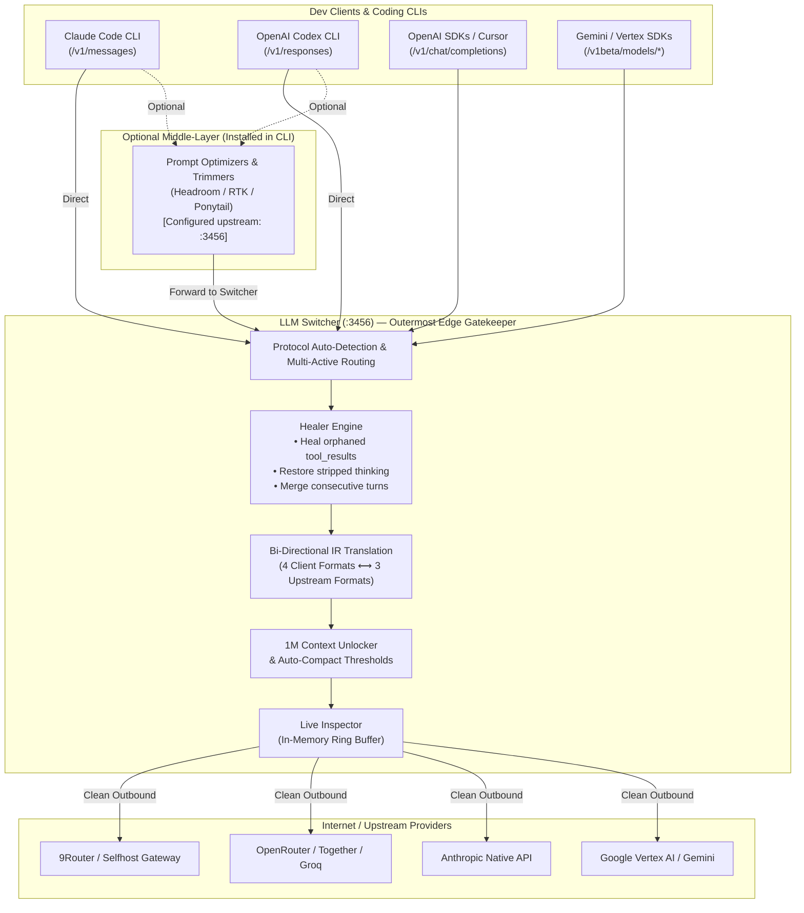
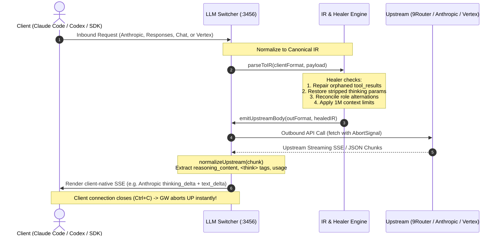
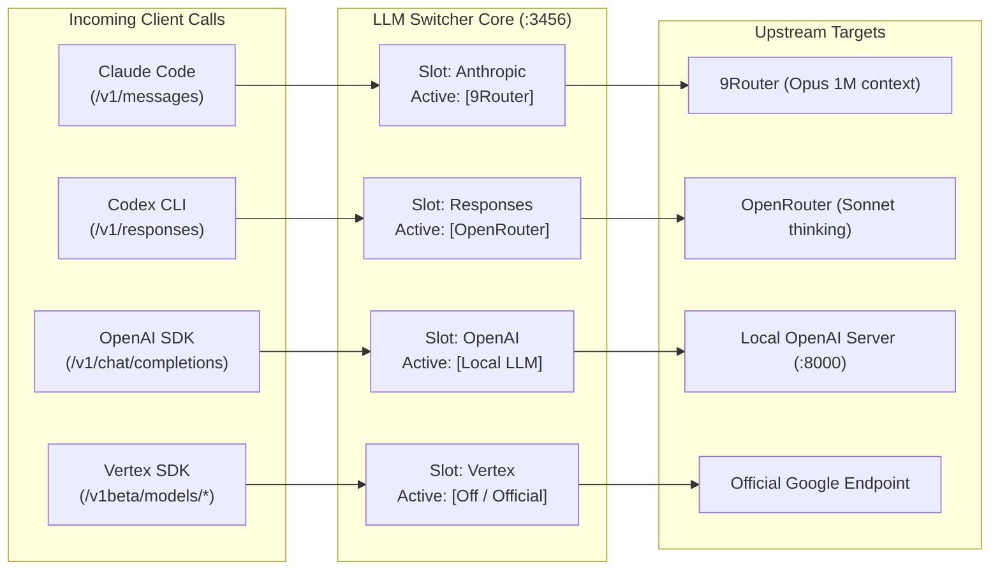

# LLM Switcher

<p align="center">
  <b>Zero-dependency, multi-protocol edge gateway & provider switcher</b><br>
  Seamlessly bridge <b>Claude Code</b>, <b>Codex</b>, OpenAI, and Gemini SDKs to any upstream LLM API.<br>
  Full bi-directional protocol conversion, 1M context unlock, thinking protocol extraction, and edge message healing.
</p>

<p align="center">
  <b>English</b> • <a href="README.vi.md">Tiếng Việt</a>
</p>

<p align="center">
  
  
  
  
  
</p>

---

> ### 💡 Design Philosophy: The Client-Side Edge Companion to 9Router
>
> **LLM Switcher intentionally does NOT implement multi-account pooling, key rotation, quota tracking, or provider load balancing.**
>
> That heavy lifting belongs to server-side AI routing gateways like **[9Router](https://github.com/decolua/9router)**, which handle centralized account rotation, rate-limit retries, and quota management far more reliably and securely at the server layer.
>
> **LLM Switcher is specifically engineered as the optimal client-side edge extension to pair with 9Router (or similar gateways):**
> - **At the Local Workstation (LLM Switcher):** Translates coding tool protocols (Claude Code `/v1/messages`, Codex `/v1/responses`, Vertex `/v1beta/...`, OpenAI Chat), injects 1M context windows, manages local multi-CLI profiles, and runs the Healer Engine to fix mangled payloads from local prompt compressors (RTK, Headroom, Ponytail).
> - **At the Server Gateway (9Router):** Manages account pools, API key rotation, load balancing, billing quotas, and global provider failover.
>
> This clean division of responsibility keeps LLM Switcher **ultra-lightweight, zero-dependency, and bloat-free** while giving you an unbeatable developer setup.

---

## Architecture & Workflow

LLM Switcher sits locally on your workstation (`127.0.0.1:3456`). It acts as the **outermost edge gatekeeper** before requests leave for the internet.

### 1. End-to-End System Topology



---

### 2. Bi-Directional IR (Intermediate Representation) Pipeline



---

### 3. Multi-Active CLI Independent Routing

You can run **multiple active profiles concurrently** — one profile dedicated to each CLI, without collision:



---

## Core Features

- **Zero-Dependency Architecture:** Built 100% on Node.js standard libraries (`http`, `fs`, `os`, `path`, `fetch`). No npm dependencies, no bundled runtime bloat, cold-start under 50ms.
- **Bi-Directional Protocol Conversion:**
  - **4 Client Inbound Formats:** Anthropic Messages, OpenAI Chat Completions, Codex Responses API, Vertex `generateContent`.
  - **3 Upstream Outbound Formats:** OpenAI Chat, Anthropic Native, Vertex Native.
- **Multi-Active CLI Routing:** Run Claude Code on Profile A, Codex on Profile B, and Cursor on Profile C simultaneously on a single gateway instance.
- **Deep Thinking & Reasoning Extraction:** Tested on 48 live response combinations. Accurately extracts `reasoning_content`, `<think>` tags, Vertex `thought` parts, and signatures into native `thinking_delta` blocks.
- **Edge Healer Engine (Anti-Collision for Token Optimizers):**
  - Fixes orphaned `tool_result` blocks caused by aggressive prompt pruners (RTK, Headroom, Ponytail) before sending to Anthropic/OpenAI upstream.
  - Automatically restores thinking parameters if an intermediary tool stripped them.
  - Merges consecutive same-role turns to enforce strict alternating turn requirements.
- **1M Context Window Unlocker:** Automatically sets `CLAUDE_CODE_MAX_CONTEXT_TOKENS=1000000` and calculates auto-compact thresholds (`900000`), with built-in visual risk warnings for unsupported models.
- **Zero Config Mutation:** Never modifies `~/.claude/settings.json` permanently. Uses launcher flags and environment injection to prevent annoying provider warning banners.
- **Live Request / Response Inspector:** Built-in dashboard tab displaying real-time requests, latency, token consumption, prompt previews, and thinking blocks.
- **Native Background Service:** Install and run as an OS background daemon on Windows (Task Scheduler), macOS (launchd), or Linux (systemd).

---

## Quick Start

### 1. Requirements
- Node.js 18+ installed on your system.
- No `npm install` needed!

### 2. Setup Configuration
Clone this repository and create your local configuration:
```bash
git clone https://github.com/your-username/llm-switcher.git
cd llm-switcher

# Copy example config (config.json is git-ignored for safety)
cp config.example.json config.json
```

Edit `config.json` with your provider base URLs and API keys.

### 3. Start the Gateway
```bash
# Start in foreground or background
node switch.mjs on

# Or run directly:
node proxy.mjs
```

Open the Web Dashboard at: **[http://127.0.0.1:3456/ui](http://127.0.0.1:3456/ui)**

---

## CLI Integration

### Universal Environment Loader (`env.cmd` / `env.sh`)

Every time you switch profiles, LLM Switcher writes ready-to-use environment loaders:

- **Windows (Command Prompt / PowerShell wrapper):**
  ```cmd
  call "path\to\llm-switcher\env.cmd"
  ```
- **macOS / Linux (Bash / Zsh):**
  ```bash
  source "path/to/llm-switcher/env.sh"
  ```

---

### Claude Code Setup (Windows)

1. Create a quick wrapper in your PATH (e.g. `cc-switch.cmd`):
   ```cmd
   @echo off
   node "path\to\llm-switcher\switch.mjs" %*
   ```

2. Patch your global Claude Code launcher (`claude.cmd` in your npm global directory):
   ```cmd
   IF EXIST "path\to\llm-switcher\active.flag" (
     SET "ANTHROPIC_BASE_URL=http://127.0.0.1:3456"
     SET "CLAUDE_CODE_DISABLE_UNKNOWN_MODEL_WINDOW_ENFORCEMENT=1"
   )
   IF EXIST "path\to\llm-switcher\1m.flag" (
     SET /P M1M=<"path\to\llm-switcher\1m.flag"
     IF "!M1M!"=="" SET "M1M=opus[1m]"
     SET "ANTHROPIC_MODEL=!M1M!"
     SET "CLAUDE_CODE_MAX_CONTEXT_TOKENS=1000000"
     SET "CLAUDE_CODE_AUTO_COMPACT_WINDOW=900000"
   )
   ```

---

### Codex CLI Setup (Windows)

In your Codex launcher wrapper (`codex.cmd`):
```cmd
IF EXIST "path\to\llm-switcher\active.flag" (
  SET "CODEX_BASE_URL=http://127.0.0.1:3456/v1"
  SET "OPENAI_BASE_URL=http://127.0.0.1:3456/v1"
)
IF EXIST "path\to\llm-switcher\codex-1m.flag" (
  SET /P CMODEL=<"path\to\llm-switcher\codex-1m.flag"
  SET "CODEX_MODEL=!CMODEL!"
  SET "CODEX_MAX_CONTEXT_TOKENS=1000000"
  SET "CODEX_AUTO_COMPACT_WINDOW=900000"
)
```

---

## Co-existence with Token Optimizers (RTK, Headroom, Ponytail)

If you use prompt-trimming tools like **Headroom**, **Ponytail**, or **RTK (Rust Token Killer)**:
1. Configure your CLI (Claude Code / Codex) to point to the optimizer proxy (e.g. `http://127.0.0.1:8787`).
2. Configure that optimizer's upstream endpoint to point to **LLM Switcher** (`http://127.0.0.1:3456`).
3. **LLM Switcher** serves as the protective final gateway before the internet:
   - **Repairs Broken Schemas:** Fixes orphaned `tool_result` turns and consecutive same-role turns caused by aggressive history pruning.
   - **Restores Stripped Thinking:** Detects reasoning models and restores thinking parameters if an optimizer stripped them to save tokens.
   - **Enforces 1M Context Windows:** Injects local 1M context flags and auto-compact thresholds.
   - **Converts Protocols:** Bridges 2-way traffic to your target upstream (9Router, OpenRouter, Vertex, etc.).

### Interoperability Test Report & Benchmark

| Failure Scenario Caused by Optimizers | Direct Upstream (Without Switcher) | Through LLM Switcher (Healer Engine) |
|---|---|---|
| **Orphaned `tool_result` turn** (Headroom prunes tool_use turn) | ❌ **HTTP 400 Crash**: `tool_use_id does not correspond to any tool_use` | ✅ **HTTP 200 OK**: Heals orphaned result into contextual text block |
| **Consecutive `user` turns** (Optimizer drops assistant turns) | ❌ **HTTP 400 Crash**: `roles must alternate` | ✅ **HTTP 200 OK**: Merges consecutive turns seamlessly |
| **Stripped `thinking` parameters** (Optimizer removes reasoning) | ⚠️ **Degraded AI**: Reasoning disabled, shallow single-liners | ✅ **HTTP 200 OK**: Automatically restores thinking budget |
| **Orphaned `tool` role in Chat API** | ❌ **HTTP 400 Crash**: `tool role must respond to tool_calls` | ✅ **HTTP 200 OK**: Converts orphaned tool into user context |
| **Custom optimizer headers** (`x-rtk-*`, `traceparent`) | ⚠️ Connection dropped / unrecognized header warnings | ✅ **HTTP 200 OK**: Clean transparent header passthrough |

Run the automated verification suite:
```bash
node tests/test-optimizer-interop.mjs
# Result: 5 PASSED / 0 FAILED (100% healed)
```

See the full research report in [📖 `docs/TOKEN-OPTIMIZER-INTEROP.md`](docs/TOKEN-OPTIMIZER-INTEROP.md).

---

## Agent Skill & MCP Server Integration

To guarantee that AI coding agents (Claude Code, Cursor, Windsurf, Opencode) and spawned sub-processes **never bypass LLM Switcher**, this repository provides two control-plane assets:

### 1. The Agent Skill (`skills/llm-switcher/SKILL.md`)
A standardized Agent Skill teaching the LLM:
- **Mandatory routing:** All LLM traffic and token compression tools (Headroom, RTK, Ponytail) MUST target `http://127.0.0.1:3456`.
- **Zero-mutation policy:** Prohibits the agent from editing `~/.claude/settings.json` directly.
- **Sub-process safety:** Automatically sources `env.cmd` or `env.sh` when launching sub-agents.

Install globally for Opencode / Claude:
```bash
# For Opencode:
cp -r skills/llm-switcher ~/.config/opencode/skills/

# For Claude Code:
cp -r skills/llm-switcher ~/.claude/skills/
```

### 2. The MCP Server (`mcp.mjs`)
A zero-dependency Model Context Protocol (MCP) server communicating over `stdio`:
- `switcher_status`: Read live active profiles and 1M flags.
- `switcher_audit`: Audit the environment to detect rogue direct outbound calls or unrouted token compressors.
- `switcher_switch_profile`: Programmatically switch a CLI's active profile.
- `switcher_recent_logs`: Inspect recent request logs, token usage, and thinking extraction.

Add to your MCP configuration (e.g. `opencode.jsonc`, `claude_desktop_config.json`, or Cursor):
```json
"mcp": {
  "llm-switcher": {
    "type": "local",
    "command": ["node", "path/to/llm-switcher/mcp.mjs"],
    "enabled": true
  }
}
```

---

## CLI Reference

```bash
switch ui                      # Open the Web UI dashboard in your browser
switch status                  # Display status for all active CLI targets
switch doctor                  # Audit environment, settings & routing
switch <profile>               # Activate profile for all compatible targets
switch claude <profile>        # Set active profile specifically for Claude Code
switch codex <profile>         # Set active profile specifically for Codex
switch openai <profile>        # Set active profile specifically for OpenAI Chat
switch vertex <profile>        # Set active profile specifically for Vertex / Gemini
switch service install         # Install OS background autostart service (Windows / macOS / Linux)
switch service uninstall       # Remove background autostart service
switch off [target]            # Deactivate gateway (or specific target) and restore official
```

---

## Configuration Schema (`config.json`)

```jsonc
{
  "port": 3456,
  "activeProfile": "9router",
  "activeProfiles": {
    "anthropic": "9router",          // Active profile for Claude Code (/v1/messages)
    "responses": "codex-profile",    // Active profile for Codex (/v1/responses)
    "openai-chat": "9router",        // Active profile for OpenAI Chat
    "vertex": "gemini-profile"       // Active profile for Vertex / Gemini
  },
  "profiles": {
    "9router": {
      "name": "9Router Cloud",
      "mode": "convert",             // hybrid | convert | direct
      "inFormat": "auto",            // auto | anthropic | openai-chat | responses | vertex
      "outFormat": "openai-chat",    // openai-chat | anthropic | vertex
      "baseURL": "https://api.9router.com/v1",
      "apiKey": "sk-...",
      "defaultModels": {
        "opus": "ag/claude-opus-4-6-thinking",
        "sonnet": "ag/claude-sonnet-4-6",
        "haiku": "ag/gemini-3.7-flash-high",
        "fable": "ag/gemini-3.8-flash-high"
      },
      "model1M": {
        "opus": true,
        "sonnet": true,
        "haiku": false,
        "fable": true
      }
    }
  },
  "debug": false
}
```

---

## Research & Protocol Matrices

Detailed response research and live-tested format matrices are documented in:
- 📖 [`docs/LLM-RESPONSE-MATRIX.md`](docs/LLM-RESPONSE-MATRIX.md) — 48 live sample variations across 8 model families.
- 📊 [`docs/response-matrix.json`](docs/response-matrix.json) — Machine-readable response signature schema.

---

## License

MIT © 2026 LLM Switcher Contributors.
