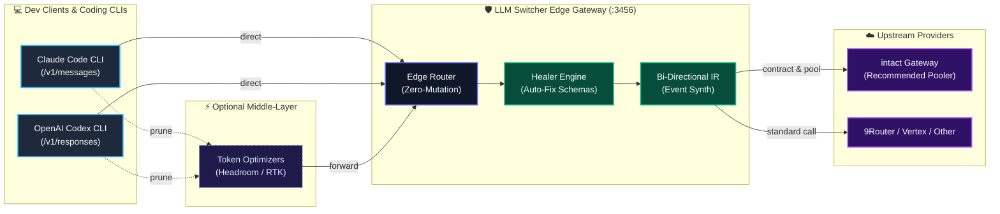

# LLM Switcher

<p align="center">
  <b>Zero-dependency, multi-protocol edge gateway & provider switcher</b><br>
  Seamlessly bridge <b>Claude Code</b>, <b>Codex</b>, OpenAI, and Gemini SDKs to any upstream LLM API.<br>
  Full bi-directional protocol conversion, official-model context windows, thinking protocol extraction, and edge message healing.
</p>

<p align="center">
  <b>English</b> • <a href="README.vi.md">Tiếng Việt</a>
</p>

<p align="center">
  
  
  
  
  
</p>

---

> ### 🛡️ Zero-Loss Native Emulation for Coding Agents
>
> Generic proxies mangle response protocols: Anthropic loses `thinking_delta` reasoning blocks, tool arguments split, and prompt caches desynchronize.
>
> **LLM Switcher solves this at the local network edge:**
> - **100% Native Emulation:** Normalizes upstream APIs (intact, 9Router, Vertex, DeepSeek) into genuine Anthropic SSE (`thinking_delta` + `tool_use`) for Claude Code, and genuine Responses API events for Codex.
> - **Client-Side Edge Companion:** Intentionally offloads heavy account pooling and key rotation to **[intact](https://github.com/louisphamdev/intact)** (recommended) or 9Router (basic alternative), keeping LLM Switcher zero-dependency and bloat-free.
> - **Targeted Tool Scope:** Built specifically for **Claude Code** and **OpenAI Codex** (OpenCode natively supports custom models without shims; refer to intact for account pooling; and Antigravity isn't worth building for 😏).

---

## Architecture & Interactive Diagrams

LLM Switcher runs locally on your workstation (`127.0.0.1:3456`) as a transparent edge interceptor and protocol bridge.

<p align="center">
  <a href="docs/diagrams/system-architecture.html">
    
  </a>
  <br>
  <sub><i>🎨 Themed with Pretty-Mermaid (Tokyo Night). Click diagram to open interactive Archify viewer (zoom, pan, tracing).</i></sub>
</p>

### 1. Interactive Archify Visual Library

All architecture maps and execution sequences are authored with **[Archify](https://github.com/tt-a1i/archify)** and rendered with **[Pretty-Mermaid](https://github.com/imxv/Pretty-mermaid-skills)**:

| Diagram | Description | Interactive Visual | Scalable Vector |
|---|---|---|---|
| **System Topology** | Complete edge architecture: Clients ➔ Optimizers ➔ Gateway & Healer Core ➔ Upstream Providers | [📊 Open Interactive View](docs/diagrams/system-architecture.html) | [SVG](docs/diagrams/system-topology.svg) • [PNG](docs/diagrams/system-topology.png) |
| **IR Healer Pipeline** | Inbound request normalization, schema healing, streaming synthesis, and abort propagation | [🔄 Open Interactive View](docs/diagrams/ir-translation-pipeline.html) | [SVG](docs/diagrams/ir-healer-pipeline.svg) • [PNG](docs/diagrams/ir-healer-pipeline.png) |
| **Codex Blindfold Routing** | TLS CONNECT proxy sequence, credential scrubbing, and upstream routing | [🛡️ Open Interactive View](docs/diagrams/blindfold-request-routing.html) | [HTML](docs/diagrams/blindfold-request-routing.html) |
| **Switch Lifecycle** | Zero-downtime tool toggle, CAS configuration writes, and interceptor sync | [⚡ Open Interactive View](docs/diagrams/blindfold-switch-lifecycle.html) | [HTML](docs/diagrams/blindfold-switch-lifecycle.html) |

---

### 2. Request Lifecycle & Healer Pipeline

<p align="center">
  <a href="docs/diagrams/ir-translation-pipeline.html">
    
  </a>
  <br>
  <sub><i>💡 Click above to inspect the interactive IR Healer lifecycle sequence.</i></sub>
</p>

### 3. High-Level Flow



---

### 4. How It Actually Works: Transparent Request Interception

LLM Switcher acts as a transparent man-in-the-middle without ever touching client configuration files:

1. **Ephemeral Shim Activation:** When you invoke `claude` or `codex`, a lightweight shim at the front of your `PATH` executes first. It injects `HTTPS_PROXY=http://127.0.0.1:3457` and custom CA certs *only into that process's in-memory environment*, leaving `~/.claude/settings.json` and `~/.codex/config.toml` completely untouched.
2. **Network Interception (`:3457`):** The tool sends standard TLS requests to official hosts (`api.anthropic.com` or `api.openai.com`). The local Blindfold interceptor terminates TLS, strips client credentials, and transparently re-routes API calls (`/v1/messages`, `/v1/responses`, `/v1/models`) locally to the Gateway (`:3456`). All other traffic (OAuth logins, GitHub, web searches) tunnels untouched to the real internet.
3. **Protocol Conversion & Upstream Call (`:3456`):** The gateway loads your active profile from `config.json`, runs the Healer Engine (repairing empty `{}` schemas and restoring reasoning budgets), and converts the request into the upstream provider's native dialect (e.g. Gemini, OpenAI Chat, or Anthropic) with your configured credentials and base URL.
4. **Native Event Stream Synthesis:** When the upstream provider streams its response, the gateway captures reasoning tokens and tool calls, re-synthesizing them into genuine Anthropic SSE (`thinking_delta` + `tool_use`) or Codex Responses events. The tool receives genuine native events and believes it is communicating directly with the official provider!

> #### 🔒 CA Security & Origin: Where does the CA come from and how safe is it?
>
> - **100% Locally Minted:** The CA certificate (`ca.pem`) and private key (`ca.key`) are generated entirely on your own machine using your local OpenSSL (`blindfold/make-certs.sh`). No keys are downloaded from the internet, and the private key is stored locally with strict `0600` permissions.
> - **Zero OS Trust Store Tampering:** Unlike tools like Charles or Fiddler, LLM Switcher **NEVER installs anything into your system or OS root certificate store** (no Windows Certificate Store, no macOS Keychain, no Linux `/etc/ssl/certs`). It requires **zero Administrator or sudo privileges**.
> - **Process-Scoped Trust Only:** The certificate is loaded ephemerally into the memory of `claude` (via `NODE_EXTRA_CA_CERTS`) and `codex` (via `CODEX_CA_CERTIFICATE`). Your browsers, banking apps, git, and other terminal sessions never trust this CA.
> - **Cryptographic Name Constraints:** The CA is minted with explicit X.509 `nameConstraints` strictly permitting only three domains: `api.anthropic.com`, `api.openai.com`, and `chatgpt.com`. Even if the local private key were compromised, standard TLS verifiers will reject it for any other domain (Google, GitHub, your bank).
> - **VPN & Corporate CA Preservation:** If your workstation already has a company CA in `NODE_EXTRA_CA_CERTS`, `ensure-ca-bundle.mjs` merges both into a combined bundle so internal corporate proxies never break.

---

## Core Features

- **Zero-Dependency Architecture:** Built 100% on Node.js standard libraries (`http`, `fs`, `os`, `path`, `fetch`). No npm dependencies, no bundled runtime bloat, cold-start under 50ms.
- **Bi-Directional Protocol Conversion:**
  - **4 Client Inbound Formats:** Anthropic Messages, OpenAI Chat Completions, Codex Responses API, Vertex `generateContent`.
  - **3 Upstream Outbound Formats:** OpenAI Chat, Anthropic Native, Vertex Native.
- **Multi-Active CLI Routing:** Run Claude Code on Profile A, Codex on Profile B, and Cursor on Profile C simultaneously on a single gateway instance.
- **Deep Thinking & Reasoning Extraction:** Tested on 48 live response combinations. Accurately extracts `reasoning_content`, `<think>` tags, Vertex `thought` parts, and signatures into native `thinking_delta` blocks.
- **Edge Healer Engine (Anti-Collision for Token Optimizers):**
  - Fixes orphaned `tool_result` blocks caused by aggressive prompt pruners (RTK, Headroom, Ponytail) before sending to Anthropic/OpenAI upstream.
  - Automatically restores thinking parameters if an intermediary tool stripped them.
  - Merges consecutive same-role turns to enforce strict alternating turn requirements.
- **Context windows come from the model:** the switcher no longer forces a 1M window or an auto-compact limit, and it writes no model name into your environment. Claude Code sizes its own session from the window of the official model you pick, and a backend with a smaller window than that model can overflow in a long session. `model1M` now only decides what `/v1/models` reports.
- **Zero Config Mutation:** Never reads or writes `~/.claude/settings.json` or `~/.codex/config.toml`, and writes no environment variable and no `--config` argument that a coding tool reads as configuration. The tool reaches the gateway only through the interceptor, so no provider warning banner appears.
- **Live Request / Response Inspector:** Built-in dashboard tab displaying real-time requests, latency, token consumption, prompt previews, and thinking blocks.
- **Native Background Service:** Install and run as an OS background daemon on Windows (Task Scheduler), macOS (launchd), or Linux (systemd).

---

## Recent Highlights (v1.2.0)

- **Zero-Mutation Interceptor:** All traffic routes via `HTTPS_PROXY` without editing client configs (`~/.claude/settings.json`, `~/.codex/config.toml`).
- **Concurrent Multi-Tool Support:** Simultaneously configures `{ claude, codex }` profiles with dynamic, zero-downtime switching (`POST /_control/active-tools`).
- **Auto-Discovery & Dynamic Model Catalog:** Discovers official models for Claude Code & Codex; detects tool version updates and refreshes mappings on the fly (`switch models`).
- **Self-Healing Schemas:** Auto-repairs `{}` empty schemas for Gemini/Vertex and restores stripped `thinking` tokens.
- **Windows Reliability:** Strict CRLF `.cmd` shims, CA path resolution, and zero-drift subroutine routing.
- *For older releases (v1.1.2 – v1.1.10), see [CHANGELOG.md](CHANGELOG.md).*

---

## Quick Start

### 1. Requirements
- Node.js 18.17 or later.
- The gateway has no npm dependencies.

### 2. Install and configure

**Option A: npm (recommended)**
```bash
npm install -g llm-switcher

# Copy the example configuration into your data folder.
mkdir -p ~/.llm-switcher
cp "$(npm root -g)/llm-switcher/config.example.json" ~/.llm-switcher/config.json
```

An npm install keeps `config.json`, `admin.token` and the launch files in `~/.llm-switcher`. An upgrade replaces the package folder only, so your configuration stays.

If you upgrade from 1.1.0 or older, stop the running gateway before you run `switch`. An older gateway cannot prove its identity, so `switch` does not stop it for you.

**Option B: git clone**
```bash
git clone https://github.com/louisphamdev/llm-switcher.git
cd llm-switcher

# Copy example config (config.json is git-ignored for safety)
cp config.example.json config.json
```

A checkout keeps its data next to the code, as before. To use another folder in either case, set `LLM_SWITCHER_HOME`.

Edit `config.json` with your provider base URLs and API keys.

The **data folder** is `~/.llm-switcher` for an npm install and the checkout folder for a git clone. The examples below use the npm install. For a checkout, run `node switch.mjs <command>` instead of `switch <command>`, or put the checkout folder on `PATH`.

### 3. Start the Gateway
```bash
# Start the gateway in the background:
switch on

# Or run it in the foreground (npm install):
node "$(npm root -g)/llm-switcher/proxy.mjs"
```

`switch <command>` works the same on Linux, macOS and Windows. A checkout has its own launchers: `switch` for Linux and macOS, `switch.cmd` for Windows. Platform differences, and the two features that are not available everywhere, are in [📖 `docs/cross-platform.md`](docs/cross-platform.md).

Open the Web Dashboard at: **[http://127.0.0.1:3456/ui](http://127.0.0.1:3456/ui)**

---

## CLI Integration

### The environment comes from the shims, not from your shell

Do **not** add a `source env.sh` or `call env.cmd` line to `~/.bashrc`, `~/.zshrc` or a wrapper
script. Those two files are neutral stubs now: a comment line and nothing else, so an old rc line
keeps running and can never re-introduce a base URL.

Each tool gets its own file instead, and only the matching shim loads it:

| File | Loaded by |
| --- | --- |
| `env-claude.sh` / `env-claude.cmd` | the `claude` shim |
| `env-codex.sh` / `env-codex.cmd` | the `codex` shim |
| `env.sh` / `env.cmd` | nobody. Neutral stub, kept only so an old rc line stays silent |

An empty per-tool file means that tool is off: the shim then leaves the environment alone and the
tool reaches its official endpoint. Before it loads anything, the shim also scrubs a stale
`ANTHROPIC_BASE_URL`, `OPENAI_BASE_URL` or `ANTHROPIC_DEFAULT_<TIER>_MODEL` inherited from an older
release or from your own shell, so `switch off` really is off.

In practice you never call these files. `switch shim install` puts `~/.llm-switcher/bin` on `PATH`,
and every `claude` and `codex` invocation — including `claude --resume` in a brand-new terminal —
runs the shim, which injects the variables into that one process.

---

### Claude Code Setup (Windows)

1. With the npm install, `switch` is already on `PATH`. With a checkout, create a wrapper on your `PATH` (for example `cc-switch.cmd`):
   ```cmd
   @echo off
   node "path\to\llm-switcher\switch.mjs" %*
   ```

2. Install the shim and put its directory **before** the real Claude Code directory in your User `PATH` (System Properties → Environment Variables), then open a new terminal:
   ```cmd
   switch shim install
   ```
   > Do **not** patch `claude.cmd` in your npm global directory: npm rewrites it on every update, and the shim is what injects the gateway URL. `settings.json` is never touched, so no "custom API" banner appears.

---

### Codex-first setup

Install the generated shim, put its directory first in `PATH`, and activate a Codex-compatible profile:

```bash
switch shim install
export PATH="$HOME/.llm-switcher/bin:$PATH"   # Bash or Zsh
switch codex <profile>
switch shim status
codex
```

On Windows, add `%USERPROFILE%\.llm-switcher\bin` before the real Codex directory in `PATH`. Open a new terminal after the change.

The shim never edits `~/.codex/config.toml`. Codex reaches the gateway cleanly through `HTTPS_PROXY` and the interceptor, retaining its own model names and context windows. Model catalog entries are served dynamically at `/v1/models`.

### Blindfold mode (optional)

A base URL override makes Codex print one line on its own `/model` screen:

```
base URL is overridden to http://127.0.0.1:3456/v1. Selecting models may not be supported or work properly.
```

Blindfold mode removes that line. Codex keeps its official endpoint, and the switcher intercepts the network hop instead. It needs no administrator rights, no certificate in a system trust store, and no change to `~/.codex/config.toml`.

```bash
bash "$(npm root -g)/llm-switcher/blindfold/make-certs.sh"   # once; a checkout runs blindfold/make-certs.sh
# the port is already top-level in config.json: "blindfold": { "port": 3457 }
switch codex <profile>                     # the gateway starts the interceptor
```

One interceptor serves both tools. It routes by the host of the CONNECT request and by the path,
and by nothing else:

| CONNECT host | Paths to this switcher's gateway | Everything else |
| --- | --- | --- |
| `api.anthropic.com` | `/v1/messages`, `/v1/messages/...` | to `api.anthropic.com`, unchanged |
| `api.openai.com` | `/v1/responses`, `/v1/responses/...`, `/v1/models`, `/v1/models/...` | to `api.openai.com`, unchanged |
| `chatgpt.com` | `/backend-api/codex/...`, forwarded as `/v1` | to `chatgpt.com`, unchanged |

There is no `blindfoldHost` and no `blindfoldPrefix` any more: that table is the routing, and it is
not a profile setting. A CONNECT host outside the table is tunneled untouched; a request whose
`Host` header names a different host than its CONNECT target gets `421` and opens no upstream
connection. See the [full table and the certificate rules](docs/cross-platform.md).

The gateway owns the interceptor: it starts it at boot and after every change, and `switch off` stops it. If the certificates are missing, or another process holds the gateway or interceptor port, `switch` refuses the activation and writes no file.

Read [📖 `docs/codex-blindfold.md`](docs/codex-blindfold.md) before you turn it on. The guide explains the interception scope, the risk of holding a private CA, and how to go back. It opens with three diagrams:

- [Request routing](docs/diagrams/blindfold-request-routing.html) — one request, from CONNECT to the provider
- [Model name resolution](docs/diagrams/codex-model-name-resolution.html) — which name the CLI sees, and where it resolves
- [Lifecycle under switch](docs/diagrams/blindfold-switch-lifecycle.html) — activation, refusal, and shutdown

### What you give up

- **1M context follows the official model's window.** The switcher no longer forces a 1M window
  or an auto-compact limit, and it writes no model name into your environment. Claude Code sizes
  its own session from the window of the model you pick. A backend whose window is smaller than
  that model can overflow in a long session. `model1M` now only decides what `/v1/models` reports.
- **Codex needs certificates once.** Blindfold mode is what keeps Codex on its official endpoint,
  and it needs a private CA plus a leaf naming the three hosts above. Skip it and Codex shows the
  `base URL is overridden` line on its `/model` screen instead.
- **The interceptor decrypts the three hosts it serves.** It refuses a CONNECT to a local or
  private address, but every process on the machine can reach it. `docs/codex-blindfold.md` opens
  with the scope, the risk of holding a private CA, and how to go back.

---

## Co-existence with Token Optimizers (RTK, Headroom, Ponytail)

If you use prompt-trimming tools like **Headroom**, **Ponytail**, or **RTK (Rust Token Killer)**:
1. Configure your CLI (Claude Code / Codex) to point to the optimizer proxy (e.g. `http://127.0.0.1:8787`).
2. Configure that optimizer's upstream endpoint to point to **LLM Switcher** (`http://127.0.0.1:3456`).
3. **LLM Switcher** serves as the protective final gateway before the internet:
   - **Repairs Broken Schemas:** Fixes orphaned `tool_result` turns and consecutive same-role turns caused by aggressive history pruning.
   - **Restores Stripped Thinking:** Detects reasoning models and restores thinking parameters if an optimizer stripped them to save tokens.
   - **Context windows follow the model:** reports the official window of each model; nothing is injected.
   - **Converts Protocols:** Bridges 2-way traffic to your target upstream (intact, 9Router, OpenRouter, Vertex, etc.).

### Interoperability Test Report & Benchmark

| Failure Scenario Caused by Optimizers | Direct Upstream (Without Switcher) | Through LLM Switcher (Healer Engine) |
|---|---|---|
| **Orphaned `tool_result` turn** (Headroom prunes tool_use turn) | ❌ **HTTP 400 Crash**: `tool_use_id does not correspond to any tool_use` | ✅ **HTTP 200 OK**: Heals orphaned result into contextual text block |
| **Consecutive `user` turns** (Optimizer drops assistant turns) | ❌ **HTTP 400 Crash**: `roles must alternate` | ✅ **HTTP 200 OK**: Merges consecutive turns seamlessly |
| **Stripped `thinking` parameters** (Optimizer removes reasoning) | ⚠️ **Degraded AI**: Reasoning disabled, shallow single-liners | ✅ **HTTP 200 OK**: Automatically restores thinking budget |
| **Orphaned `tool` role in Chat API** | ❌ **HTTP 400 Crash**: `tool role must respond to tool_calls` | ✅ **HTTP 200 OK**: Converts orphaned tool into user context |
| **Custom optimizer headers** (`x-rtk-*`, `traceparent`) | ⚠️ Connection dropped / unrecognized header warnings | ✅ **HTTP 200 OK**: Clean transparent header passthrough |

Run the automated verification suites:
```bash
# Offline (mock upstream, no API key needed): protocol conversion, healer, streaming, security
npm test

# Live (requires a running gateway and a real upstream; consumes tokens)
node tests/live-optimizer-interop.mjs
```

See the full research report in [📖 `docs/TOKEN-OPTIMIZER-INTEROP.md`](docs/TOKEN-OPTIMIZER-INTEROP.md).

---

## Agent Skill & MCP Server Integration

To guarantee that AI coding agents (Claude Code, Cursor, Windsurf, Opencode) and spawned sub-processes **never bypass LLM Switcher**, this repository provides two control-plane assets:

### 1. The Agent Skill (`skills/llm-switcher/SKILL.md`)
A standardized Agent Skill teaching the LLM:
- **Mandatory routing:** All LLM traffic and token compression tools (Headroom, RTK, Ponytail) MUST target `http://127.0.0.1:3456`.
- **Zero-mutation policy:** Prohibits the agent from editing `~/.claude/settings.json` — the switcher never reads or writes that file either.
- **Sub-process safety:** Never tells a sub-agent to `source env.sh`; the shims in `~/.llm-switcher/bin` inject the proxy variables into the tool process itself and scrub anything stale first.

Install globally for Opencode / Claude:
```bash
# For Opencode:
cp -r skills/llm-switcher ~/.config/opencode/skills/

# For Claude Code:
cp -r skills/llm-switcher ~/.claude/skills/
```

### 2. The MCP Server (`mcp.mjs`)
A zero-dependency Model Context Protocol (MCP) server communicating over `stdio`:
- `switcher_status`: Read live active profiles and gateway state.
- `switcher_audit`: Audit the environment to detect rogue direct outbound calls or unrouted token compressors.
- `switcher_switch_profile`: Programmatically switch a CLI's active profile.
- `switcher_recent_logs`: Inspect recent request logs, token usage, and thinking extraction.

NOTE: `switcher_recent_logs` returns the first 150 characters of each recent prompt, from every client that used the gateway. The agent that calls the tool can read them.

Add the server to your MCP configuration (for example `opencode.jsonc`, `claude_desktop_config.json`, or Cursor). Run `npm root -g` to get the folder that holds `llm-switcher/mcp.mjs`. For a checkout, use the `mcp.mjs` in the checkout folder.
```json
"mcp": {
  "llm-switcher": {
    "type": "local",
    "command": ["node", "/path/from/npm-root-g/llm-switcher/mcp.mjs"],
    "enabled": true
  }
}
```

---

## CLI Reference

```bash
switch ui                      # Open the Web UI dashboard in your browser
switch status                  # Display status for all active CLI targets
switch doctor                  # Audit environment, settings & routing
switch on [profile]            # Start the gateway and activate a profile
switch <profile>               # Activate a profile for both tools
switch claude <profile>        # Set the active profile for Claude Code only
switch codex <profile>         # Set the active profile for Codex only
switch port <number>           # Change the gateway port (restarts it if running)
switch service install         # Install OS background autostart service (Windows / macOS / Linux)
switch service uninstall       # Remove background autostart service
switch shim install            # Route new Claude and Codex sessions through the gateway
switch shim status             # Verify shims + detect running sessions that bypass the gateway
switch shim uninstall          # Remove the launcher shims
switch off                     # Stop everything and restore the official endpoints
switch off claude              # Turn Claude Code off; Codex keeps running
switch off codex               # Turn Codex off; Claude Code keeps running
switch contract-probe [--model m] # Drive the contract-lab variants through the gateway
switch contract-check          # Turn the open contract findings into failing tests
```

Targets are `claude` and `codex`, and they are the only two. A profile is one tool: `tool` is
either `"claude"` or `"codex"` (or `null` for a profile that is switched off), so `switch claude` and
`switch codex` can never point at the same profile by accident. There is no `openai` or `vertex`
target any more — the input routes those names stood for are gone.

The service runs without your shell. `switch service install` therefore copies `CLAUDE_CONFIG_DIR`, `LLM_SWITCHER_CONFIG`, `LLM_SWITCHER_STATE_DIR` and `LLM_SWITCHER_BLINDFOLD_CERTS` into the systemd unit or the launchd plist when they are set. The Windows task cannot carry them; set them as User environment variables instead. If the installed definition differs from the new one, for example after a hand edit, the old file is kept as `<file>.bak`. On Windows the task is created from an XML definition, so paths with spaces need no extra quoting and the task has no run-time limit. This Windows path is not tested on Windows yet.

### Resumed sessions & the shim (important)

`switch on` writes `env-claude.*` and `env-codex.*` and writes nothing into
`~/.claude/settings.json` — the switcher never reads or writes that file, which is what keeps
Claude Code from showing its "custom API" banner.
The side effect: a CLI started without the shim has **no**
`ANTHROPIC_BASE_URL`, so it talks to the provider directly and skips the gateway
(no Healer, no pooled quota). `claude --resume` in a fresh terminal is the
classic case.

The shim closes that hole. It installs tiny wrappers in `~/.llm-switcher/bin` that inject the
tool's own environment and then `exec` the real binary:

```bash
switch shim install
export PATH="$HOME/.llm-switcher/bin:$PATH"   # add to ~/.zshrc or ~/.bashrc
switch shim status                            # verify
```

Behaviour:

- **Tool active** → the shim loads that tool's own env file, so every invocation (including
  `--resume`) is routed through the gateway.
- **Tool off** (its env file is empty) → the shim is fully transparent and runs the real
  binary untouched; it never forces routing.
- Before it loads anything, the shim scrubs a stale `ANTHROPIC_BASE_URL`, `OPENAI_BASE_URL` or
  `ANTHROPIC_DEFAULT_<TIER>_MODEL` inherited from an older release or from your shell, so a
  variable cannot survive a `switch off`.
- No `--config` arguments are passed to Codex. The shim changes nothing on Codex's side but the
  environment.
- The real binary is located with the shim directory stripped from `PATH`, so it can never
  call itself recursively. If no real binary is found it exits `127` with a clear message
  instead of failing silently.
- `settings.json` is left alone, so **no warning banner** appears.

`switch on` installs the shims automatically and warns when `PATH` still needs the export
line. `switch doctor` and `switch shim status` additionally scan running `claude`/`codex`
processes and flag any that lack `ANTHROPIC_BASE_URL` — those sessions must be quit and
re-opened from a shell where the shim is on `PATH`.

---

## Configuration Schema (`config.json`)

```jsonc
{
  "port": 3456,
  "activeProfiles": {
    "claude": "claude-default",      // Active profile for Claude Code (/v1/messages)
    "codex": "codex-default"         // Active profile for Codex (/v1/responses)
  },
  "blindfold": { "port": 3457 },     // Interceptor port. Top-level, optional, default 3457
  "profiles": {
    "claude-default": {
      "name": "Intact Gateway",
      "mode": "convert",             // hybrid | convert | direct
      "tool": "claude",              // claude | codex | null (profile is off)
      "outFormat": "openai-chat",    // openai-chat | anthropic | vertex
      "thinkingMode": "auto",        // auto | native | off (see Advanced Options)
      "baseURL": "https://intact.example.com/v1", // or https://api.9router.com/v1
      "apiKey": "sk-...",
      "defaultModels": {
        "opus": "ag/claude-opus-4-6-thinking",
        "sonnet": "ag/gemini-3.7-flash",
        "haiku": "ag/gemini-3.6-flash-medium",
        "fable": "ag/gemini-3.8-flash"
      },
      "model1M": {
        "opus": true,
        "sonnet": true,
        "haiku": false,
        "fable": true
      }
    },
    "codex-default": {
      "name": "Codex via router",
      "mode": "convert",
      "tool": "codex",
      "outFormat": "vertex",
      "baseURL": "https://YOUR-GATEWAY/v1",
      "apiKey": "sk-...",
      // A profile that serves Codex MUST have publicModels (see Codex-first setup).
      "publicModels": ["gpt-5.6-sol", "gpt-5.6-terra", "gpt-5.6-luna"], // official names for main, review, subagent
      "codexRoles": { "review": "gpt-5.6-sol" }, // optional: pair one role with another public name
      "defaultModels": { "main": "gemini-3.8-flash", "review": "gemini-3.7-flash-medium", "subagent": "gemini-3.6-flash-low" },
      "model1M": { "main": false, "review": false, "subagent": false }
    }
  },
  "debug": false,
  "contractLab": {
    "url": "https://intact.example.com",
    "apiKey": "sk-...",
    "enabled": false
  }
}
```

`tool` replaces `inFormat`: it says which tool a profile serves, not what its upstream speaks.
There is no top-level `activeProfile`, no `blindfold`, `blindfoldPort`, `blindfoldHost` or
`blindfoldPrefix` inside a profile, and no `openai-chat` or `vertex` key in `activeProfiles`.

An older `config.json` is rewritten once, on load, through a compare-and-swap that refuses to
touch a file somebody else changed first. When two profiles would collapse onto the same key the
migration stops, names the clashing keys on the CLI and in the dashboard, and leaves the file
exactly as it was: every mutating `switch` command then exits non-zero, `switch off` and
`switch doctor` still work, and fixing the file makes everything work again.

### Contract lab

The contract lab finds fields that the converter loses. It is off by default.

Before it sends a sample, the gateway masks every string value with `x` of the same length. Only the short enum values that intact reads stay: `type`, `role`, `object`, `model`, `status`, `event`, `finish_reason` and `stop_reason`. Numbers, flags, SSE event names and the keys of the API also stay. Inside user data (tool arguments, tool input, `metadata`) the keys are masked too. intact keeps only the length of any other string, so the analysis loses nothing.

- Set `contractLab: {url, apiKey, enabled}` in `config.json`. If `enabled` is `true`, the gateway sends a sample of complete exchanges to intact.
- `switch contract-probe [--model m]` sends six test requests per model and format through the gateway.
- `switch contract-check` gets the open findings from intact and writes one test file for each lost field.

### Self-improvement with intact

[intact](https://github.com/louisphamdev/intact) is the credential proxy that this gateway can use as its upstream. The two tools find and correct their own faults, in two loops.

- **intact corrects what providers refuse.** It records every provider error and groups the errors that recur. For a fake 429, intact replays the failing request and removes the system prompt text in halves. It keeps the smallest text that the provider refuses as a filter in its database. Every machine gets the fix at once, and this gateway needs no update. Two examples: Antigravity answered a fake 429 to "You are Codex, an agent based on GPT-5" and to "You are a Claude agent, built on Anthropic's Claude Agent SDK".
- **This gateway corrects what its converter loses.** With the contract lab on, the gateway sends masked samples to intact. intact compares each sample with the request that it received, and records each field that the conversion lost. `switch contract-check` writes one failing test for each finding, and the fix goes into the converter.

Because of this split, a provider fingerprint is never a rule in this gateway. It is a filter in intact, which intact finds and proves by replay.

---

## Advanced Options

| Option | Description |
|---|---|
| `LLM_SWITCHER_HOME=/path` | Use this folder as the data folder (config, admin token, launch files, logs) for an npm install or a checkout. |
| `LLM_SWITCHER_CONFIG=/path/config.json` | Use a config file outside the data folder (the proxy, `switch` and `mcp.mjs` all honour it). |
| `--port <n>` / `LLM_SWITCHER_PORT` | Override the listening port (priority: flag > env > `config.port`). |
| `x-llm-profile: <key>` header (alias `x-profile`) or `?profile=<key>` | Route a single request through a specific profile. An unknown key returns HTTP 400 instead of silently falling back. |
| `profile.thinkingMode` | `auto` (default, for gateways like intact or 9Router): restore stripped thinking, inject a `<think>` guide for non-reasoning models, send `thinking` + `reasoning_effort`. `native` (strict OpenAI APIs): send only `reasoning_effort` when the client asks, never touch the prompt, use `max_completion_tokens`. `off`: never send reasoning parameters. |
| `profile.endpoints.countTokens` | Override the Anthropic `count_tokens` URL. |
| `profile.endpoints` | Override upstream URLs per format: `{ "openai-chat": "...", "anthropic": "...", "vertex": "https://.../models/{model}:{action}" }`. |
| `CLAUDE_CONFIG_DIR` | Respected when locating Claude Code's `settings.json`. |
| `LLM_SWITCHER_STATE_DIR` | Move the launch files and the logs out of the data folder. The tests use it; the shims read the directory that was set when they were installed. |

## Security Model

- The gateway binds to `127.0.0.1` only and rejects requests whose `Host` is not a loopback name (DNS-rebinding protection) or whose `Origin` is not the dashboard itself (CSRF protection).
- The admin API (`/api/*`) requires the `x-llm-switcher-token` header. The gateway creates the token in `admin.token`, next to `config.json`, with mode 0600. The gateway puts this token in the dashboard page, so `http://127.0.0.1:3456/ui` works when you open it directly. The Host and Origin checks keep the page and the token from other sites. The MCP server reads the file. `/v1/*` and `/health` need no token.
- API keys are never sent to the browser: `/api/status` returns redacted profiles and the dashboard keeps the stored key unless you type a new one. The stored key goes only to the stored `baseURL` and `endpoints` of that profile. A save that changes either one must carry the key again.
- Every dashboard change carries the config revision that the page loaded. If another tab, the CLI or the MCP server saved in the meantime, the gateway answers 409 and the page reloads instead of overwriting that change.
- Client credentials such as `x-api-key`, `authorization` or `x-goog-api-key` are **not** forwarded to upstreams. Other `x-*` headers, `traceparent` and `tracestate` pass through. The gateway drops its own control headers (`x-profile`, `x-llm-profile`) and the network identity headers (`x-forwarded-*`, `x-real-ip`).
- `config.json` is written atomically with mode 0600. `~/.claude/settings.json` is rewritten only to remove values that the switcher wrote itself. `ANTHROPIC_AUTH_TOKEN`, `*_MODEL_NAME` and your own model or URL values stay, and `switch` prints the name of every value it removes.

## Compatibility Notes

- **Direct Anthropic passthrough:** valid requests are forwarded byte-for-byte (thinking signatures, `cache_control`, documents stay intact). Malformed ones are repaired in place by a native Anthropic healer: orphaned `tool_result` → text, missing `tool_result` → placeholder, results moved to the start of the user turn.
- **Thinking signatures:** thinking blocks produced by conversion carry a gateway signature (`reasoning-sig`, or a foreign signature prefixed with `lsw1.`). They are stripped before a request reaches Anthropic. If that leaves an in-progress tool loop without the thinking block Anthropic requires, thinking is disabled for that single request instead of failing.
- **Codex tools:** `custom`/freeform tools (e.g. `apply_patch` with its Lark grammar), `namespace` tools and `local_shell` are exposed to upstreams as function tools and converted back to `custom_tool_call` / namespaced `function_call` / `local_shell_call` items. Hosted tools (`web_search`, `file_search`, `tool_search`, image generation) execute on OpenAI's servers, so other upstreams cannot provide them and they are omitted.
- **Gemini 3 thought signatures:** signatures returned with function calls are cached in memory by tool call id (last 5,000 calls) and replayed on the matching `functionCall` part, including through Gemini's OpenAI-compatible `extra_content`. After a gateway restart, unknown calls in the current turn get Google's documented `skip_thought_signature_validator` value, which Google notes may reduce quality.
- **`/v1/messages/count_tokens`:** exact when the active Claude Code profile uses a native Anthropic upstream; otherwise an estimate (other providers have no equivalent endpoint).

## Research & Protocol Matrices

Detailed response research and live-tested format matrices are documented in:
- 📖 [`docs/LLM-RESPONSE-MATRIX.md`](docs/LLM-RESPONSE-MATRIX.md) — 48 live sample variations across 8 model families.
- 📊 [`docs/response-matrix.json`](docs/response-matrix.json) — Machine-readable response signature schema.

---

## License

MIT © 2026 LLM Switcher Contributors.
