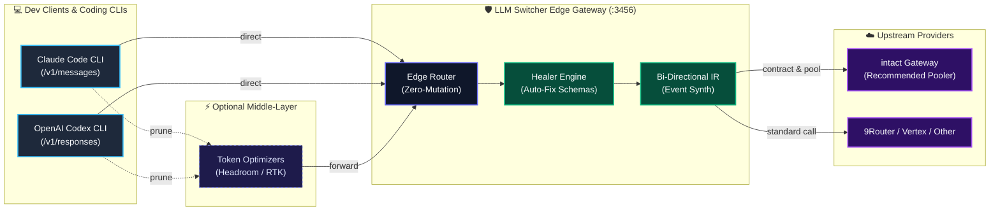

# LLM Switcher

<p align="center">
  <b>Zero-dependency, multi-protocol edge gateway & provider switcher</b><br>
  Bridge <b>Claude Code</b>, <b>Codex</b> and the <b>Antigravity CLI</b> to any upstream LLM API: OpenAI-compatible, Anthropic, or Vertex.<br>
  Full bi-directional protocol conversion, official-model context windows, thinking protocol extraction, and edge message healing.
</p>

<p align="center">
  <b>English</b> • <a href="README.vi.md">Tiếng Việt</a>
</p>

<p align="center">
  
  
  
  
  
</p>

---

> ### 🛡️ Zero-Loss Native Emulation for Coding Agents
>
> Generic proxies mangle response protocols: Anthropic loses `thinking_delta` reasoning blocks, tool arguments split, and prompt caches desynchronize.
>
> **LLM Switcher solves this at the local network edge:**
> - **100% Native Emulation:** Normalizes upstream APIs (intact, 9Router, Vertex, DeepSeek) into genuine Anthropic SSE (`thinking_delta` + `tool_use`) for Claude Code, and genuine Responses API events for Codex.
> - **Client-Side Edge Companion:** Intentionally offloads heavy account pooling and key rotation to **[intact](https://github.com/louisphamdev/intact)** (recommended) or 9Router (basic alternative), keeping LLM Switcher zero-dependency and bloat-free.
> - **Targeted Tool Scope:** Built specifically for **Claude Code**, **OpenAI Codex** and the **Antigravity CLI** (`agy`). OpenCode supports custom models without shims; refer to intact for account pooling.

---

## Architecture & Interactive Diagrams

LLM Switcher runs locally on your workstation (`127.0.0.1:3456`) as a transparent edge interceptor and protocol bridge.

<p align="center">
  <a href="docs/diagrams/system-architecture.html">
    
  </a>
  <br>
  <sub><i>🎨 Themed with Pretty-Mermaid (Tokyo Night). Click diagram to open interactive Archify viewer (zoom, pan, tracing).</i></sub>
</p>

### 1. Interactive Archify Visual Library

All architecture maps and execution sequences are authored with **[Archify](https://github.com/tt-a1i/archify)** and rendered with **[Pretty-Mermaid](https://github.com/imxv/Pretty-mermaid-skills)**:

| Diagram | Description | Interactive Visual | Scalable Vector |
|---|---|---|---|
| **System Topology** | Complete edge architecture: Clients ➔ Optimizers ➔ Gateway & Healer Core ➔ Upstream Providers | [📊 Open Interactive View](docs/diagrams/system-architecture.html) | [SVG](docs/diagrams/system-topology.svg) • [PNG](docs/diagrams/system-topology.png) |
| **IR Healer Pipeline** | Inbound request normalization, schema healing, streaming synthesis, and abort propagation | [🔄 Open Interactive View](docs/diagrams/ir-translation-pipeline.html) | [SVG](docs/diagrams/ir-healer-pipeline.svg) • [PNG](docs/diagrams/ir-healer-pipeline.png) |
| **Codex Blindfold Routing** | TLS CONNECT proxy sequence, credential scrubbing, and upstream routing | [🛡️ Open Interactive View](docs/diagrams/blindfold-request-routing.html) | [HTML](docs/diagrams/blindfold-request-routing.html) |
| **Switch Lifecycle** | Zero-downtime tool toggle, CAS configuration writes, and interceptor sync | [⚡ Open Interactive View](docs/diagrams/blindfold-switch-lifecycle.html) | [HTML](docs/diagrams/blindfold-switch-lifecycle.html) |

---

### 2. Request Lifecycle & Healer Pipeline

<p align="center">
  <a href="docs/diagrams/ir-translation-pipeline.html">
    
  </a>
  <br>
  <sub><i>💡 Click above to inspect the interactive IR Healer lifecycle sequence.</i></sub>
</p>

### 3. High-Level Flow


```mermaid
flowchart LR
    classDef client fill:#1e293b,stroke:#38bdf8,stroke-width:2px,color:#f8fafc;
    classDef edge fill:#0f172a,stroke:#6366f1,stroke-width:2px,color:#f8fafc;
    classDef healer fill:#064e3b,stroke:#10b981,stroke-width:2px,color:#f8fafc;
    classDef upstream fill:#2e1065,stroke:#a855f7,stroke-width:2px,color:#f8fafc;
    classDef opt fill:#1e1b4b,stroke:#818cf8,stroke-dasharray: 4 4,color:#e0e7ff;

    subgraph Clients[" 💻 Dev Clients & Coding CLIs "]
        CC["Claude Code CLI\n(/v1/messages)"]:::client
        CDX["OpenAI Codex CLI\n(/v1/responses)"]:::client
    end

    subgraph Middle[" ⚡ Optional Middle-Layer "]
        OPT["Token Optimizers\n(Headroom / RTK)"]:::opt
    end

    subgraph Gateway[" 🛡️ LLM Switcher Edge Gateway (:3456) "]
        ROUTER["Edge Router\n(Zero-Mutation)"]:::edge
        HEALER["Healer Engine\n(Auto-Fix Schemas)"]:::healer
        IR["Bi-Directional IR\n(Event Synth)"]:::healer
        ROUTER --> HEALER --> IR
    end

    subgraph Upstreams[" ☁️ Upstream Providers "]
        INTACT["intact Gateway\n(Recommended Pooler)"]:::upstream
        OTHER["9Router / Vertex / Other"]:::upstream
    end

    CC -->|direct| ROUTER
    CDX -->|direct| ROUTER
    CC -.->|prune| OPT
    CDX -.->|prune| OPT
    OPT -->|forward| ROUTER

    IR -->|contract & pool| INTACT
    IR -->|standard call| OTHER
```

---

### 4. How It Actually Works: Transparent Request Interception

LLM Switcher acts as a transparent man-in-the-middle without ever touching client configuration files:

1. **Ephemeral Shim Activation:** When you invoke `claude` or `codex`, a lightweight shim at the front of your `PATH` executes first. It injects `HTTPS_PROXY=http://127.0.0.1:3457` and custom CA certs *only into that process's in-memory environment*, leaving `~/.claude/settings.json` and `~/.codex/config.toml` completely untouched.
2. **Network Interception (`:3457`):** The tool sends standard TLS requests to official hosts (`api.anthropic.com` or `api.openai.com`). The local Blindfold interceptor terminates TLS, strips client credentials, and transparently re-routes API calls (`/v1/messages`, `/v1/responses`, `/v1/models`) locally to the Gateway (`:3456`). All other traffic (OAuth logins, GitHub, web searches) tunnels untouched to the real internet.
3. **Protocol Conversion & Upstream Call (`:3456`):** The gateway loads your active profile from `config.json`, runs the Healer Engine (repairing empty `{}` schemas and restoring reasoning budgets), and converts the request into the upstream provider's native dialect (e.g. Gemini, OpenAI Chat, or Anthropic) with your configured credentials and base URL.
4. **Native Event Stream Synthesis:** When the upstream provider streams its response, the gateway captures reasoning tokens and tool calls, re-synthesizing them into genuine Anthropic SSE (`thinking_delta` + `tool_use`) or Codex Responses events. The tool receives genuine native events and believes it is communicating directly with the official provider!

> #### 🔒 CA Security & Origin: Where does the CA come from and how safe is it?
>
> - **100% Locally Minted:** The CA certificate (`ca.pem`) and private key (`ca.key`) are generated entirely on your own machine. The switcher builds them itself with Node's crypto the first time a tool is switched on, and again when the leaf is missing or out of date. It keeps a CA that still works, because Codex already trusts it. `blindfold/make-certs.sh` builds the same set with OpenSSL. No keys are downloaded from the internet, and the private key is stored locally with strict `0600` permissions.
> - **Zero OS Trust Store Tampering:** Unlike tools like Charles or Fiddler, LLM Switcher **NEVER installs anything into your system or OS root certificate store** (no Windows Certificate Store, no macOS Keychain, no Linux `/etc/ssl/certs`). It requires **zero Administrator or sudo privileges**.
> - **Process-Scoped Trust Only:** The certificate is loaded ephemerally into the memory of `claude` (via `NODE_EXTRA_CA_CERTS`) and `codex` (via `CODEX_CA_CERTIFICATE`). Your browsers, banking apps, git, and other terminal sessions never trust this CA.
> - **Cryptographic Name Constraints:** The CA is minted with explicit X.509 `nameConstraints` strictly permitting only three domains: `api.anthropic.com`, `api.openai.com`, and `chatgpt.com`. Even if the local private key were compromised, standard TLS verifiers will reject it for any other domain (Google, GitHub, your bank).
> - **VPN & Corporate CA Preservation:** If your workstation already has a company CA in `NODE_EXTRA_CA_CERTS`, `ensure-ca-bundle.mjs` merges both into a combined bundle so internal corporate proxies never break.

---

## Core Features

- **Zero-Dependency Architecture:** Built 100% on Node.js standard libraries (`http`, `fs`, `os`, `path`, `fetch`). No npm dependencies, no bundled runtime bloat, cold-start under 50ms.
- **Bi-Directional Protocol Conversion:**
  - **3 Client Inbound Formats:** Anthropic Messages (Claude Code), Codex Responses API (Codex), Code Assist (Antigravity CLI).
  - **3 Upstream Outbound Formats:** OpenAI Chat, Anthropic Native, Vertex Native.
- **Bifrost:** A coding tool on an account of its own provider in intact goes through unchanged. Only the key changes. No conversion, no healer, no filter. This works for Claude Code, Codex and the Antigravity CLI. The gateway turns it on by itself. [Bifrost](#bifrost-a-coding-tool-to-its-own-account-on-intact)
- **Multi-Active CLI Routing:** Run Claude Code on Profile A, Codex on Profile B, and Cursor on Profile C simultaneously on a single gateway instance.
- **Deep Thinking & Reasoning Extraction:** Tested on 48 live response combinations. Accurately extracts `reasoning_content`, `<think>` tags, Vertex `thought` parts, and signatures into native `thinking_delta` blocks.
- **Edge Healer Engine (Anti-Collision for Token Optimizers):**
  - Fixes orphaned `tool_result` blocks caused by aggressive prompt pruners (RTK, Headroom, Ponytail) before sending to Anthropic/OpenAI upstream.
  - Automatically restores thinking parameters if an intermediary tool stripped them.
  - Merges consecutive same-role turns to enforce strict alternating turn requirements.
- **Context windows come from the model:** the switcher no longer forces a window and it writes no model name into your environment. A profile's own model list is the source: the whole window becomes `max_context_window` and the window to compress at becomes `context_window` in `/v1/models`, so Codex plans and compacts against what the model really has. Claude Code sizes its own session from the model it calls, and a backend with a smaller window than that model can overflow in a long session.
- **Zero Config Mutation:** Never reads or writes `~/.claude/settings.json` or `~/.codex/config.toml`, and writes no environment variable and no `--config` argument that a coding tool reads as configuration. The tool reaches the gateway only through the interceptor, so no provider warning banner appears.
- **Live Request / Response Inspector:** Built-in dashboard tab displaying real-time requests, latency, token consumption, prompt previews, and thinking blocks.
- **Native Background Service:** Install and run as an OS background daemon on Windows (Task Scheduler), macOS (launchd), or Linux (systemd).

---

## Recent Highlights (v1.3.0)

- **Antigravity CLI (`agy`):** A third tool with its own profile. `switch agy <profile>` routes it. agy reaches the gateway through `CLOUD_CODE_URL`, so it needs no proxy and no certificate. Remote control keeps working, because it uses its own host. [Antigravity CLI setup](#antigravity-cli-agy-setup)
- **Bifrost for agy and Codex:** On an intact pool, agy and Codex requests cross unchanged, as Claude Code requests already did.

## Earlier Highlights (v1.2.0)

- **Zero-Mutation Interceptor:** All traffic routes via `HTTPS_PROXY` without editing client configs (`~/.claude/settings.json`, `~/.codex/config.toml`).
- **Concurrent Multi-Tool Support:** Simultaneously configures `{ claude, codex }` profiles with dynamic, zero-downtime switching (`POST /_control/active-tools`).
- **Auto-Discovery & Dynamic Model Catalog:** Discovers official models for Claude Code & Codex; detects tool version updates and refreshes mappings on the fly (`switch models`).
- **Self-Healing Schemas:** Auto-repairs `{}` empty schemas for Gemini/Vertex and restores stripped `thinking` tokens.
- **Windows Reliability:** Strict CRLF `.cmd` shims, CA path resolution, and zero-drift subroutine routing.
- *For older releases (v1.1.2 – v1.1.10), see [CHANGELOG.md](CHANGELOG.md).*

---

## Quick Start

### 1. Requirements
- Node.js 18.17 or later.
- The gateway has no npm dependencies.

### 2. Install and configure

**Option A: npm (recommended)**
```bash
npm install -g llm-switcher

# Copy the example configuration into your data folder.
mkdir -p -m 700 ~/.llm-switcher
cp "$(npm root -g)/llm-switcher/config.example.json" ~/.llm-switcher/config.json
```

An npm install keeps `config.json`, `admin.token` and the launch files in `~/.llm-switcher`. An upgrade replaces the package folder only, so your configuration stays.

If you upgrade from 1.1.0 or older, stop the running gateway before you run `switch`. An older gateway cannot prove its identity, so `switch` does not stop it for you.

**Option B: git clone**
```bash
git clone https://github.com/louisphamdev/llm-switcher.git
cd llm-switcher

# Copy example config (config.json is git-ignored for safety)
cp config.example.json config.json
```

A checkout keeps its data next to the code, as before. To use another folder in either case, set `LLM_SWITCHER_HOME`.

Edit `config.json` with your provider base URLs and API keys.

The **data folder** is `~/.llm-switcher` for an npm install and the checkout folder for a git clone. The examples below use the npm install. For a checkout, run `node switch.mjs <command>` instead of `switch <command>`, or put the checkout folder on `PATH`.

### 3. Start the Gateway
```bash
# Start the gateway in the background:
switch on

# Or run it in the foreground (npm install):
node "$(npm root -g)/llm-switcher/proxy.mjs"
```

`switch <command>` works the same on Linux, macOS and Windows. A checkout has its own launchers: `switch` for Linux and macOS, `switch.cmd` for Windows. Platform differences, and the two features that are not available everywhere, are in [📖 `docs/cross-platform.md`](docs/cross-platform.md).

Open the Web Dashboard with `switch ui`. It opens `http://127.0.0.1:3456/ui` with the access token of
this install, and the browser tab keeps the token while it stays open.

---

## CLI Integration

### The environment comes from the shims, not from your shell

Do **not** add a `source env.sh` or `call env.cmd` line to `~/.bashrc`, `~/.zshrc` or a wrapper
script. Those two files are neutral stubs now: a comment line and nothing else, so an old rc line
keeps running and can never re-introduce a base URL.

Each tool gets its own file instead, and only the matching shim loads it:

| File | Loaded by |
| --- | --- |
| `env-claude.sh` / `env-claude.cmd` | the `claude` shim |
| `env-codex.sh` / `env-codex.cmd` | the `codex` shim |
| `env-agy.sh` / `env-agy.cmd` | the `agy` shim |
| `env.sh` / `env.cmd` | nobody. Neutral stub, kept only so an old rc line stays silent |

An empty per-tool file means that tool is off: the shim then leaves the environment alone and the
tool reaches its official endpoint. Before it loads anything, the shim also scrubs a stale
`ANTHROPIC_BASE_URL`, `OPENAI_BASE_URL` or `ANTHROPIC_DEFAULT_<TIER>_MODEL` inherited from an older
release or from your own shell, so `switch off` really is off. The `agy` shim removes a
`CLOUD_CODE_URL` that points at the gateway while agy is off.

In practice you never call these files. `switch shim install` puts `~/.llm-switcher/bin` on `PATH`,
and every `claude` and `codex` invocation — including `claude --resume` in a brand-new terminal —
runs the shim, which injects the variables into that one process.

`switch on` installs the shims itself and prints what it installed, so the command above is only
necessary when `LLM_SWITCHER_STATE_DIR` is set. A shim holds the state directory, and `switch on`
leaves the install to you in that case, because a temporary state directory outlives no shim.

---

### Claude Code Setup (Windows)

1. With the npm install, `switch` is already on `PATH`. With a checkout, create a wrapper on your `PATH` (for example `cc-switch.cmd`):
   ```cmd
   @echo off
   node "path\to\llm-switcher\switch.mjs" %*
   ```

2. Install the shim and put its directory **before** the real Claude Code directory in your User `PATH` (System Properties → Environment Variables), then open a new terminal:
   ```cmd
   switch shim install
   ```
   > Do **not** patch `claude.cmd` in your npm global directory: npm rewrites it on every update, and the shim is what injects the gateway URL. `settings.json` is never touched, so no "custom API" banner appears.

---

### Codex-first setup

Install the generated shim, put its directory first in `PATH`, and activate a Codex-compatible profile:

```bash
switch shim install
export PATH="$HOME/.llm-switcher/bin:$PATH"   # Bash or Zsh
switch codex <profile>
switch shim status
codex
```

On Windows, add `%USERPROFILE%\.llm-switcher\bin` before the real Codex directory in `PATH`. Open a new terminal after the change.

The shim never edits `~/.codex/config.toml`. Codex reaches the gateway cleanly through `HTTPS_PROXY` and the interceptor, retaining its own model names and context windows. Model catalog entries are served dynamically at `/v1/models`.

### Antigravity CLI (agy) setup

agy is the command-line client of Google Antigravity. It reads the variable `CLOUD_CODE_URL` and
sends every Code Assist call to that address. The `agy` shim sets this variable to the gateway,
so agy needs no proxy and no certificate.

1. Sign in to agy with your Google account. agy needs this sign-in for its own calls.
2. Create a profile with `"tool": "agy"`. The dashboard has a template, **agy on intact**.
3. Run these commands, then open a new terminal:
   ```bash
   switch shim install
   switch agy <profile>
   agy
   ```

The gateway routes the calls of agy as follows:

| Call | Where it goes |
| --- | --- |
| An agent turn (`requestType: "agent"`) | The profile of agy: Bifrost on intact, or a conversion to any upstream |
| A checkpoint summary, the model list, quota, sign-in state, analytics | Google, with your own token |
| Any call while agy is off | Google |

A call to Google keeps its headers and its bytes. The gateway removes only its own headers
(`x-llm-profile`, `x-profile`, `x-llm-switcher-token`, and the contract-lab headers `x-intact-probe`
and `x-intact-trace`) and the headers of a proxy in front of it (`proxy-authorization`,
`x-forwarded-*`, `x-real-ip`).

While agy is routed, the gateway refuses an agent turn that it cannot route. It never sends that
turn to Google instead:

| Condition | Answer to agy |
| --- | --- |
| `config.json` never loaded | 503 |
| The request names a profile that does not exist (`x-llm-profile`, `?profile=`) | 400 |
| The request body does not parse | 400 |
| The request names no model, and the `main` slot holds a `*` | 400 |

The profile has one model slot, `main`. A `*` in the value stands for the model that agy picked:

- `antigravity/*` sends `gemini-3.8-flash-high` to intact as `antigravity/gemini-3.8-flash-high`.
  intact names agy as the own client of its Antigravity pool, so the request crosses through
  Bifrost.
- `claude/claude-opus-5` sends every agent turn to that model. The gateway converts the Code
  Assist request, and converts the answer back to the Code Assist shape.

Remote control of agy uses its own host (`jetski-webchannel.googleapis.com`). It does not use
`CLOUD_CODE_URL`, so it works while the switcher routes agy.

The Google token of agy goes only to Google. A Bifrost or converted request carries the key of the
profile, never this token.

agy sends this token in clear text to `CLOUD_CODE_URL`. For this reason, the `agy` shim asks the
gateway for its identity proof before it gives agy the variable. If the port does not answer with
the proof of this install within 3 seconds, the shim removes the variable, prints one line, and agy
uses its official endpoint.

The gateway can also stop while agy runs (`switch off`, a crash, an update). Its port is then free,
and another program can take it. So a routed agy never talks to the gateway port directly. The shim
starts agy behind a relay (`agy-relay.mjs`) that holds its own loopback port for as long as agy
runs. For each connection from agy, the relay asks the gateway for its identity proof on the same
socket, and sends the request on that socket only after the proof holds. If the proof fails, agy
gets a 502, and its token stays in the relay.

The relay accepts only a proof keyed by `gateway.secret`, a random key next to `admin.token`. No
page and no route of the gateway serves this key, and no program can derive it from `admin.token`.
If the running
gateway is older than the relay, agy gets a 502 that says to restart it (`switch off`, then
`switch on`).

### Blindfold mode (optional)

A base URL override makes Codex print one line on its own `/model` screen:

```
base URL is overridden to http://127.0.0.1:3456/v1. Selecting models may not be supported or work properly.
```

Blindfold mode removes that line. Codex keeps its official endpoint, and the switcher intercepts the network hop instead. It needs no administrator rights, no certificate in a system trust store, and no change to `~/.codex/config.toml`.

```bash
# the port is already top-level in config.json: "blindfold": { "port": 3457 }
switch codex <profile>   # builds the certificates when they are missing, then the gateway starts the interceptor
```

One interceptor serves both tools. It routes by the host of the CONNECT request and by the path,
and by nothing else:

| CONNECT host | Paths to this switcher's gateway | Everything else |
| --- | --- | --- |
| `api.anthropic.com` | `/v1/messages`, `/v1/messages/...` | to `api.anthropic.com`, unchanged |
| `api.openai.com` | `/v1/responses`, `/v1/responses/...`, `/v1/models`, `/v1/models/...` | to `api.openai.com`, unchanged |
| `chatgpt.com` | `/backend-api/codex/...`, forwarded as `/v1` | to `chatgpt.com`, unchanged |

There is no `blindfoldHost` and no `blindfoldPrefix` any more: that table is the routing, and it is
not a profile setting. A CONNECT host outside the table is tunneled untouched; a request whose
`Host` header names a different host than its CONNECT target gets `421` and opens no upstream
connection. See the [full table and the certificate rules](docs/cross-platform.md).

The gateway owns the interceptor: it starts it at boot and after every change, and `switch off` stops it. If the certificates are missing, or another process holds the gateway or interceptor port, `switch` refuses the activation and writes no file.

Read [📖 `docs/codex-blindfold.md`](docs/codex-blindfold.md) before you turn it on. The guide explains the interception scope, the risk of holding a private CA, and how to go back. It opens with three diagrams:

- [Request routing](docs/diagrams/blindfold-request-routing.html) — one request, from CONNECT to the provider
- [Model name resolution](docs/diagrams/codex-model-name-resolution.html) — which name the CLI sees, and where it resolves
- [Lifecycle under switch](docs/diagrams/blindfold-switch-lifecycle.html) — activation, refusal, and shutdown

### What you give up

- **The window follows the model, so there is nothing to set.** The switcher no longer forces a
  window or an auto-compact limit, and it writes no model name into your environment. What a
  coding tool gets is what the model has: the gateway reads the window of each model from the
  profile's own list (`context_length`, `max_context_window`, or the `compact_window` intact adds
  for a Codex model) and serves it at `/v1/models` as `max_context_window` for the whole window and
  `context_window` for the point to compress at. A 1M model gets 1M; a 872K model gets 872K, and it
  still compacts at its own threshold instead of at 95% of a window it does not have. When the list
  names no window, the catalog template is used. Claude Code sizes its own session from the model it
  calls, and a backend whose window is smaller than that model can overflow in a long session.
- **Codex needs certificates once.** Blindfold mode is what keeps Codex on its official endpoint,
  and it needs a private CA plus a leaf naming the three hosts above. Skip it and Codex shows the
  `base URL is overridden` line on its `/model` screen instead.
- **The interceptor decrypts the three hosts it serves.** It refuses a CONNECT to a local or
  private address, but every process on the machine can reach it. `docs/codex-blindfold.md` opens
  with the scope, the risk of holding a private CA, and how to go back.

---

## Co-existence with Token Optimizers (RTK, Headroom, Ponytail)

If you use prompt-trimming tools like **Headroom**, **Ponytail**, or **RTK (Rust Token Killer)**:
1. Configure your CLI (Claude Code / Codex) to point to the optimizer proxy (e.g. `http://127.0.0.1:8787`).
2. Configure that optimizer's upstream endpoint to point to **LLM Switcher** (`http://127.0.0.1:3456`).
3. **LLM Switcher** serves as the protective final gateway before the internet:
   - **Repairs Broken Schemas:** Fixes orphaned `tool_result` turns and consecutive same-role turns caused by aggressive history pruning.
   - **Restores Stripped Thinking:** Detects reasoning models and restores thinking parameters if an optimizer stripped them to save tokens.
   - **Context windows follow the model:** reports the official window of each model; nothing is injected.
   - **Converts Protocols:** Bridges 2-way traffic to your target upstream (intact, 9Router, OpenRouter, Vertex, etc.).

### Interoperability Test Report & Benchmark

| Failure Scenario Caused by Optimizers | Direct Upstream (Without Switcher) | Through LLM Switcher (Healer Engine) |
|---|---|---|
| **Orphaned `tool_result` turn** (Headroom prunes tool_use turn) | ❌ **HTTP 400 Crash**: `tool_use_id does not correspond to any tool_use` | ✅ **HTTP 200 OK**: Heals orphaned result into contextual text block |
| **Consecutive `user` turns** (Optimizer drops assistant turns) | ❌ **HTTP 400 Crash**: `roles must alternate` | ✅ **HTTP 200 OK**: Merges consecutive turns seamlessly |
| **Stripped `thinking` parameters** (Optimizer removes reasoning) | ⚠️ **Degraded AI**: Reasoning disabled, shallow single-liners | ✅ **HTTP 200 OK**: Automatically restores thinking budget |
| **Orphaned `tool` role in Chat API** | ❌ **HTTP 400 Crash**: `tool role must respond to tool_calls` | ✅ **HTTP 200 OK**: Converts orphaned tool into user context |
| **Custom optimizer headers** (`x-rtk-*`, `traceparent`) | ⚠️ Connection dropped / unrecognized header warnings | ✅ **HTTP 200 OK**: Clean transparent header passthrough |

Run the automated verification suites:
```bash
# Offline (mock upstream, no API key needed): protocol conversion, healer, streaming, security
npm test

# Live (requires a running gateway and a real upstream; consumes tokens)
node tests/live-optimizer-interop.mjs
```

See the full research report in [📖 `docs/TOKEN-OPTIMIZER-INTEROP.md`](docs/TOKEN-OPTIMIZER-INTEROP.md).

---

## Agent Skill & MCP Server Integration

To guarantee that AI coding agents (Claude Code, Cursor, Windsurf, Opencode) and spawned sub-processes **never bypass LLM Switcher**, this repository provides two control-plane assets:

### 1. The Agent Skill (`skills/llm-switcher/SKILL.md`)
A standardized Agent Skill teaching the LLM:
- **Mandatory routing:** All LLM traffic and token compression tools (Headroom, RTK, Ponytail) MUST target `http://127.0.0.1:3456`.
- **Zero-mutation policy:** Prohibits the agent from editing `~/.claude/settings.json` — the switcher never reads or writes that file either.
- **Sub-process safety:** Never tells a sub-agent to `source env.sh`; the shims in `~/.llm-switcher/bin` inject the proxy variables into the tool process itself and scrub anything stale first.

Install globally for Opencode / Claude:
```bash
# For Opencode:
cp -r skills/llm-switcher ~/.config/opencode/skills/

# For Claude Code:
cp -r skills/llm-switcher ~/.claude/skills/
```

### 2. The MCP Server (`mcp.mjs`)
A zero-dependency Model Context Protocol (MCP) server communicating over `stdio`:
- `switcher_status`: Read live active profiles and gateway state.
- `switcher_audit`: Audit the environment to detect rogue direct outbound calls or unrouted token compressors.
- `switcher_switch_profile`: Programmatically switch a CLI's active profile.
- `switcher_recent_logs`: Inspect recent request logs, token usage, and thinking extraction.

NOTE: `switcher_recent_logs` returns the first 150 characters of each recent prompt, from every client that used the gateway. The agent that calls the tool can read them.

Add the server to your MCP configuration (for example `opencode.jsonc`, `claude_desktop_config.json`, or Cursor). Run `npm root -g` to get the folder that holds `llm-switcher/mcp.mjs`. For a checkout, use the `mcp.mjs` in the checkout folder.
```json
"mcp": {
  "llm-switcher": {
    "type": "local",
    "command": ["node", "/path/from/npm-root-g/llm-switcher/mcp.mjs"],
    "enabled": true
  }
}
```

---

## Bifrost: a coding tool to its own account on intact

Bifrost sends a request of a coding tool to intact without a change. Only the key changes. The healer, `thinkingMode`, and the format conversion do not run.

Bifrost has no setting. The gateway turns it on for each request when two conditions are true:

1. intact gives `bifrost_ua` for the mapped model in `GET /v1/models/{model}`. intact gives it only for a model of an account that belongs to the provider of the tool.
2. The `User-Agent` of the client starts with the `bifrost_ua` value.

| Tool | `bifrost_ua` | Path on intact |
| --- | --- | --- |
| Claude Code | `claude-cli/` | `/v1/messages` |
| Codex (HTTP and WebSocket) | `codex_cli_rs/` | `/v1/responses` |
| Antigravity CLI | `antigravity/cli/` | `/v1/v1internal:streamGenerateContent`, `/v1/v1internal:generateContent` |

For agy, intact also writes the project of the chosen account into the request.

Codex names its client in the `User-Agent`: `codex_cli_rs` for the terminal UI, `codex_exec` for
`codex exec`, `codex_vscode` and `codex_sdk_ts`. The gateway takes all four as the Codex client.

Codex over its WebSocket transport crosses Bifrost too. intact keeps no WebSocket state, so the
gateway sends each turn to `/v1/responses` as one HTTP request with the whole conversation. Each
event of the answer goes back to Codex as one WebSocket frame, unchanged.

The gateway keeps the answer from intact for 10 minutes for each model. Only a 2xx answer is kept that long. If intact does not answer, or answers with an error (a 404 too), the gateway uses the normal route. It asks again after 30 seconds (`LLM_SWITCHER_BIFROST_RETRY_MS`), and it prints one line for each series of failures.

The gateway sends every client header, the body bytes, and the query string. It removes the credentials of the client and the hop-by-hop headers, and it sets `x-api-key` to the profile key. If the profile maps the model, the gateway also changes the `model` field. A different client, or a model of an account that does not belong to the provider of the tool, uses the normal route of the profile.

## CLI Reference

```bash
switch ui                      # Open the Web UI dashboard in your browser
switch status                  # Display status for all active CLI targets
switch version                 # Show the version and tell you when npm has a newer one
switch doctor                  # Audit environment, settings & routing
switch update                  # Install the newest release and restart the gateway on it
switch on [profile]            # Start the gateway and activate a profile
switch <profile>               # Activate a profile for both tools
switch claude <profile>        # Set the active profile for Claude Code only
switch codex <profile>         # Set the active profile for Codex only
switch agy <profile>           # Set the active profile for the Antigravity CLI only
switch port <number>           # Change the gateway port (restarts it if running)
switch service install         # Install OS background autostart service (Windows / macOS / Linux); updates at each logon
switch service uninstall       # Remove background autostart service
switch shim install            # Route new Claude, Codex and agy sessions through the gateway
switch shim status             # Verify shims + detect running sessions that bypass the gateway
switch shim uninstall          # Remove the launcher shims
switch plugin install          # Optional: a launch notice inside Claude Code, Codex and agy
switch plugin status           # Report whether that notice is installed
switch plugin uninstall        # Remove that notice
switch off                     # Stop everything and restore the official endpoints
switch off claude              # Turn Claude Code off; Codex keeps running
switch off codex               # Turn Codex off; the other tools keep running
switch off agy                 # Turn the Antigravity CLI off; the other tools keep running
switch contract-probe [--model m] # Drive the contract-lab variants through the gateway
switch contract-check          # Turn the open contract findings into failing tests
```

Targets are `claude`, `codex` and `agy`. A profile is one tool: `tool` is `"claude"`, `"codex"` or
`"agy"` (or `null` for a profile that is switched off), so two targets can never point at the same
profile by accident. There is no `openai` or `vertex`
target any more — the input routes those names stood for are gone.

The service runs without your shell. `switch service install` therefore copies `LLM_SWITCHER_HOME`, `CLAUDE_CONFIG_DIR`, `LLM_SWITCHER_CONFIG`, `LLM_SWITCHER_STATE_DIR` and `LLM_SWITCHER_BLINDFOLD_CERTS` into the systemd unit or the launchd plist when they are set. The Windows task cannot carry them; set them as User environment variables instead. If the installed definition differs from the new one, for example after a hand edit, the old file is kept as `<file>.bak`. On Windows the task is created from an XML definition, so paths with spaces need no extra quoting and the task has no run-time limit. This Windows path is not tested on Windows yet.

On Linux the unit is a systemd *user* service: it starts when you log in. To start it at boot without a login (a server reached over SSH), run `loginctl enable-linger $USER` once. The unit records the absolute path of the current `node`; if you manage Node with nvm and remove that version, run `switch service install` again.

### Updates

When npm has a newer release, the dashboard shows a notice. Click **Update now** in this notice. The gateway installs the release and starts the new code. Then the dashboard reloads. `switch update` does the same from a terminal.

The gateway installs a release in one of two ways:

- A git checkout runs `git pull --ff-only`. If the checkout has local changes, or commits that are not on the upstream branch, the update stops and changes nothing.
- An npm install runs `npm install -g llm-switcher@<latest>`.

Requests that are open on the gateway when the update starts finish on the old code. New requests go to the new code. The Codex interceptor stops, and the new gateway starts it again. Thus a Codex request that is open at that moment fails one time. The old process stays as the parent of the new process until the gateway stops. Thus a service manager keeps the process that it started.

`switch service install` adds `--autoupdate` to the service command line. With this flag, the gateway installs the newest release before it starts, at each logon. To install the service without this flag, run `switch service install --no-autoupdate`. If a service from an older version is installed, run `switch service install` again to add the flag.

### Resumed sessions & the shim (important)

`switch on` writes `env-claude.*` and `env-codex.*` and writes nothing into
`~/.claude/settings.json` — the switcher never reads or writes that file, which is what keeps
Claude Code from showing its "custom API" banner.
The side effect: a CLI started without the shim has **no**
`ANTHROPIC_BASE_URL`, so it talks to the provider directly and skips the gateway
(no Healer, no pooled quota). `claude --resume` in a fresh terminal is the
classic case.

The shim closes that hole. It installs tiny wrappers in `~/.llm-switcher/bin` that inject the
tool's own environment and then `exec` the real binary:

```bash
switch shim install
export PATH="$HOME/.llm-switcher/bin:$PATH"   # add to ~/.zshrc or ~/.bashrc
switch shim status                            # verify
```

Behaviour:

- **Tool active** → the shim loads that tool's own env file, so every invocation (including
  `--resume`) is routed through the gateway.
- **Tool off** (its env file is empty) → the shim is fully transparent and runs the real
  binary untouched; it never forces routing.
- Before it loads anything, the shim scrubs a stale `ANTHROPIC_BASE_URL`, `OPENAI_BASE_URL` or
  `ANTHROPIC_DEFAULT_<TIER>_MODEL` inherited from an older release or from your shell, so a
  variable cannot survive a `switch off`.
- No `--config` arguments are passed to Codex. The shim changes nothing on Codex's side but the
  environment.
- The real binary is located with the shim directory stripped from `PATH`, so it can never
  call itself recursively. If no real binary is found it exits `127` with a clear message
  instead of failing silently.
- `settings.json` is left alone, so **no warning banner** appears.

`switch on` installs the shims automatically and warns when `PATH` still needs the export
line. `switch doctor` and `switch shim status` additionally scan running `claude`/`codex`
processes and flag any that lack `ANTHROPIC_BASE_URL` — those sessions must be quit and
re-opened from a shell where the shim is on `PATH`.

---

### Knowing that the switcher is on

Transparency has a price. The switcher opens neither `settings.json` nor `config.toml`, so no banner
appears, and you can forget that another provider answers every request. Two notices correct that.
The first is always on. The second is your choice, and you lose nothing if you skip it.

**1. The notice from the shim — always on**

When the shim starts a routed tool, it reports where the traffic goes:

```
claude -> intact-claude | intact.louispham.qzz.io | antigravity/gemini-3.8-flash | 1M
```

On Windows this is a desktop toast. Both tools can claim the whole screen, so a printed line
disappears behind the interface. On Linux and macOS it is one line on stderr. A tool that is off says
nothing at all, because the notice is read from `route-<tool>.txt`, which is written with that tool's
env file and is empty exactly when the tool is not routed.

This notice needs the shim, so it needs `~/.llm-switcher/bin` first on `PATH`. If you keep your own
`claude` or `codex` wrapper, the shim never runs and the notice never appears. The second notice
covers that case.

**2. The notice inside the tool — optional**

```bash
switch plugin install     # add it
switch plugin status      # report whether it is there
switch plugin uninstall   # remove it
```

This writes one file for each tool, and it opens no configuration file of either tool:

| Tool | What is written | Why the tool loads it |
| --- | --- | --- |
| Claude Code | `~/.claude/skills/llm-switcher-status/` | A folder with `.claude-plugin/plugin.json` under a skills directory loads as a plugin on the next session. There is no marketplace and no install step. |
| Codex | `~/.codex/hooks.json` | Codex reads this file by itself. `config.toml` stays closed. |
| Antigravity CLI | `~/.gemini/antigravity-cli/hooks.json` | agy reads this file at the start. agy 1.2.14 loads it, but it does not run global hooks yet. Only `.agents/hooks.json` in a workspace runs. Until a release runs global hooks, the shim toast is the notice for agy. agy cannot run a quoted path, so if the path of `hook-status.mjs` holds a space, the install skips agy and prints `[Skip]`. |

An existing `~/.codex/hooks.json` is merged. Your own hooks stay, and `switch plugin uninstall` takes
only ours away. If the file does not parse, the install refuses it and changes nothing, because that
file can hold work that no backup returns.

The hook runs inside the tool, so it reports whatever launched the tool. It reports three states:

- **Routed, and the gateway answers** — it names the profile, the host, the model and the 1M window.
- **Routed, and the gateway does not answer** — it warns that the tool cannot reach the provider, it
  names the port, and it names `switch on`. Before this notice, that state appeared only as a
  connection error with no cause.
- **Not routed** — nothing. A tool on its official endpoint stays silent.

Codex asks you once to trust a new hook. If you decline, the hook stays off and nothing else changes.

**If you want neither notice**

Install no plugin, and keep the shim off `PATH`. The gateway still routes every request, the healer
still runs, and `switch status` still reports the state. A notice is a reminder. It is never a part
of the routing.

---

## Configuration Schema (`config.json`)

```jsonc
{
  "port": 3456,
  "activeProfiles": {
    "claude": "claude-default",      // Active profile for Claude Code (/v1/messages)
    "codex": "codex-default",        // Active profile for Codex (/v1/responses)
    "agy": "agy-default"              // Active profile for the Antigravity CLI (/v1internal:*)
  },
  "blindfold": { "port": 3457 },     // Interceptor port. Top-level, optional, default 3457
  "profiles": {
    "claude-default": {
      "name": "Intact Gateway",
      "mode": "convert",             // hybrid | convert | direct
      "tool": "claude",              // claude | codex | agy | null (profile is off)
      "outFormat": "openai-chat",    // openai-chat | anthropic | vertex
      "thinkingMode": "auto",        // auto | native | off (see Advanced Options)
      "baseURL": "https://intact.example.com/v1", // or https://api.9router.com/v1
      "apiKey": "sk-...",
      "defaultModels": {
        "opus": "ag/claude-opus-4-6-thinking",
        "sonnet": "ag/gemini-3.7-flash",
        "haiku": "ag/gemini-3.6-flash-medium",
        "fable": "ag/gemini-3.8-flash"
      }
    },
    "codex-default": {
      "name": "Codex via router",
      "mode": "convert",
      "tool": "codex",
      "outFormat": "vertex",
      "baseURL": "https://YOUR-GATEWAY/v1",
      "apiKey": "sk-...",
      // A profile that serves Codex MUST have publicModels (see Codex-first setup).
      "publicModels": ["gpt-5.6-sol", "gpt-5.6-terra", "gpt-5.6-luna"], // official names for main, review, subagent
      "codexRoles": { "review": "gpt-5.6-sol" }, // optional: pair one role with another public name
      "defaultModels": { "main": "gemini-3.8-flash", "review": "gemini-3.7-flash-medium", "subagent": "gemini-3.6-flash-low" }      "defaultModels": { "main": "gemini-3.8-flash", "review": "gemini-3.7-flash-medium", "subagent": "gemini-3.6-flash-low" },
    },
    "agy-default": {
      "name": "agy via intact",
      "mode": "convert",
      "tool": "agy",
      "outFormat": "openai-chat",
      "baseURL": "https://intact.example.com/v1",
      "apiKey": "sk-...",
      // One slot. * stands for the model that agy picked; antigravity/* crosses Bifrost on intact.
      "defaultModels": { "main": "antigravity/*" }
    }
  },
  "debug": false,
  "contractLab": {
    "url": "https://intact.example.com",
    "apiKey": "sk-...",
    "enabled": false
  }
}
```

`tool` replaces `inFormat`: it says which tool a profile serves, not what its upstream speaks.
There is no top-level `activeProfile`, no `blindfold`, `blindfoldPort`, `blindfoldHost` or
`blindfoldPrefix` inside a profile, and no `openai-chat` or `vertex` key in `activeProfiles`.

An older `config.json` is rewritten once, on load, through a compare-and-swap that refuses to
touch a file somebody else changed first. When two profiles would collapse onto the same key the
migration stops, names the clashing keys on the CLI and in the dashboard, and leaves the file
exactly as it was: every mutating `switch` command then exits non-zero, `switch off` and
`switch doctor` still work, and fixing the file makes everything work again.

### Contract lab

The contract lab finds fields that the converter loses. It is off by default.

Before it sends a sample, the gateway masks every string value with `x` of the same length. Only the short enum values that intact reads stay: `type`, `role`, `object`, `model`, `status`, `event`, `finish_reason` and `stop_reason`. Numbers, flags, SSE event names and the keys of the API also stay. Inside user data (tool arguments, tool input, `metadata`) the keys are masked too. intact keeps only the length of any other string, so the analysis loses nothing.

- Set `contractLab: {url, apiKey, enabled}` in `config.json`. If `enabled` is `true`, the gateway sends a sample of complete exchanges to intact.
- `switch contract-probe [--model m]` sends six test requests per model and format through the gateway.
- `switch contract-check` gets the open findings from intact and writes one test file for each lost field.

### Self-improvement with intact

[intact](https://github.com/louisphamdev/intact) is the credential proxy that this gateway can use as its upstream. The two tools find and correct their own faults, in two loops.

- **intact corrects what providers refuse.** It records every provider error and groups the errors that recur. For a fake 429, intact replays the failing request and removes the system prompt text in halves. It keeps the smallest text that the provider refuses as a filter in its database. Every machine gets the fix at once, and this gateway needs no update. Two examples: Antigravity answered a fake 429 to "You are Codex, an agent based on GPT-5" and to "You are a Claude agent, built on Anthropic's Claude Agent SDK".
- **This gateway corrects what its converter loses.** With the contract lab on, the gateway sends masked samples to intact. intact compares each sample with the request that it received, and records each field that the conversion lost. `switch contract-check` writes one failing test for each finding, and the fix goes into the converter.

Because of this split, a provider fingerprint is never a rule in this gateway. It is a filter in intact, which intact finds and proves by replay.

---

## Advanced Options

| Option | Description |
|---|---|
| `LLM_SWITCHER_HOME=/path` | Use this folder as the data folder (config, admin token, launch files, logs) for an npm install or a checkout. |
| `LLM_SWITCHER_CONFIG=/path/config.json` | Use a config file outside the data folder (the proxy, `switch` and `mcp.mjs` all honour it). |
| `--port <n>` / `LLM_SWITCHER_PORT` | Override the listening port of the gateway (priority: flag > env > `config.port`). |
| `LLM_SWITCHER_BLINDFOLD_PORT` | Override the listening port of the interceptor (priority: env > `config.blindfold.port` > 3457). Set it together with `LLM_SWITCHER_PORT` to run a second instance. |
| `LLM_SWITCHER_CODE_ASSIST_URL` | The Code Assist host that receives the agy calls the gateway does not route (default `https://daily-cloudcode-pa.googleapis.com`). |
| `LLM_SWITCHER_CODE_ASSIST_TIMEOUT_MS` | Idle time of such a call, from 1000 to 2147483647 ms (default 300000). Before the answer starts, agy gets a 504. After it starts, the connection is cut. |
| `LLM_SWITCHER_BIFROST_RETRY_MS` | Time before the gateway asks intact again after a failed Bifrost lookup (default 30000 ms). |
| `x-llm-profile: <key>` header (alias `x-profile`) or `?profile=<key>` | Route a single request through a specific profile. An unknown key returns HTTP 400 instead of silently falling back. |
| `profile.thinkingMode` | `auto` (default, for gateways like intact or 9Router): restore stripped thinking, inject a `<think>` guide for non-reasoning models, send `thinking` + `reasoning_effort`. `native` (strict OpenAI APIs): send only `reasoning_effort` when the client asks, never touch the prompt, use `max_completion_tokens`. `off`: never send reasoning parameters. |
| `profile.endpoints.countTokens` | Override the Anthropic `count_tokens` URL. |
| `profile.endpoints` | Override upstream URLs per format: `{ "openai-chat": "...", "anthropic": "...", "vertex": "https://.../models/{model}:{action}" }`. |
| `CLAUDE_CONFIG_DIR` | Respected when locating Claude Code's `settings.json`. |
| `LLM_SWITCHER_STATE_DIR` | Move the launch files and the logs out of the data folder. The tests use it; the shims read the directory that was set when they were installed. |

## Security Model

- The gateway binds to `127.0.0.1` only and rejects requests whose `Host` is not a loopback name (DNS-rebinding protection) or whose `Origin` is not the dashboard itself (CSRF protection).
- The admin API (`/api/*`) requires the `x-llm-switcher-token` header. The gateway creates the token in `admin.token`, next to `config.json`, with mode 0600. The dashboard page does not carry this token, because any program on the computer can load the page. `switch ui` opens the dashboard through a private file (mode 0600) that gives the token to the browser tab in the URL fragment, and the page removes it from the address bar. A tab opened at `http://127.0.0.1:3456/ui` without this file shows a message that says to use `switch ui`. The MCP server reads the file. `/v1/*` and `/health` need no token.
- API keys are never sent to the browser: `/api/status` returns redacted profiles and the dashboard keeps the stored key unless you type a new one. The stored key goes only to the stored `baseURL` and `endpoints` of that profile. A save that changes either one must carry the key again.
- Every dashboard change carries the config revision that the page loaded. If another tab, the CLI or the MCP server saved in the meantime, the gateway answers 409 and the page reloads instead of overwriting that change.
- Client credentials such as `x-api-key`, `authorization` or `x-goog-api-key` are **not** forwarded to upstreams. Other `x-*` headers, `traceparent` and `tracestate` pass through. The gateway drops its own control headers (`x-profile`, `x-llm-profile`) and the network identity headers (`x-forwarded-*`, `x-real-ip`).
- `config.json` is written atomically with mode 0600. `~/.claude/settings.json` is rewritten only to remove values that the switcher wrote itself. `ANTHROPIC_AUTH_TOKEN`, `*_MODEL_NAME` and your own model or URL values stay, and `switch` prints the name of every value it removes.

## Compatibility Notes

- **Direct Anthropic passthrough:** valid requests are forwarded byte-for-byte (thinking signatures, `cache_control`, documents stay intact). Malformed ones are repaired in place by a native Anthropic healer: orphaned `tool_result` → text, missing `tool_result` → placeholder, results moved to the start of the user turn.
- **Thinking signatures:** thinking blocks produced by conversion carry a gateway signature (`reasoning-sig`, or a foreign signature prefixed with `lsw1.`). They are stripped before a request reaches Anthropic. If that leaves an in-progress tool loop without the thinking block Anthropic requires, thinking is disabled for that single request instead of failing.
- **Codex tools:** `custom`/freeform tools (e.g. `apply_patch` with its Lark grammar), `namespace` tools and `local_shell` are exposed to upstreams as function tools and converted back to `custom_tool_call` / namespaced `function_call` / `local_shell_call` items. Hosted tools (`web_search`, `file_search`, `tool_search`, image generation) execute on OpenAI's servers, so other upstreams cannot provide them and they are omitted.
- **Gemini 3 thought signatures:** signatures returned with function calls are cached in memory by tool call id (last 5,000 calls) and replayed on the matching `functionCall` part, including through Gemini's OpenAI-compatible `extra_content`. After a gateway restart, unknown calls in the current turn get Google's documented `skip_thought_signature_validator` value, which Google notes may reduce quality.
- **`/v1/messages/count_tokens`:** exact when the active Claude Code profile uses a native Anthropic upstream; otherwise an estimate (other providers have no equivalent endpoint).
- **Thinking effort:** one ladder orders the levels, `none` → `ultra`, and each level stands for one token budget, so a level and a budget are the same request in either vocabulary. A level crosses every hop: OpenAI Chat `reasoning_effort`, Anthropic `output_config.effort`, Codex `reasoning.effort`, and a budget for Anthropic `thinking.budget_tokens` and Gemini `thinkingBudget`. A target that names fewer levels is asked for the deepest one it names (`xhigh` becomes `high` on a strict OpenAI upstream, never `medium`), and the Gemini budget never goes above the 32768 Gemini accepts.

### Claude Code Remote Control (`claude rc`)

A Remote Control session runs on two hops, and only one of them is yours.

| Hop | Where it goes | Served by |
|---|---|---|
| Session bridge | `https://api.anthropic.com/v1/code/sessions/...` | Anthropic |
| Inference | the gateway on `127.0.0.1`, then the upstream of the profile | LLM Switcher |

The bridge carries the conversation itself: the prompt typed in the app or web UI, the session sync, and the account check against your Max/Pro subscription. Only the model calls of the agent it drives are yours to replace.

**An empty Claude quota stops the session at the bridge, before any model call is made.** The subscription is checked before the prompt is dispatched, so the UI answers out-of-quota and nothing ever reaches the gateway. Pointing the profile at an upstream with a full balance does not help: the bridge refuses first. Keep quota on the Claude account for the bridge, and a working profile for the inference.

## Research & Protocol Matrices

Detailed response research and live-tested format matrices are documented in:
- 📖 [`docs/LLM-RESPONSE-MATRIX.md`](docs/LLM-RESPONSE-MATRIX.md) — 48 live sample variations across 8 model families.
- 📊 [`docs/response-matrix.json`](docs/response-matrix.json) — Machine-readable response signature schema.

---

## License

MIT © 2026 LLM Switcher Contributors.
