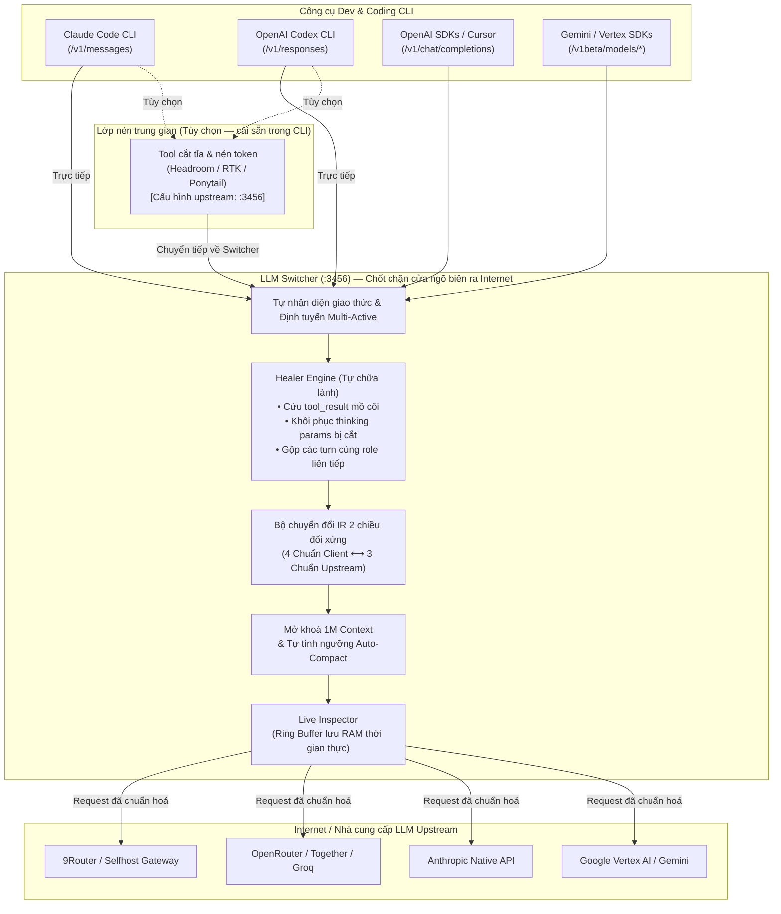
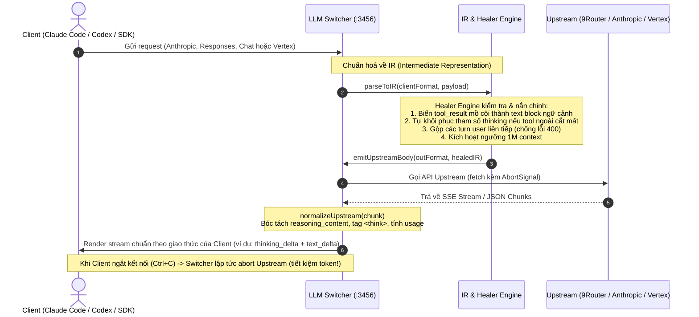
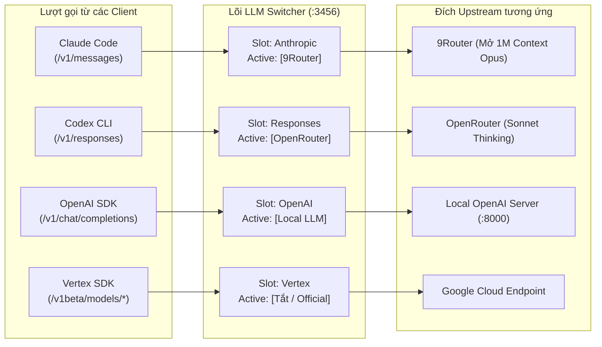

# LLM Switcher (Bản Tiếng Việt)

<p align="center">
  <b>Cổng ngõ biên (Edge Gateway) chuyển đổi đa giao thức LLM siêu nhẹ, Zero-Dependency</b><br>
  Cầu nối hai chiều giữa <b>Claude Code</b>, <b>Codex</b>, OpenAI SDKs, Gemini/Vertex SDKs với mọi nhà cung cấp LLM.<br>
  Chuyển đổi giao thức qua IR, mở khoá 1M context, trích xuất thinking blocks và tự chữa lành đồ thị tin nhắn trước khi ra Internet.
</p>

<p align="center">
  <a href="README.md">English</a> • <b>Tiếng Việt</b>
</p>

<p align="center">
  
  
  
  
  
</p>

---

> ### 🎯 Vấn đề Cốt lõi: Vì sao Proxy Chung Chung Làm "Tê Liệt" Công cụ Coding AI?
>
> Mỗi nhà cung cấp LLM hiện nay sử dụng một **chuẩn API response hoàn toàn khác nhau**:
> - **Anthropic** bắt buộc phải có các block `thinking` riêng biệt (`thinking_delta` + `signature_delta`), luật xen kẽ lượt nghiêm ngặt (`roles must alternate`), và schema `tool_use` có định kiểu.
> - **OpenAI** stream reasoning qua các chunk delta `reasoning_content` hoặc `reasoning_details[]`, và định dạng tool thành `tool_calls` chứa chuỗi JSON arguments.
> - **Google Vertex AI** đặt khối suy luận vào `candidates[0].content.parts[{thought: true, text, thoughtSignature}]` và truyền arguments dạng object thuần.
> - **Các model mã nguồn mở (DeepSeek, Qwen, GLM)** thường đổ thẳng chain-of-thought vào nội dung `content`, hoặc trả trùng lặp nhiều trường gây rối loạn parser.
>
> **Khi các công cụ lập trình cao cấp như Claude Code hoặc Codex nhận về response không chuẩn định dạng gốc, chúng không chỉ hiển thị lỗi — mà hiệu năng và trí thông minh của AI bị suy giảm nghiêm trọng:**
> 1. **Mất Khối Suy Luận (Lost Chain-of-Thought):** Nếu Claude Code không nhận được block `thinking_delta` chuẩn của Anthropic, nó **hoàn toàn không nhận biết được tiến trình suy luận** của model. Agent sẽ hành động vội vàng, bỏ qua bước lập kế hoạch kiến trúc, và sinh ra code lỗi.
> 2. **Lỗi Thực Thi Công Cụ (Broken Tool Calling):** Sự sai lệch về stop reason (`tool_calls` vs `tool_use`) hoặc cách cắt chunk arguments làm agent không parse được tham số lệnh, dẫn đến vòng lặp lỗi vô tận.
> 3. **Lệch Token & Hỏng Prompt Cache:** Tính toán sai cấu trúc token usage làm vỡ cơ chế KV-cache của provider và kích hoạt nén ngữ cảnh (compaction) quá sớm.
>
> Nhiều lập trình viên lầm tưởng model AI "ngày càng ngáo đi", nhưng thực chất là **do proxy trung gian đã làm biến dạng cấu trúc response!**
>
> ### 🛡️ Giải pháp: Giả Lập Chuẩn Gốc Không Hao Hụt (Zero-Loss Native Emulation)
>
> **LLM Switcher giải quyết triệt để bài toán này bằng cơ chế giả lập giao thức chuẩn xác 100%.**
>
> Dù upstream phía sau của bạn là 9Router, OpenRouter, Vertex hay DeepSeek, Switcher sẽ chuẩn hoá và tái tạo lại **chính xác từng byte event stream theo đúng chuẩn mà client đó được thiết kế để tiếp nhận**:
> - **Claude Code** nhận về 100% luồng Anthropic SSE xịn (`message_start` ➔ `thinking_delta` ➔ `signature_delta` ➔ `tool_use` ➔ `message_delta`), hoạt động **mượt mà y hệt như đang dùng gói thuê bao chính chủ đắt đỏ**.
> - **Codex** nhận về 100% luồng Responses API xịn (`response.created` ➔ `output_text.delta` ➔ `function_call` ➔ `response.completed`).
>
> **Bạn vừa được hưởng lợi ích chi phí và độ phủ 1M context của các API bên thứ ba, vừa giữ trọn 100% trí thông minh và sức mạnh của công cụ như dùng gói subscription gốc.**

---

> ### 💡 Triết lý Thiết kế: Phần Mở Rộng Ở Biên Tối Ưu Cho 9Router
>
> **LLM Switcher CỐ TÌNH KHÔNG làm các tính năng xoay vòng API key (key rotation), quản lý account pool, theo dõi quota, hay chia tải (load balancing) giữa nhiều key của cùng một nhà cung cấp.**
>
> Những việc nặng nhọc đó thuộc về các gateway định tuyến chuyên dụng ở phía máy chủ như **[9Router](https://github.com/decolua/9router)**. Máy chủ trung tâm quản lý việc xoay vòng tài khoản, tự động retry khi gặp rate-limit, và tính toán hạn mức tập trung hiệu quả và an toàn hơn rất nhiều so với một công cụ chạy trên từng máy cá nhân.
>
> **LLM Switcher được thiết kế chuẩn xác là phần mở rộng ở biên (Client-Side Edge Extension) tối ưu nhất khi kết hợp với 9Router (hoặc các gateway tương tự):**
> - **Phía máy cá nhân (LLM Switcher đảm nhiệm):** Chuyển đổi giao thức cho các coding tool trên máy bạn (Claude Code `/v1/messages`, Codex `/v1/responses`, Vertex `/v1beta/...`, OpenAI Chat), mở khoá 1M context cục bộ, quản lý đa profile song song cho từng CLI, và làm chốt chặn Healer Engine để tự chữa lành tin nhắn bị các tool nén token ngoài (RTK, Headroom, Ponytail) cắt xén trước khi gửi đi.
> - **Phía máy chủ trung tâm (9Router đảm nhiệm):** Quản lý account pool, xoay vòng API key, chia tải weighted routing, theo dõi quota và tự động failover giữa các nhà cung cấp.
>
> Sự phân định ranh giới rõ ràng này giúp LLM Switcher giữ vững tiêu chí **siêu nhẹ, Zero-Dependency, không phình to tính năng (no bloatware)** nhưng vẫn mang lại trải nghiệm lập trình AI mạnh mẽ nhất.

---

## Kiến trúc & Luồng hoạt động

LLM Switcher lắng nghe cục bộ trên máy bạn (`127.0.0.1:3456`), đóng vai trò là **chốt chặn cuối cùng ở cửa ngõ ra Internet** trước khi request được gửi đến các nhà cung cấp LLM (9Router, OpenRouter, Anthropic, Vertex, v.v.).

### 1. Sơ đồ Tổng quan Hệ thống (System Topology)



---

### 2. Pipeline Chuyển đổi Giao thức qua IR & Healer Engine



---

### 3. Cơ chế Định tuyến Đa CLI Độc lập (Multi-Active Concurrent Routing)

Bạn có thể kích hoạt **đồng thời nhiều profile hoạt động song song** — mỗi công cụ CLI kết nối tới 1 profile riêng biệt mà không hề xung đột:



---

## Tính năng nổi bật

- **Kiến trúc Zero-Dependency:** Xây dựng 100% bằng thư viện chuẩn của Node.js (`http`, `fs`, `os`, `path`, `fetch`). Không cần chạy `npm install`, không kéo theo runtime Bun hay binary nặng, khởi động dưới 50ms.
- **Chuyển đổi Giao thức 2 Chiều Đối xứng:**
  - **4 Định dạng đầu vào (Client):** Anthropic Messages, OpenAI Chat Completions, Codex Responses API, Vertex `generateContent`.
  - **3 Định dạng đầu ra (Upstream):** OpenAI Chat, Anthropic Native, Vertex Native.
- **Multi-Active CLI Routing:** Kích hoạt cùng lúc Claude Code dùng Profile A, Codex dùng Profile B, Cursor dùng Profile C trên cùng 1 gateway mà không tranh chấp cấu hình.
- **Trích xuất Thinking & Reasoning Chuyên sâu:** Kiểm chứng thực tế qua 48 tổ hợp mẫu response live. Tự động bóc tách `reasoning_content`, thẻ `<think>`, các block `thought` của Vertex và thought signature thành các `thinking_delta` chuẩn của Anthropic.
- **Edge Healer Engine (Tự chữa lành tin nhắn):**
  - Khắc phục lỗi mồ côi `tool_result` do các công cụ nén token (RTK, Headroom, Ponytail) vô tình cắt mất turn `assistant` phía trước $\implies$ chống lỗi `HTTP 400 Bad Request`.
  - Tự động bù lại tham số `thinking` nếu tool ngoài cắt mất trên các reasoning model.
  - Gộp các turn cùng role liên tiếp để đáp ứng nghiêm ngặt luật xen kẽ lượt nói của Anthropic.
- **Mở khoá Context 1,000,000 Tokens (1M):** Đi theo `model1M` của profile cho từng tier: tier nào bật 1M thì được `ANTHROPIC_DEFAULT_<TIER>_MODEL=<tier>[1m]` (nên `/model sonnet`, đổi tier hay subagent vẫn giữ 1M; tier không bật thì ở 200K), kèm cửa sổ nén `CLAUDE_CODE_AUTO_COMPACT_WINDOW=900000`, tích hợp badge cảnh báo trực quan cho model không hỗ trợ.
- **Không làm bẩn `settings.json` (Zero Config Mutation):** Tuyệt đối không lưu endpoint hay key vào `~/.claude/settings.json` (chỉ gỡ các biến proxy cũ nếu có). Dùng launcher flags và biến môi trường động để không bao giờ bị hiện banner cảnh báo đỏ.
- **Live Request / Response Inspector:** Bảng theo dõi thời gian thực ngay trên Web UI: xem độ trễ, token prompt/output, preview prompt câu hỏi và khối suy luận thinking.
- **Cài đặt Daemon Service nền:** Cung cấp lệnh cài đặt gateway chạy ngầm tự khởi động cùng hệ điều hành trên Windows (Task Scheduler), macOS (launchd) và Linux (systemd).

---

## Thay đổi trong lần cập nhật này

- Dashboard cho máy tính nay có bố cục gọn như một công cụ dành cho lập trình viên. Các điều khiển route rõ hơn, tab dùng được bằng bàn phím, trường model có nhãn đầy đủ và không còn emoji trang trí.
- Profile Codex dùng ba vai trò theo tài liệu chính thức: `main`, `review` và `subagent`.
- Shim Codex truyền các khóa cấu hình chính thức: `model`, `review_model`, `agents.default_subagent_model`, `model_context_window` và `model_auto_compact_token_limit`.
- Profile cũ vẫn đọc được. Giá trị rỗng ở khóa mới sẽ xóa fallback từ khóa cũ.
- Model Claude Opus được nhận diện khả năng reasoning mà không phụ thuộc số phiên bản.

Shim Codex không còn dựa vào `CODEX_MODEL`, `CODEX_MAX_CONTEXT_TOKENS` hoặc `CODEX_AUTO_COMPACT_WINDOW`. Codex không tài liệu hóa các biến môi trường này. Xem [bảng tham chiếu cấu hình](https://developers.openai.com/codex/config-reference/) và [hướng dẫn cấu hình nâng cao](https://developers.openai.com/codex/config-advanced/) chính thức.

---

## Hướng dẫn Bắt đầu Nhanh

### 1. Yêu cầu hệ thống
- Máy đã cài sẵn Node.js 18 trở lên.
- Không cần cài thêm bất kỳ gói npm nào!

### 2. Cài đặt Cấu hình
Clone repo và tạo file cấu hình cá nhân:
```bash
git clone https://github.com/louisphamdev/llm-switcher.git
cd llm-switcher

# Copy file cấu hình mẫu (config.json đã được gitignore chặn an toàn)
cp config.example.json config.json
```

Điền URL và API key của các nhà cung cấp vào `config.json`.

### 3. Khởi động Gateway
```bash
# Bật gateway chạy ngầm:
node switch.mjs on

# Hoặc chạy trực tiếp trên terminal:
node proxy.mjs
```

Repo có sẵn hai launcher cho cùng một script: `switch` cho Linux và macOS, `switch.cmd`
cho Windows. Thêm thư mục repo vào PATH là `switch <lệnh>` chạy giống nhau trên cả ba.
Khác biệt giữa các nền tảng, và hai tính năng không chạy ở mọi nơi, nằm trong
[📖 `docs/cross-platform.md`](docs/cross-platform.md).

Mở Bảng điều khiển Web Dashboard tại: **[http://127.0.0.1:3456/ui](http://127.0.0.1:3456/ui)**

---

## Tích hợp vào các Công cụ CLI

### Bộ nạp Biến Môi trường Toàn năng (`env.cmd` / `env.sh`)

Mỗi khi bạn chuyển đổi profile, LLM Switcher sẽ tự động sinh file nạp môi trường tương ứng:

- **Trên Windows (CMD / PowerShell wrapper):**
  ```cmd
  call "path\to\llm-switcher\env.cmd"
  ```
- **Trên macOS / Linux (Bash / Zsh):**
  ```bash
  source "path/to/llm-switcher/env.sh"
  ```

---

### Cấu hình cho Claude Code (Windows)

1. Tạo file wrapper trong thư mục PATH (ví dụ `cc-switch.cmd`):
   ```cmd
   @echo off
   node "path\to\llm-switcher\switch.mjs" %*
   ```

2. Thêm đoạn mã sau vào wrapper chính của Claude Code (`claude.cmd` trong thư mục global npm):
   ```cmd
   SETLOCAL EnableDelayedExpansion
   IF EXIST "path\to\llm-switcher\active.flag" (
     SET "ANTHROPIC_BASE_URL=http://127.0.0.1:3456"
     SET "CLAUDE_CODE_DISABLE_UNKNOWN_MODEL_WINDOW_ENFORCEMENT=1"
   )
   IF EXIST "path\to\llm-switcher\1m.flag" (
     SET /P M1M=<"path\to\llm-switcher\1m.flag"
     IF "!M1M!"=="" SET "M1M=opus[1m]"
     SET "ANTHROPIC_MODEL=!M1M!"
     SET "CLAUDE_CODE_AUTO_COMPACT_WINDOW=900000"
   )
   ```
   > Cần `SETLOCAL EnableDelayedExpansion` để `!M1M!` hoạt động. npm ghi đè `claude.cmd` mỗi lần update, nên tốt hơn là tạo wrapper riêng chạy `call "path\to\llm-switcher\env.cmd"` rồi `claude %*`. Chỉ `env.cmd` / `env.sh` mới có các biến `ANTHROPIC_DEFAULT_<TIER>_MODEL=<tier>[1m]` theo từng tier.

---

### Cấu hình ưu tiên Codex

Cài shim, đặt thư mục shim lên đầu `PATH`, rồi kích hoạt một profile tương thích với Codex:

```bash
switch shim install
export PATH="$HOME/.llm-switcher/bin:$PATH"   # Bash hoặc Zsh
switch codex <profile>
switch shim status
codex
```

Trên Windows, đặt `%USERPROFILE%\.llm-switcher\bin` trước thư mục Codex thật trong `PATH`. Sau đó, mở terminal mới.

Shim không sửa `~/.codex/config.toml`. Khi gateway hoạt động, shim truyền các override chính thức sau vào binary Codex thật:

| Vai trò trong profile | Khóa cấu hình Codex | Tên mà CLI nhận được |
|---|---|---|
| `main` | `model` | `publicModels[0]` |
| `review` | `review_model` | `publicModels[1]` |
| `subagent` | `agents.default_subagent_model` | `publicModels[2]` |

**Codex không bao giờ nhận tên nội bộ.** Alias `main`, `review`, `subagent` chỉ tồn tại bên trong gateway. CLI nhận tên model chính thức từ `publicModels`, và `mapModel` phân giải ngược từng tên về đúng slot. Đặt `codexRoles` trong profile nếu muốn ghép khác thứ tự danh sách đó.

Shim còn truyền `model_catalog_json`. File này được sinh lại từ `publicModels` mỗi lần đổi profile, và màn `/model` đọc chính nó. Màn `/model` không gọi `/v1/models`.

Shim cũng truyền `openai_base_url` để route qua gateway cục bộ. Nếu `main` bật context 1M, shim truyền `model_context_window=1000000` và `model_auto_compact_token_limit=900000`. Override dòng lệnh có độ ưu tiên cao hơn cấu hình người dùng và dự án. Hãy chạy lại `switch shim install` sau khi nâng cấp từ bản cũ.

### Chế độ blindfold (tùy chọn)

Khi có override base URL, Codex in một dòng ngay trên màn `/model` của nó:

```
base URL is overridden to http://127.0.0.1:3456/v1. Selecting models may not be supported or work properly.
```

Blindfold xóa dòng đó. Codex giữ nguyên endpoint chính thức, switcher chặn ở tầng mạng. Không cần quyền admin, không cài chứng chỉ vào system trust store, không sửa `~/.codex/config.toml`.

```bash
bash blindfold/make-certs.sh chatgpt.com   # chạy một lần
# rồi đặt "blindfold": true trong profile Codex
switch codex <profile>                     # interceptor khởi động cùng gateway
```

`switch` khởi động interceptor cùng gateway và dừng nó bằng `switch off`. Thiếu CA thì `switch` từ chối kích hoạt và không ghi file nào.

Hãy đọc [📖 `docs/codex-blindfold.md`](docs/codex-blindfold.md) trước khi bật. Tài liệu nói rõ phạm vi chặn, rủi ro khi giữ private key của CA, và cách quay lại. Mở đầu là ba sơ đồ:

- [Request routing](docs/diagrams/blindfold-request-routing.html) — một request, từ CONNECT tới provider
- [Model name resolution](docs/diagrams/codex-model-name-resolution.html) — CLI thấy tên nào, và tên đó phân giải ở đâu
- [Lifecycle under switch](docs/diagrams/blindfold-switch-lifecycle.html) — kích hoạt, từ chối, và tắt

---

## Hoạt động Cùng các Tool Nén Token (RTK, Headroom, Ponytail)

Nếu bạn sử dụng các tool cắt tỉa prompt như **Headroom**, **Ponytail** hoặc **RTK (Rust Token Killer)**:
1. Cấu hình CLI của bạn (Claude Code / Codex) trỏ vào tool nén đó (ví dụ: `http://127.0.0.1:8787`).
2. Cấu hình endpoint upstream trong tool nén đó trỏ về **LLM Switcher** (`http://127.0.0.1:3456`).
3. **LLM Switcher** sẽ đóng vai trò là trạm kiểm soát cuối cùng trước khi ra internet:
   - **Tự chữa lành đồ thị tin nhắn:** Cứu các lượt `tool_result` mồ côi và gộp các lượt cùng role liên tiếp do tool nén cắt xén bừa bãi gây ra.
   - **Khôi phục thinking bị xóa:** Tự động phát hiện reasoning model và khôi phục lại tham số thinking nếu bị tool ngoài xóa mất để "tiết kiệm token".
   - **Giữ nguyên 1M Context Window:** Tự động mở khoá 1M context và ngưỡng compact `900,000` tokens.
   - **Chuyển đổi 2 chiều:** Kết nối chuẩn sang 9Router, OpenRouter, Vertex, Anthropic.

### Báo cáo Kiểm thử & Đo lường Khả năng Tương thích

| Kịch bản Lỗi do Tool Nén Gây Ra | Gọi Thẳng Upstream (Không qua Switcher) | Đi qua LLM Switcher (Healer Engine) |
|---|---|---|
| **Turn `tool_result` mồ côi** (Headroom cắt mất turn `tool_use`) | ❌ **HTTP 400 Crash**: `tool_use_id does not correspond to any tool_use` | ✅ **HTTP 200 OK**: Chữa lành thành block văn bản ngữ cảnh an toàn |
| **Các turn `user` liên tiếp** (Tool nén bỏ sót turn assistant) | ❌ **HTTP 400 Crash**: `roles must alternate` | ✅ **HTTP 200 OK**: Tự động gộp các turn liền kề mượt mà |
| **Bị xóa tham số `thinking`** (Tool nén triệt tiêu reasoning) | ⚠️ **AI bị giảm chất lượng**: Mất suy luận, ra code ẩu | ✅ **HTTP 200 OK**: Tự động khôi phục thinking budget an toàn |
| **Role `tool` mồ côi trong Chat API** | ❌ **HTTP 400 Crash**: `tool role must respond to tool_calls` | ✅ **HTTP 200 OK**: Chuyển thành user context hợp lệ |
| **Header tracing riêng của tool** (`x-rtk-*`, `traceparent`) | ⚠️ Rớt kết nối / cảnh báo header lạ | ✅ **HTTP 200 OK**: Chuyển tiếp trong suốt 100% |

Chạy bộ kiểm thử tự động trên máy bạn:
```bash
# Offline (mock upstream, không cần API key): chuyển đổi giao thức, healer, streaming, bảo mật
npm test

# Live (cần gateway đang chạy và upstream thật; tốn token)
node tests/live-optimizer-interop.mjs
```

Đọc báo cáo nghiên cứu kỹ thuật chuyên sâu tại: [📖 `docs/TOKEN-OPTIMIZER-INTEROP.md`](docs/TOKEN-OPTIMIZER-INTEROP.md).

---

## Tích hợp Agent Skill & MCP Server (Chống Chạy Bậy)

Để đảm bảo các AI coding agent (Claude Code, Cursor, Windsurf, Opencode) và các tiến trình con (sub-agents) **không bao giờ vượt rào gọi thẳng ra internet**, dự án cung cấp 2 giải pháp điều khiển:

### 1. Agent Skill Chuyên dụng (`skills/llm-switcher/SKILL.md`)
Một Agent Skill theo chuẩn quốc tế hướng dẫn AI model:
- **Định tuyến bắt buộc:** Mọi lượt gọi LLM và tool nén (Headroom, RTK, Ponytail) BẮT BUỘC phải trỏ về `http://127.0.0.1:3456`.
- **Cấm sửa `settings.json`:** Tuyệt đối cấm agent ghi đè endpoint vào `~/.claude/settings.json`.
- **An toàn cho Sub-process:** Tự động nạp `env.cmd` hoặc `env.sh` trước khi spawn lệnh terminal con.

Cài đặt vào thư mục skill:
```bash
# Cho Opencode:
cp -r skills/llm-switcher ~/.config/opencode/skills/

# Cho Claude Code:
cp -r skills/llm-switcher ~/.claude/skills/
```

### 2. MCP Server Chuẩn (`mcp.mjs`)
Một server Model Context Protocol (MCP) chạy qua `stdio` cực nhẹ (Zero-dependency):
- `switcher_status`: Đọc trạng thái live của các CLI target và cờ 1M.
- `switcher_audit`: Quét môi trường máy xem có tool nén nào chạy bậy gọi thẳng ra ngoài không.
- `switcher_switch_profile`: Cho phép agent tự động chuyển đổi profile theo nhu cầu bài toán.
- `switcher_recent_logs`: Đọc log gần nhất để tự debug khi output bị cắt cụt.

Thêm vào cấu hình MCP (ví dụ `opencode.jsonc`, `claude_desktop_config.json`, hoặc Cursor):
```json
"mcp": {
  "llm-switcher": {
    "type": "local",
    "command": ["node", "path/to/llm-switcher/mcp.mjs"],
    "enabled": true
  }
}
```

---

## Bảng Tra cứu Lệnh CLI (`switch`)

```bash
switch ui                      # Mở giao diện Web UI trên trình duyệt
switch status                  # Xem trạng thái kích hoạt của tất cả các CLI
switch doctor                  # Quét & thanh tra toàn bộ môi trường, settings và định tuyến
switch on [profile]            # Khởi động gateway và kích hoạt profile cho mọi target tương thích
switch <profile>               # Kích hoạt profile cho tất cả các target tương thích
switch claude <profile>        # Đặt profile kích hoạt riêng cho Claude Code
switch codex <profile>         # Đặt profile kích hoạt riêng cho Codex
switch openai <profile>        # Đặt profile kích hoạt riêng cho OpenAI Chat
switch vertex <profile>        # Đặt profile kích hoạt riêng cho Vertex / Gemini
switch port <number>           # Đổi cổng gateway (tự restart nếu đang chạy)
switch service install         # Cài đặt gateway thành service chạy ngầm tự bật cùng máy
switch service uninstall       # Gỡ bỏ service chạy ngầm
switch shim install            # Route phiên Claude và Codex mới qua gateway
switch shim status             # Kiểm tra shim + phát hiện phiên đang chạy ngoài gateway
switch shim uninstall          # Gỡ shim khỏi launcher
switch off [target]            # Tắt gateway (toàn bộ hoặc từng CLI) và quay về gói Official
```

### Phiên mở lại (`--resume`) và cơ chế shim — quan trọng

`switch on` ghi `env.sh` / `env.cmd` và **chủ động xoá** các biến proxy khỏi
`~/.claude/settings.json` để Claude Code không hiện banner "custom API". Hệ quả: một CLI
khởi chạy từ shell **chưa** source `env.sh` sẽ không có `ANTHROPIC_BASE_URL`, nên gọi
thẳng nhà cung cấp và bỏ qua gateway (mất Healer, mất 1M, mất quota gộp). Trường hợp kinh
điển là `claude --resume` mở lại phiên cũ trong terminal sạch.

Shim bịt đúng lỗ đó. Nó cài wrapper nhỏ vào `~/.llm-switcher/bin`, wrapper source `env.sh`
rồi `exec` binary thật:

```bash
switch shim install
export PATH="$HOME/.llm-switcher/bin:$PATH"   # thêm vào ~/.zshrc hoặc ~/.bashrc
switch shim status                            # kiểm tra lại
```

Cách hoạt động:

- **Gateway BẬT** → wrapper nạp env, nên mọi lần gọi (kể cả `--resume`) đều qua gateway.
- Với Codex, wrapper truyền các khóa vai trò model và context chính thức bằng `--config`.
  Wrapper không phụ thuộc vào các biến `CODEX_*` không được hỗ trợ.
- **Gateway TẮT** (không có `active.flag`) → wrapper trong suốt hoàn toàn, chạy binary thật
  nguyên trạng, không ép định tuyến.
- Wrapper tìm binary thật sau khi **loại thư mục shim khỏi `PATH`**, nên không bao giờ tự
  gọi đệ quy chính nó. Không tìm thấy binary thật thì thoát mã `127` kèm thông báo rõ ràng,
  không im lặng.
- Không đụng `settings.json`, nên **không hiện banner cảnh báo**.

`switch on` tự cài shim và nhắc nếu `PATH` còn thiếu dòng export. Ngoài ra `switch doctor`
và `switch shim status` còn quét các tiến trình `claude`/`codex` đang chạy và cảnh báo
tiến trình nào thiếu `ANTHROPIC_BASE_URL` — phiên đó phải thoát và mở lại từ shell có shim
trong `PATH`.

---

## Cấu trúc Cấu hình (`config.json`)

```jsonc
{
  "port": 3456,
  "activeProfile": "9router",
  "activeProfiles": {
    "anthropic": "9router",          // Profile active cho Claude Code (/v1/messages)
    "responses": "codex-profile",    // Profile active cho Codex (/v1/responses)
    "openai-chat": "9router",        // Profile active cho OpenAI Chat
    "vertex": "gemini-profile"       // Profile active cho Vertex / Gemini
  },
  "profiles": {
    "9router": {
      "name": "9Router Cloud",
      "mode": "convert",             // hybrid | convert | direct
      "inFormat": "auto",            // auto | anthropic | openai-chat | responses | vertex
      "outFormat": "openai-chat",    // openai-chat | anthropic | vertex
      "thinkingMode": "auto",        // auto | native | off (xem Tuỳ chọn Nâng cao)
      "baseURL": "https://api.9router.com/v1",
      "apiKey": "sk-...",
      "defaultModels": {
        "opus": "ag/claude-opus-4-6-thinking",
        "sonnet": "ag/gemini-3.7-flash",
        "haiku": "ag/gemini-3.6-flash-medium",
        "fable": "ag/gemini-3.8-flash"
      },
      "model1M": {
        "opus": true,
        "sonnet": true,
        "haiku": false,
        "fable": true
      }
    }
  },
  "debug": false
}
```

---

## Tuỳ chọn Nâng cao

| Tuỳ chọn | Mô tả |
|---|---|
| `LLM_SWITCHER_CONFIG=/path/config.json` | Dùng file cấu hình nằm ngoài repo (proxy, `switch` và `mcp.mjs` đều hỗ trợ). |
| `--port <n>` / `LLM_SWITCHER_PORT` | Ghi đè cổng lắng nghe (ưu tiên: flag > env > `config.port`). |
| Header `x-llm-profile: <key>` hoặc `?profile=<key>` | Định tuyến riêng 1 request qua profile chỉ định. Key không tồn tại trả HTTP 400 thay vì âm thầm dùng profile khác. |
| `profile.thinkingMode` | `auto` (mặc định, cho gateway như 9Router): phục hồi thinking bị xoá, chèn hướng dẫn `<think>` cho model không có reasoning, gửi `thinking` + `reasoning_effort`. `native` (API OpenAI nghiêm ngặt): chỉ gửi `reasoning_effort` khi client yêu cầu, không sửa prompt, dùng `max_completion_tokens`. `off`: không bao giờ gửi tham số reasoning. |
| `profile.endpoints.countTokens` | Ghi đè URL `count_tokens` của Anthropic. |
| `profile.endpoints` | Ghi đè URL upstream theo từng format: `{ "openai-chat": "...", "anthropic": "...", "vertex": "https://.../models/{model}:{action}" }`. |
| `CLAUDE_CONFIG_DIR` | Được tôn trọng khi tìm `settings.json` của Claude Code. |

## Mô hình Bảo mật

- Gateway chỉ lắng nghe `127.0.0.1` và từ chối request có `Host` không phải loopback (chống DNS rebinding) hoặc `Origin` không phải chính dashboard (chống CSRF).
- API key không bao giờ gửi xuống trình duyệt: `/api/status` trả profile đã che key, dashboard giữ nguyên key đã lưu nếu bạn không nhập key mới.
- Credential của client (`x-api-key`, `authorization`, `x-goog-api-key`) **không** được chuyển tiếp lên upstream; chỉ các header tracing (`x-*`, `traceparent`) được passthrough.
- `config.json` được ghi atomic; `~/.claude/settings.json` chỉ bị ghi lại khi thực sự còn biến proxy cũ.

## Ghi chú Tương thích

- **Direct passthrough Anthropic:** request hợp lệ được chuyển tiếp nguyên bytes (giữ thinking signature, `cache_control`, document). Request lỗi được healer native của Anthropic sửa tại chỗ: `tool_result` mồ côi → text, thiếu `tool_result` → placeholder, đưa result lên đầu user turn.
- **Chữ ký thinking:** thinking block sinh ra khi convert mang chữ ký của gateway (`reasoning-sig`, hoặc chữ ký provider khác có prefix `lsw1.`) và bị gỡ trước khi tới Anthropic. Nếu việc gỡ làm vòng tool đang dở thiếu thinking block mà Anthropic bắt buộc, gateway tắt thinking cho riêng request đó thay vì để lỗi.
- **Tool của Codex:** tool `custom`/freeform (VD `apply_patch` với Lark grammar), tool `namespace` và `local_shell` được đưa lên upstream dưới dạng function tool rồi chuyển ngược thành item `custom_tool_call` / `function_call` có namespace / `local_shell_call`. Hosted tool (`web_search`, `file_search`, `tool_search`, sinh ảnh) chạy trên server OpenAI nên upstream khác không cung cấp được và bị lược bỏ.
- **Thought signature của Gemini 3:** chữ ký đi kèm function call được cache trong RAM theo tool call id (5.000 call gần nhất) và gắn lại vào đúng part `functionCall`, kể cả qua `extra_content` của endpoint OpenAI-compatible của Gemini. Sau khi restart gateway, call không rõ chữ ký trong lượt hiện tại dùng giá trị `skip_thought_signature_validator` mà Google cho phép (Google lưu ý có thể giảm chất lượng).
- **`/v1/messages/count_tokens`:** chính xác khi profile của Claude Code dùng upstream Anthropic native; các trường hợp khác là ước lượng (provider khác không có endpoint tương đương).

## Nghiên cứu & Ma trận Giao thức Response

Dữ liệu khảo sát chi tiết và kết quả test live 48 biến thể response được ghi lại tại:
- 📖 [`docs/LLM-RESPONSE-MATRIX.md`](docs/LLM-RESPONSE-MATRIX.md) — Báo cáo khảo sát 48 biến thể live trên 8 họ model.
- 📊 [`docs/response-matrix.json`](docs/response-matrix.json) — Schema cấu trúc dữ liệu response machine-readable.

---

## Giấy phép

Phát hành theo giấy phép MIT © 2026 LLM Switcher Contributors.
