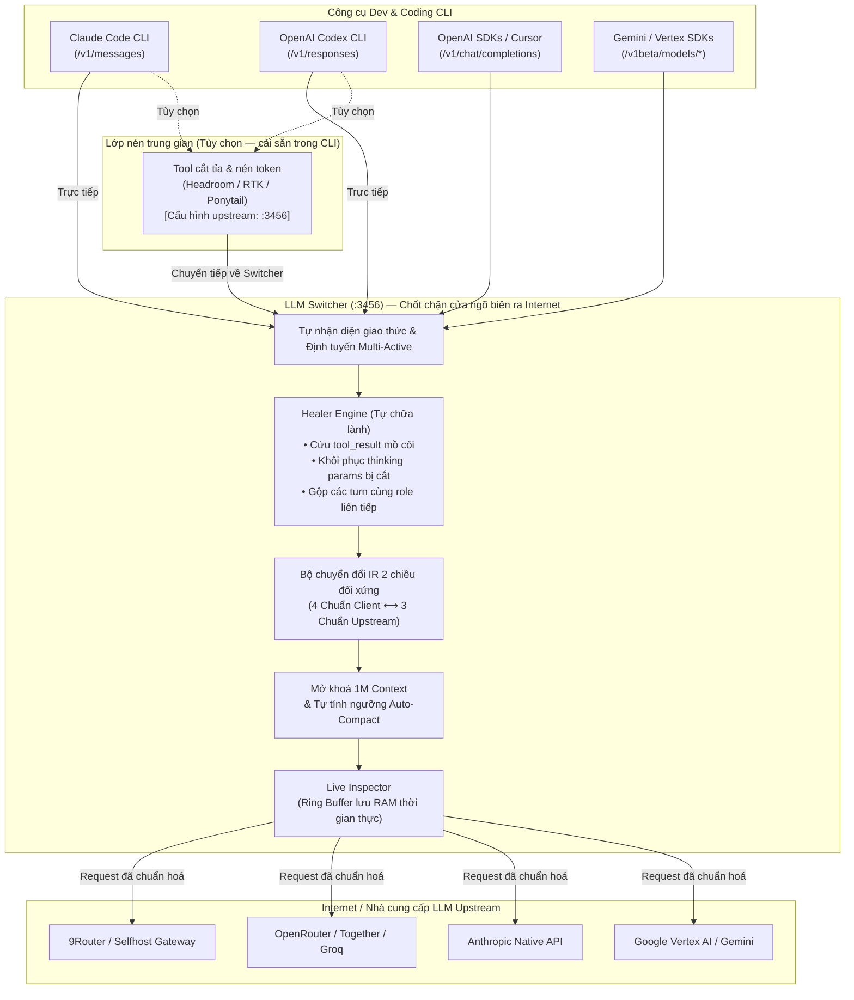
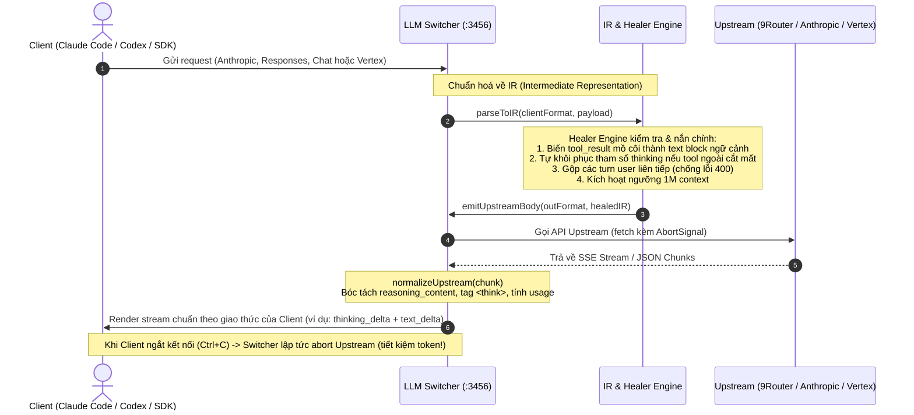
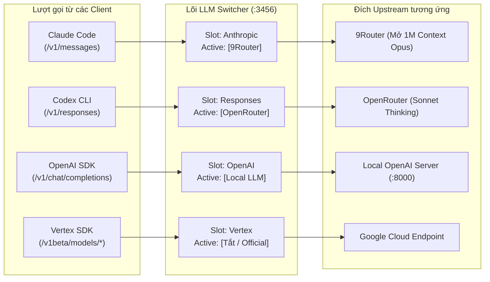

# LLM Switcher (Bản Tiếng Việt)

<p align="center">
  <b>Cổng ngõ biên (Edge Gateway) chuyển đổi đa giao thức LLM siêu nhẹ, Zero-Dependency</b><br>
  Cầu nối hai chiều giữa <b>Claude Code</b>, <b>Codex</b>, OpenAI SDKs, Gemini/Vertex SDKs với mọi nhà cung cấp LLM.<br>
  Chuyển đổi giao thức qua IR, mở khoá 1M context, trích xuất thinking blocks và tự chữa lành đồ thị tin nhắn trước khi ra Internet.
</p>

<p align="center">
  <a href="README.md">English</a> • <b>Tiếng Việt</b>
</p>

<p align="center">
  
  
  
  
  
</p>

---

> ### 💡 Triết lý Thiết kế: Phần Mở Rộng Ở Biên Tối Ưu Cho 9Router
>
> **LLM Switcher CỐ TÌNH KHÔNG làm các tính năng xoay vòng API key (key rotation), quản lý account pool, theo dõi quota, hay chia tải (load balancing) giữa nhiều key của cùng một nhà cung cấp.**
>
> Những việc nặng nhọc đó thuộc về các gateway định tuyến chuyên dụng ở phía máy chủ như **[9Router](https://github.com/decolua/9router)**. Máy chủ trung tâm quản lý việc xoay vòng tài khoản, tự động retry khi gặp rate-limit, và tính toán hạn mức tập trung hiệu quả và an toàn hơn rất nhiều so với một công cụ chạy trên từng máy cá nhân.
>
> **LLM Switcher được thiết kế chuẩn xác là phần mở rộng ở biên (Client-Side Edge Extension) tối ưu nhất khi kết hợp với 9Router (hoặc các gateway tương tự):**
> - **Phía máy cá nhân (LLM Switcher đảm nhiệm):** Chuyển đổi giao thức cho các coding tool trên máy bạn (Claude Code `/v1/messages`, Codex `/v1/responses`, Vertex `/v1beta/...`, OpenAI Chat), mở khoá 1M context cục bộ, quản lý đa profile song song cho từng CLI, và làm chốt chặn Healer Engine để tự chữa lành tin nhắn bị các tool nén token ngoài (RTK, Headroom, Ponytail) cắt xén trước khi gửi đi.
> - **Phía máy chủ trung tâm (9Router đảm nhiệm):** Quản lý account pool, xoay vòng API key, chia tải weighted routing, theo dõi quota và tự động failover giữa các nhà cung cấp.
>
> Sự phân định ranh giới rõ ràng này giúp LLM Switcher giữ vững tiêu chí **siêu nhẹ, Zero-Dependency, không phình to tính năng (no bloatware)** nhưng vẫn mang lại trải nghiệm lập trình AI mạnh mẽ nhất.

---

## Kiến trúc & Luồng hoạt động

LLM Switcher lắng nghe cục bộ trên máy bạn (`127.0.0.1:3456`), đóng vai trò là **chốt chặn cuối cùng ở cửa ngõ ra Internet** trước khi request được gửi đến các nhà cung cấp LLM (9Router, OpenRouter, Anthropic, Vertex, v.v.).

### 1. Sơ đồ Tổng quan Hệ thống (System Topology)



---

### 2. Pipeline Chuyển đổi Giao thức qua IR & Healer Engine



---

### 3. Cơ chế Định tuyến Đa CLI Độc lập (Multi-Active Concurrent Routing)

Bạn có thể kích hoạt **đồng thời nhiều profile hoạt động song song** — mỗi công cụ CLI kết nối tới 1 profile riêng biệt mà không hề xung đột:



---

## Tính năng nổi bật

- **Kiến trúc Zero-Dependency:** Xây dựng 100% bằng thư viện chuẩn của Node.js (`http`, `fs`, `os`, `path`, `fetch`). Không cần chạy `npm install`, không kéo theo runtime Bun hay binary nặng, khởi động dưới 50ms.
- **Chuyển đổi Giao thức 2 Chiều Đối xứng:**
  - **4 Định dạng đầu vào (Client):** Anthropic Messages, OpenAI Chat Completions, Codex Responses API, Vertex `generateContent`.
  - **3 Định dạng đầu ra (Upstream):** OpenAI Chat, Anthropic Native, Vertex Native.
- **Multi-Active CLI Routing:** Kích hoạt cùng lúc Claude Code dùng Profile A, Codex dùng Profile B, Cursor dùng Profile C trên cùng 1 gateway mà không tranh chấp cấu hình.
- **Trích xuất Thinking & Reasoning Chuyên sâu:** Kiểm chứng thực tế qua 48 tổ hợp mẫu response live. Tự động bóc tách `reasoning_content`, thẻ `<think>`, các block `thought` của Vertex và thought signature thành các `thinking_delta` chuẩn của Anthropic.
- **Edge Healer Engine (Tự chữa lành tin nhắn):**
  - Khắc phục lỗi mồ côi `tool_result` do các công cụ nén token (RTK, Headroom, Ponytail) vô tình cắt mất turn `assistant` phía trước $\implies$ chống lỗi `HTTP 400 Bad Request`.
  - Tự động bù lại tham số `thinking` nếu tool ngoài cắt mất trên các reasoning model.
  - Gộp các turn cùng role liên tiếp để đáp ứng nghiêm ngặt luật xen kẽ lượt nói của Anthropic.
- **Mở khoá Context 1,000,000 Tokens (1M):** Tự động thiết lập `CLAUDE_CODE_MAX_CONTEXT_TOKENS=1000000` và tính toán cửa sổ nén `CLAUDE_CODE_AUTO_COMPACT_WINDOW=900000`, tích hợp badge cảnh báo trực quan cho model không hỗ trợ.
- **Không làm bẩn `settings.json` (Zero Config Mutation):** Tuyệt đối không lưu đè endpoint vào `~/.claude/settings.json`. Dùng launcher flags và biến môi trường động để không bao giờ bị hiện banner cảnh báo đỏ.
- **Live Request / Response Inspector:** Bảng theo dõi thời gian thực ngay trên Web UI: xem độ trễ, token prompt/output, preview prompt câu hỏi và khối suy luận thinking.
- **Cài đặt Daemon Service nền:** Cung cấp lệnh cài đặt gateway chạy ngầm tự khởi động cùng hệ điều hành trên Windows (Task Scheduler), macOS (launchd) và Linux (systemd).

---

## Hướng dẫn Bắt đầu Nhanh

### 1. Yêu cầu hệ thống
- Máy đã cài sẵn Node.js 18 trở lên.
- Không cần cài thêm bất kỳ gói npm nào!

### 2. Cài đặt Cấu hình
Clone repo và tạo file cấu hình cá nhân:
```bash
git clone https://github.com/your-username/llm-switcher.git
cd llm-switcher

# Copy file cấu hình mẫu (config.json đã được gitignore chặn an toàn)
cp config.example.json config.json
```

Điền URL và API key của các nhà cung cấp vào `config.json`.

### 3. Khởi động Gateway
```bash
# Bật gateway chạy ngầm:
node switch.mjs on

# Hoặc chạy trực tiếp trên terminal:
node proxy.mjs
```

Mở Bảng điều khiển Web Dashboard tại: **[http://127.0.0.1:3456/ui](http://127.0.0.1:3456/ui)**

---

## Tích hợp vào các Công cụ CLI

### Bộ nạp Biến Môi trường Toàn năng (`env.cmd` / `env.sh`)

Mỗi khi bạn chuyển đổi profile, LLM Switcher sẽ tự động sinh file nạp môi trường tương ứng:

- **Trên Windows (CMD / PowerShell wrapper):**
  ```cmd
  call "path\to\llm-switcher\env.cmd"
  ```
- **Trên macOS / Linux (Bash / Zsh):**
  ```bash
  source "path/to/llm-switcher/env.sh"
  ```

---

### Cấu hình cho Claude Code (Windows)

1. Tạo file wrapper trong thư mục PATH (ví dụ `cc-switch.cmd`):
   ```cmd
   @echo off
   node "path\to\llm-switcher\switch.mjs" %*
   ```

2. Thêm đoạn mã sau vào wrapper chính của Claude Code (`claude.cmd` trong thư mục global npm):
   ```cmd
   IF EXIST "path\to\llm-switcher\active.flag" (
     SET "ANTHROPIC_BASE_URL=http://127.0.0.1:3456"
     SET "CLAUDE_CODE_DISABLE_UNKNOWN_MODEL_WINDOW_ENFORCEMENT=1"
   )
   IF EXIST "path\to\llm-switcher\1m.flag" (
     SET /P M1M=<"path\to\llm-switcher\1m.flag"
     IF "!M1M!"=="" SET "M1M=opus[1m]"
     SET "ANTHROPIC_MODEL=!M1M!"
     SET "CLAUDE_CODE_MAX_CONTEXT_TOKENS=1000000"
     SET "CLAUDE_CODE_AUTO_COMPACT_WINDOW=900000"
   )
   ```

---

### Cấu hình cho Codex CLI (Windows)

Trong file wrapper của Codex (`codex.cmd`):
```cmd
IF EXIST "path\to\llm-switcher\active.flag" (
  SET "CODEX_BASE_URL=http://127.0.0.1:3456/v1"
  SET "OPENAI_BASE_URL=http://127.0.0.1:3456/v1"
)
IF EXIST "path\to\llm-switcher\codex-1m.flag" (
  SET /P CMODEL=<"path\to\llm-switcher\codex-1m.flag"
  SET "CODEX_MODEL=!CMODEL!"
  SET "CODEX_MAX_CONTEXT_TOKENS=1000000"
  SET "CODEX_AUTO_COMPACT_WINDOW=900000"
)
```

---

## Hoạt động Cùng các Tool Nén Token (RTK, Headroom, Ponytail)

Nếu bạn sử dụng các tool cắt tỉa prompt như **Headroom**, **Ponytail** hoặc **RTK (Rust Token Killer)**:
1. Cấu hình CLI của bạn (Claude Code / Codex) trỏ vào tool nén đó (ví dụ: `http://127.0.0.1:8787`).
2. Cấu hình endpoint upstream trong tool nén đó trỏ về **LLM Switcher** (`http://127.0.0.1:3456`).
3. **LLM Switcher** sẽ đóng vai trò là trạm kiểm soát cuối cùng trước khi ra internet:
   - **Tự chữa lành đồ thị tin nhắn:** Cứu các lượt `tool_result` mồ côi và gộp các lượt cùng role liên tiếp do tool nén cắt xén bừa bãi gây ra.
   - **Khôi phục thinking bị xóa:** Tự động phát hiện reasoning model và khôi phục lại tham số thinking nếu bị tool ngoài xóa mất để "tiết kiệm token".
   - **Giữ nguyên 1M Context Window:** Tự động mở khoá 1M context và ngưỡng compact `900,000` tokens.
   - **Chuyển đổi 2 chiều:** Kết nối chuẩn sang 9Router, OpenRouter, Vertex, Anthropic.

### Báo cáo Kiểm thử & Đo lường Khả năng Tương thích

| Kịch bản Lỗi do Tool Nén Gây Ra | Gọi Thẳng Upstream (Không qua Switcher) | Đi qua LLM Switcher (Healer Engine) |
|---|---|---|
| **Turn `tool_result` mồ côi** (Headroom cắt mất turn `tool_use`) | ❌ **HTTP 400 Crash**: `tool_use_id does not correspond to any tool_use` | ✅ **HTTP 200 OK**: Chữa lành thành block văn bản ngữ cảnh an toàn |
| **Các turn `user` liên tiếp** (Tool nén bỏ sót turn assistant) | ❌ **HTTP 400 Crash**: `roles must alternate` | ✅ **HTTP 200 OK**: Tự động gộp các turn liền kề mượt mà |
| **Bị xóa tham số `thinking`** (Tool nén triệt tiêu reasoning) | ⚠️ **AI bị giảm chất lượng**: Mất suy luận, ra code ẩu | ✅ **HTTP 200 OK**: Tự động khôi phục thinking budget an toàn |
| **Role `tool` mồ côi trong Chat API** | ❌ **HTTP 400 Crash**: `tool role must respond to tool_calls` | ✅ **HTTP 200 OK**: Chuyển thành user context hợp lệ |
| **Header tracing riêng của tool** (`x-rtk-*`, `traceparent`) | ⚠️ Rớt kết nối / cảnh báo header lạ | ✅ **HTTP 200 OK**: Chuyển tiếp trong suốt 100% |

Chạy bộ kiểm thử tự động trên máy bạn:
```bash
node tests/test-optimizer-interop.mjs
# Kết quả: 5 PASSED / 0 FAILED (Chữa lành thành công 100%)
```

Đọc báo cáo nghiên cứu kỹ thuật chuyên sâu tại: [📖 `docs/TOKEN-OPTIMIZER-INTEROP.md`](docs/TOKEN-OPTIMIZER-INTEROP.md).

---

## Tích hợp Agent Skill & MCP Server (Chống Chạy Bậy)

Để đảm bảo các AI coding agent (Claude Code, Cursor, Windsurf, Opencode) và các tiến trình con (sub-agents) **không bao giờ vượt rào gọi thẳng ra internet**, dự án cung cấp 2 giải pháp điều khiển:

### 1. Agent Skill Chuyên dụng (`skills/llm-switcher/SKILL.md`)
Một Agent Skill theo chuẩn quốc tế hướng dẫn AI model:
- **Định tuyến bắt buộc:** Mọi lượt gọi LLM và tool nén (Headroom, RTK, Ponytail) BẮT BUỘC phải trỏ về `http://127.0.0.1:3456`.
- **Cấm sửa `settings.json`:** Tuyệt đối cấm agent ghi đè endpoint vào `~/.claude/settings.json`.
- **An toàn cho Sub-process:** Tự động nạp `env.cmd` hoặc `env.sh` trước khi spawn lệnh terminal con.

Cài đặt vào thư mục skill:
```bash
# Cho Opencode:
cp -r skills/llm-switcher ~/.config/opencode/skills/

# Cho Claude Code:
cp -r skills/llm-switcher ~/.claude/skills/
```

### 2. MCP Server Chuẩn (`mcp.mjs`)
Một server Model Context Protocol (MCP) chạy qua `stdio` cực nhẹ (Zero-dependency):
- `switcher_status`: Đọc trạng thái live của các CLI target và cờ 1M.
- `switcher_audit`: Quét môi trường máy xem có tool nén nào chạy bậy gọi thẳng ra ngoài không.
- `switcher_switch_profile`: Cho phép agent tự động chuyển đổi profile theo nhu cầu bài toán.
- `switcher_recent_logs`: Đọc log gần nhất để tự debug khi output bị cắt cụt.

Thêm vào cấu hình MCP (ví dụ `opencode.jsonc`, `claude_desktop_config.json`, hoặc Cursor):
```json
"mcp": {
  "llm-switcher": {
    "type": "local",
    "command": ["node", "path/to/llm-switcher/mcp.mjs"],
    "enabled": true
  }
}
```

---

## Bảng Tra cứu Lệnh CLI (`switch`)

```bash
switch ui                      # Mở giao diện Web UI trên trình duyệt
switch status                  # Xem trạng thái kích hoạt của tất cả các CLI
switch doctor                  # Quét & thanh tra toàn bộ môi trường, settings và định tuyến
switch <profile>               # Kích hoạt profile cho tất cả các target tương thích
switch claude <profile>        # Đặt profile kích hoạt riêng cho Claude Code
switch codex <profile>         # Đặt profile kích hoạt riêng cho Codex
switch openai <profile>        # Đặt profile kích hoạt riêng cho OpenAI Chat
switch vertex <profile>        # Đặt profile kích hoạt riêng cho Vertex / Gemini
switch service install         # Cài đặt gateway thành service chạy ngầm tự bật cùng máy
switch service uninstall       # Gỡ bỏ service chạy ngầm
switch off [target]            # Tắt gateway (toàn bộ hoặc từng CLI) và quay về gói Official
```

---

## Cấu trúc Cấu hình (`config.json`)

```jsonc
{
  "port": 3456,
  "activeProfile": "9router",
  "activeProfiles": {
    "anthropic": "9router",          // Profile active cho Claude Code (/v1/messages)
    "responses": "codex-profile",    // Profile active cho Codex (/v1/responses)
    "openai-chat": "9router",        // Profile active cho OpenAI Chat
    "vertex": "gemini-profile"       // Profile active cho Vertex / Gemini
  },
  "profiles": {
    "9router": {
      "name": "9Router Cloud",
      "mode": "convert",             // hybrid | convert | direct
      "inFormat": "auto",            // auto | anthropic | openai-chat | responses | vertex
      "outFormat": "openai-chat",    // openai-chat | anthropic | vertex
      "baseURL": "https://api.9router.com/v1",
      "apiKey": "sk-...",
      "defaultModels": {
        "opus": "ag/claude-opus-4-6-thinking",
        "sonnet": "ag/claude-sonnet-4-6",
        "haiku": "ag/gemini-3.7-flash-high",
        "fable": "ag/gemini-3.8-flash-high"
      },
      "model1M": {
        "opus": true,
        "sonnet": true,
        "haiku": false,
        "fable": true
      }
    }
  },
  "debug": false
}
```

---

## Nghiên cứu & Ma trận Giao thức Response

Dữ liệu khảo sát chi tiết và kết quả test live 48 biến thể response được ghi lại tại:
- 📖 [`docs/LLM-RESPONSE-MATRIX.md`](docs/LLM-RESPONSE-MATRIX.md) — Báo cáo khảo sát 48 biến thể live trên 8 họ model.
- 📊 [`docs/response-matrix.json`](docs/response-matrix.json) — Schema cấu trúc dữ liệu response machine-readable.

---

## Giấy phép

Phát hành theo giấy phép MIT © 2026 LLM Switcher Contributors.
