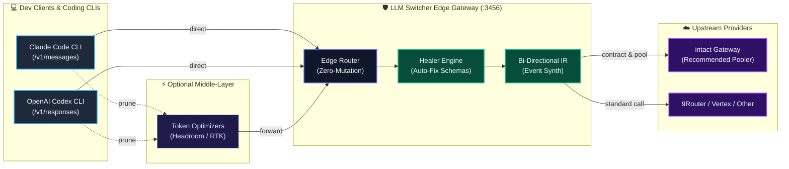

# LLM Switcher (Bản Tiếng Việt)

<p align="center">
  <b>Cổng ngõ biên (Edge Gateway) chuyển đổi đa giao thức LLM siêu nhẹ, Zero-Dependency</b><br>
  Cầu nối hai chiều giữa <b>Claude Code</b>, <b>Codex</b>, OpenAI SDKs, Gemini/Vertex SDKs với mọi nhà cung cấp LLM.<br>
  Chuyển đổi giao thức qua IR, cửa sổ context theo model chính thức, trích xuất thinking blocks và tự chữa lành đồ thị tin nhắn trước khi ra Internet.
</p>

<p align="center">
  <a href="README.md">English</a> • <b>Tiếng Việt</b>
</p>

<p align="center">
  
  
  
  
  
</p>

---

> ### 🛡️ Zero-Loss Native Emulation Cho Coding Agent
>
> Proxy thông thường làm biến dạng API response: Claude Code mất block reasoning `thinking_delta`, argument tool bị cắt vụn, và prompt cache bị lệch.
>
> **LLM Switcher giải quyết triệt để vấn đề này ngay tại network edge cục bộ:**
> - **100% Native Emulation:** Chuẩn hóa upstream API (intact, 9Router, Vertex, DeepSeek) thành luồng Anthropic SSE xịn (`thinking_delta` + `tool_use`) cho Claude Code, và Responses API event cho Codex.
> - **Client-Side Edge Companion:** Cố tình tách biệt các tác vụ nặng như account pooling, key rotation cho **[intact](https://github.com/louisphamdev/intact)** (khuyên dùng) hoặc 9Router (cơ bản), giúp Switcher giữ vững tiêu chí Zero-Dependency siêu nhẹ.
> - **Phạm vi Tập trung:** Tối ưu chuyên sâu cho **Claude Code** và **OpenAI Codex** (OpenCode đã hỗ trợ đổi model native ngay trong config; muốn pooling thì dùng intact; còn Antigravity thì không đáng để bận tâm làm 😏).

---

## Kiến trúc & Sơ đồ Trực quan (Interactive Diagrams)

LLM Switcher lắng nghe cục bộ trên máy bạn (`127.0.0.1:3456`), đóng vai trò là transparent edge interceptor và protocol bridge.

<p align="center">
  <a href="docs/diagrams/system-architecture.html">
    
  </a>
  <br>
  <sub><i>🎨 Theme Pretty-Mermaid (Tokyo Night). Click vào ảnh để mở trình xem tương tác Archify HTML (zoom, pan, tracing).</i></sub>
</p>

### 1. Thư viện Sơ đồ Tương tác Archify

Toàn bộ sơ đồ kiến trúc và luồng xử lý được biên soạn bằng **[Archify](https://github.com/tt-a1i/archify)** và render bằng **[Pretty-Mermaid](https://github.com/imxv/Pretty-mermaid-skills)**:

| Sơ đồ | Mô tả luồng | Bản đồ Tương tác (HTML) | Vector Sắc Nét |
|---|---|---|---|
| **System Topology** | Kiến trúc tổng thể: Client CLIs ➔ Optimizer ➔ Gateway & Healer Core ➔ Upstream Providers | [📊 Mở Sơ đồ](docs/diagrams/system-architecture.html) | [SVG](docs/diagrams/system-topology.svg) • [PNG](docs/diagrams/system-topology.png) |
| **IR Healer Pipeline** | Chuẩn hoá request, tự sửa schema lỗi, tổng hợp stream SSE và cơ chế abort | [🔄 Mở Sơ đồ](docs/diagrams/ir-translation-pipeline.html) | [SVG](docs/diagrams/ir-healer-pipeline.svg) • [PNG](docs/diagrams/ir-healer-pipeline.png) |
| **Codex Blindfold Routing** | Luồng TLS CONNECT proxy, bóc tách credential và định tuyến an toàn | [🛡️ Mở Sơ đồ](docs/diagrams/blindfold-request-routing.html) | [HTML](docs/diagrams/blindfold-request-routing.html) |
| **Switch Lifecycle** | Vòng đời chuyển đổi profile không downtime, CAS config và sync interceptor | [⚡ Mở Sơ đồ](docs/diagrams/blindfold-switch-lifecycle.html) | [HTML](docs/diagrams/blindfold-switch-lifecycle.html) |

---

### 2. Vòng đời Request & Pipeline Healer Engine

<p align="center">
  <a href="docs/diagrams/ir-translation-pipeline.html">
    
  </a>
  <br>
  <sub><i>💡 Click vào sơ đồ phía trên để kiểm tra chi tiết chuỗi sequence tương tác.</i></sub>
</p>

### 3. Sơ đồ Luồng Tổng quát



---

### 4. Cơ chế "Bắt cóc" & Chuyển đổi Request Diễn Ra Như Thế Nào?

LLM Switcher hoạt động như một lớp trung gian mạng trong suốt (transparent network proxy) mà tuyệt đối không sửa file cấu hình của công cụ:

1. **Shim kích hoạt cục bộ trong RAM:** Khi bạn gõ lệnh `claude` hoặc `codex`, file shim nằm đầu `PATH` sẽ chạy trước. Shim nạp tạm thời `HTTPS_PROXY=http://127.0.0.1:3457` và chứng chỉ CA *chỉ trong bộ nhớ của tiến trình đó*, hoàn toàn không chạm vào `~/.claude/settings.json` hay `~/.codex/config.toml`.
2. **Blindfold Interceptor chặn ở tầng mạng (`:3457`):** Công cụ gửi request HTTPS tới domain chính hãng (`api.anthropic.com` hoặc `api.openai.com`). Interceptor giải mã TLS cục bộ, bóc sạch token cũ của client, và chuyển tiếp các đường dẫn API (`/v1/messages`, `/v1/responses`, `/v1/models`) về Gateway nội bộ (`:3456`). Các traffic khác (đăng nhập OAuth, GitHub, web search...) được tunnel nguyên vẹn ra Internet thật.
3. **Chuyển đổi giao thức & Gọi Upstream (`:3456`):** Gateway đọc profile được kích hoạt trong `config.json`, kích hoạt Healer Engine (tự sửa schema rỗng `{}`, cứu `tool_result` mồ côi, phục hồi thinking budget), rồi đóng gói request sang định dạng của provider được cấu hình (Gemini, OpenAI Chat, Anthropic...) với `baseURL` và `apiKey` tương ứng.
4. **Tái tạo Response chuẩn Native:** Khi provider phản hồi stream về, Gateway bóc tách reasoning token và tool call, tổng hợp lại thành 100% genuine Anthropic SSE (`thinking_delta` + `tool_use`) hoặc Codex Responses events. Công cụ nhận được response chuẩn chỉ và tin rằng nó vừa nói chuyện trực tiếp với server chính hãng!

> #### 🔒 Độ An Toàn & Nguồn Gốc Chứng Chỉ CA: CA từ đâu ra và an toàn thế nào?
>
> - **Tự sinh 100% tại máy cục bộ:** File chứng chỉ (`ca.pem`) và private key (`ca.key`) được sinh trực tiếp trên chính máy tính của bạn bằng OpenSSL nội bộ (`blindfold/make-certs.sh`). Tuyệt đối không tải bất kỳ chứng chỉ nào từ internet về, private key được lưu với quyền bảo mật nghiêm ngặt `0600`.
> - **Không can thiệp vào System Trust Store của hệ điều hành:** Khác với các công cụ bắt proxy như Charles hay Fiddler, LLM Switcher **tuyệt đối KHÔNG cài đặt chứng chỉ vào OS Root Store** (không đụng vào Windows Certificate Manager, macOS Keychain hay Linux `/etc/ssl/certs`). Bạn **không cần quyền Administrator hay sudo**.
> - **Chỉ tin cậy trong phạm vi tiến trình (Process-Scoped):** Chứng chỉ CA chỉ được nạp tạm thời vào bộ nhớ của `claude` (qua `NODE_EXTRA_CA_CERTS`) và `codex` (qua `CODEX_CA_CERTIFICATE`). Trình duyệt web (Chrome, Edge), ứng dụng ngân hàng, git và các app khác trên máy hoàn toàn không biết và không tin cậy chứng chỉ này.
> - **Giới hạn tên miền bằng mật mã học (Name Constraints):** Chứng chỉ CA được cấu hình thuộc tính X.509 `nameConstraints` bắt buộc, chỉ cho phép ký duy nhất cho 3 domain: `api.anthropic.com`, `api.openai.com`, và `chatgpt.com`. Dù có ai đánh cắp được private key, các trình xác thực TLS chuẩn sẽ lập tức từ chối chứng chỉ này đối với mọi trang web khác (Google, GitHub, ngân hàng...).
> - **Bảo toàn chứng chỉ VPN / Doanh nghiệp:** Nếu máy bạn đã có sẵn chứng chỉ proxy công ty trong `NODE_EXTRA_CA_CERTS`, script `ensure-ca-bundle.mjs` sẽ tự động gộp cả 2 chứng chỉ vào một bundle tạm thời, không bao giờ ghi đè làm hỏng mạng nội bộ công ty bạn.

---

## Tính năng nổi bật

- **Kiến trúc Zero-Dependency:** Xây dựng 100% bằng thư viện chuẩn của Node.js (`http`, `fs`, `os`, `path`, `fetch`). Không cần chạy `npm install`, không kéo theo runtime Bun hay binary nặng, khởi động dưới 50ms.
- **Chuyển đổi Giao thức 2 Chiều Đối xứng:**
  - **4 Định dạng đầu vào (Client):** Anthropic Messages, OpenAI Chat Completions, Codex Responses API, Vertex `generateContent`.
  - **3 Định dạng đầu ra (Upstream):** OpenAI Chat, Anthropic Native, Vertex Native.
- **Multi-Active CLI Routing:** Kích hoạt cùng lúc Claude Code dùng Profile A, Codex dùng Profile B, Cursor dùng Profile C trên cùng 1 gateway mà không tranh chấp cấu hình.
- **Trích xuất Thinking & Reasoning Chuyên sâu:** Kiểm chứng thực tế qua 48 tổ hợp mẫu response live. Tự động bóc tách `reasoning_content`, thẻ `<think>`, các block `thought` của Vertex và thought signature thành các `thinking_delta` chuẩn của Anthropic.
- **Edge Healer Engine (Tự chữa lành tin nhắn):**
  - Khắc phục lỗi mồ côi `tool_result` do các công cụ nén token (RTK, Headroom, Ponytail) vô tình cắt mất turn `assistant` phía trước $\implies$ chống lỗi `HTTP 400 Bad Request`.
  - Tự động bù lại tham số `thinking` nếu tool ngoài cắt mất trên các reasoning model.
  - Gộp các turn cùng role liên tiếp để đáp ứng nghiêm ngặt luật xen kẽ lượt nói của Anthropic.
- **Context window theo model chính thức:** switcher không còn ép cửa sổ 1M hay ngưỡng auto-compact, và không ghi tên model nào vào môi trường của bạn. Claude Code tự ước lượng phiên theo cửa sổ của model bạn chọn; backend có cửa sổ nhỏ hơn model đó có thể tràn trong phiên dài. `model1M` giờ chỉ quyết định `/v1/models` liệt kê gì.
- **Không làm bẩn `settings.json` (Zero Config Mutation):** Không bao giờ đọc hay ghi `~/.claude/settings.json` hay `~/.codex/config.toml`, và không ghi biến môi trường nào cũng không thêm tham số `--config` nào mà công cụ đọc như cấu hình. Công cụ chỉ đến gateway qua interceptor, nên không hiện banner cảnh báo của nhà cung cấp.
- **Live Request / Response Inspector:** Bảng theo dõi thời gian thực ngay trên Web UI: xem độ trễ, token prompt/output, preview prompt câu hỏi và khối suy luận thinking.
- **Cài đặt Daemon Service nền:** Cung cấp lệnh cài đặt gateway chạy ngầm tự khởi động cùng hệ điều hành trên Windows (Task Scheduler), macOS (launchd) và Linux (systemd).

---

## Thay đổi gần đây (v1.2.0)

- **Zero-Mutation Interceptor:** Định tuyến qua `HTTPS_PROXY`, tuyệt đối không can thiệp hay sửa file cấu hình của tool (`~/.claude/settings.json`, `~/.codex/config.toml`).
- **Hỗ trợ đồng thời cả Claude Code & Codex:** Quản lý độc lập `{ claude, codex }`, chuyển đổi profile tức thì qua `POST /_control/active-tools` mà không cần restart cổng.
- **Tự động cập nhật Model Catalog:** Tự động lấy danh sách model mới nhất của hãng; tự detect khi tool nâng cấp version để đồng bộ mapping (`switch models`).
- **Tự sửa lỗi Schema:** Tự động chuẩn hóa schema rỗng `{}` cho Gemini/Vertex và khôi phục tham số `thinking` bị cắt.
- **Tăng độ tin cậy trên Windows:** Định dạng chuẩn CRLF cho `.cmd` shim, sửa đường dẫn CA và loại bỏ lỗi trôi nhãn subroutine.
- *Xem lịch sử các phiên bản cũ (v1.1.2 – v1.1.10) tại [CHANGELOG.md](CHANGELOG.md).*

---

## Hướng dẫn Bắt đầu Nhanh

### 1. Yêu cầu hệ thống
- Node.js 18.17 trở lên.
- Gateway không cần gói npm phụ thuộc nào.

### 2. Cài đặt và cấu hình

**Cách A: npm (khuyên dùng)**
```bash
npm install -g llm-switcher

# Chép file cấu hình mẫu vào thư mục dữ liệu.
mkdir -p ~/.llm-switcher
cp "$(npm root -g)/llm-switcher/config.example.json" ~/.llm-switcher/config.json
```

Bản cài bằng npm lưu `config.json`, `admin.token` và các file khởi chạy trong `~/.llm-switcher`. Khi nâng cấp, npm chỉ thay thư mục package, nên cấu hình của bạn vẫn còn.

Nếu bạn nâng cấp từ 1.1.0 trở xuống, hãy dừng gateway đang chạy trước khi chạy `switch`. Gateway cũ không chứng minh được danh tính, nên `switch` không tự dừng nó.

**Cách B: git clone**
```bash
git clone https://github.com/louisphamdev/llm-switcher.git
cd llm-switcher

# Copy file cấu hình mẫu (config.json đã được gitignore chặn an toàn)
cp config.example.json config.json
```

Bản checkout lưu dữ liệu cạnh mã nguồn như trước. Muốn dùng thư mục khác ở cả hai cách, đặt biến `LLM_SWITCHER_HOME`.

Điền URL và API key của các nhà cung cấp vào `config.json`.

**Thư mục dữ liệu** là `~/.llm-switcher` với bản cài bằng npm, và là thư mục checkout với bản git clone. Các ví dụ bên dưới dùng bản cài bằng npm. Với bản checkout, chạy `node switch.mjs <lệnh>` thay cho `switch <lệnh>`, hoặc thêm thư mục checkout vào `PATH`.

### 3. Khởi động Gateway
```bash
# Bật gateway chạy ngầm:
switch on

# Hoặc chạy trực tiếp trên terminal (bản cài bằng npm):
node "$(npm root -g)/llm-switcher/proxy.mjs"
```

`switch <lệnh>` chạy giống nhau trên Linux, macOS và Windows. Bản checkout có sẵn hai launcher: `switch` cho Linux và macOS, `switch.cmd` cho Windows.
Khác biệt giữa các nền tảng, và hai tính năng không chạy ở mọi nơi, nằm trong
[📖 `docs/cross-platform.md`](docs/cross-platform.md).

Mở Bảng điều khiển Web Dashboard tại: **[http://127.0.0.1:3456/ui](http://127.0.0.1:3456/ui)**

---

## Tích hợp vào các Công cụ CLI

### Biến môi trường đến từ shim, không từ shell của bạn

**Đừng** thêm dòng `source env.sh` hay `call env.cmd` vào `~/.bashrc`, `~/.zshrc` hay một file
wrapper nào. Hai file đó giờ là stub trống: một dòng chú thích và không gì khác, nên dòng rc cũ vẫn
chạy được và không bao giờ tái tạo lại một base URL.

Mỗi công cụ có file riêng, và chỉ shim tương ứng mới nạp:

| File | Được nạp bởi |
| --- | --- |
| `env-claude.sh` / `env-claude.cmd` | shim `claude` |
| `env-codex.sh` / `env-codex.cmd` | shim `codex` |
| `env.sh` / `env.cmd` | không ai. Stub trống, giữ lại chỉ để dòng rc cũ lặng lẽ |

File của công cụ rỗng nghĩa là công cụ đó đang tắt: shim để nguyên môi trường và công cụ gọi thẳng
endpoint chính thức. Trước khi nạp bất cứ thứ gì, shim cũng quét một `ANTHROPIC_BASE_URL`,
`OPENAI_BASE_URL` hay `ANTHROPIC_DEFAULT_<TIER>_MODEL` cũ còn sót từ bản trước hoặc từ shell của
bạn, nên `switch off` là off thật sự.

Trong thực tế bạn không bao giờ tự gọi các file này. `switch shim install` đặt `~/.llm-switcher/bin`
vào `PATH`, và mọi lệnh `claude` hay `codex` — kể cả `claude --resume` trong một terminal hoàn toàn
mới — đều chạy shim, vốn chỉ tiêm biến vào đúng tiến trình đó.

---

### Cấu hình cho Claude Code (Windows)

1. Với bản cài bằng npm, `switch` đã có sẵn trong `PATH`. Với bản checkout, tạo file wrapper trong `PATH` (ví dụ `cc-switch.cmd`):
   ```cmd
   @echo off
   node "path\to\llm-switcher\switch.mjs" %*
   ```

2. Cài shim và đặt thư mục của nó **trước** thư mục Claude Code thật trong `PATH` User (System Properties → Environment Variables), rồi mở terminal mới:
   ```cmd
   switch shim install
   ```
   > **Đừng** sửa `claude.cmd` trong thư mục global npm: npm ghi đè nó mỗi lần update, và shim mới là thứ tiêm URL gateway. `settings.json` không bao giờ bị đụng tới, nên không hiện banner "custom API".

---

### Cấu hình ưu tiên Codex

Cài shim, đặt thư mục shim lên đầu `PATH`, rồi kích hoạt một profile tương thích với Codex:

```bash
switch shim install
export PATH="$HOME/.llm-switcher/bin:$PATH"   # Bash hoặc Zsh
switch codex <profile>
switch shim status
codex
```

Trên Windows, đặt `%USERPROFILE%\.llm-switcher\bin` trước thư mục Codex thật trong `PATH`. Sau đó, mở terminal mới.

Shim tuyệt đối không sửa `~/.codex/config.toml`. Codex kết nối tới gateway qua `HTTPS_PROXY` và interceptor mạng, giữ nguyên tên model và context window chính thức. Danh sách model được phục vụ động tại `/v1/models`.

### Chế độ blindfold (tùy chọn)

Khi có override base URL, Codex in một dòng ngay trên màn `/model` của nó:

```
base URL is overridden to http://127.0.0.1:3456/v1. Selecting models may not be supported or work properly.
```

Blindfold xóa dòng đó. Codex giữ nguyên endpoint chính thức, switcher chặn ở tầng mạng. Không cần quyền admin, không cài chứng chỉ vào system trust store, không sửa `~/.codex/config.toml`.

```bash
bash "$(npm root -g)/llm-switcher/blindfold/make-certs.sh"   # chạy một lần; bản checkout chạy blindfold/make-certs.sh
# cổng đã nằm sẵn ở cấp cao nhất của config.json: "blindfold": { "port": 3457 }
switch codex <profile>                     # gateway khởi động interceptor
```

Một interceptor phục vụ cả hai công cụ. Nó định tuyến theo host của request CONNECT và theo path,
không theo thứ gì khác:

| CONNECT host | Các path chuyển về gateway | Các path còn lại |
| --- | --- | --- |
| `api.anthropic.com` | `/v1/messages`, `/v1/messages/...` | chuyển về `api.anthropic.com`, giữ nguyên |
| `api.openai.com` | `/v1/responses`, `/v1/responses/...`, `/v1/models`, `/v1/models/...` | chuyển về `api.openai.com`, giữ nguyên |
| `chatgpt.com` | `/backend-api/codex/...`, đổi thành `/v1` | chuyển về `chatgpt.com`, giữ nguyên |

Không còn `blindfoldHost` và `blindfoldPrefix`: bảng trên chính là luật định tuyến, và nó không phải
setting của profile. Host CONNECT ngoài bảng được mở hầm (tunnel) nguyên vẹn; request có header
`Host` khác host của CONNECT nhận `421` và không mở kết nối upstream. Xem [bảng đầy đủ và quy tắc chứng chỉ](docs/cross-platform.md).

Gateway sở hữu interceptor: nó khởi động interceptor khi boot và sau mỗi thay đổi, còn `switch off` dừng nó. Thiếu certificate, hoặc cổng gateway/interceptor bị tiến trình khác giữ, thì `switch` từ chối kích hoạt và không ghi file nào.

Hãy đọc [📖 `docs/codex-blindfold.md`](docs/codex-blindfold.md) trước khi bật. Tài liệu nói rõ phạm vi chặn, rủi ro khi giữ private key của CA, và cách quay lại. Mở đầu là ba sơ đồ:

- [Request routing](docs/diagrams/blindfold-request-routing.html) — một request, từ CONNECT tới provider
- [Model name resolution](docs/diagrams/codex-model-name-resolution.html) — CLI thấy tên nào, và tên đó phân giải ở đâu
- [Lifecycle under switch](docs/diagrams/blindfold-switch-lifecycle.html) — kích hoạt, từ chối, và tắt

### Những gì bạn đánh đổi

- **Context 1M theo cửa sổ của model chính thức.** Switcher không còn ép cửa sổ 1M hay ngưỡng
  auto-compact, cũng không ghi tên model nào vào môi trường: Claude Code tự ước lượng phiên theo
  cửa sổ của model bạn chọn. Backend có cửa sổ nhỏ hơn model đó có thể tràn trong phiên dài.
  `model1M` giờ chỉ quyết định `/v1/models` liệt kê gì.
- **Codex cần chứng chỉ làm một lần.** Blindfold là thứ giữ Codex trên endpoint chính thức, và nó
  cần một CA riêng cộng leaf nêu đúng ba host ở trên. Không bật thì Codex hiện dòng
  `base URL is overridden` trên màn `/model`.
- **Interceptor giải mã ba host nó phục vụ.** Nó từ chối CONNECT tới địa chỉ nội bộ hoặc riêng tư,
  nhưng mọi tiến trình trên máy đều gọi được nó. `docs/codex-blindfold.md` mở đầu bằng phạm vi, rủi
  ro khi giữ CA riêng, và cách quay lại.

---

## Hoạt động Cùng các Tool Nén Token (RTK, Headroom, Ponytail)

Nếu bạn sử dụng các tool cắt tỉa prompt như **Headroom**, **Ponytail** hoặc **RTK (Rust Token Killer)**:
1. Cấu hình CLI của bạn (Claude Code / Codex) trỏ vào tool nén đó (ví dụ: `http://127.0.0.1:8787`).
2. Cấu hình endpoint upstream trong tool nén đó trỏ về **LLM Switcher** (`http://127.0.0.1:3456`).
3. **LLM Switcher** sẽ đóng vai trò là trạm kiểm soát cuối cùng trước khi ra internet:
   - **Tự chữa lành đồ thị tin nhắn:** Cứu các lượt `tool_result` mồ côi và gộp các lượt cùng role liên tiếp do tool nén cắt xén bừa bãi gây ra.
   - **Khôi phục thinking bị xóa:** Tự động phát hiện reasoning model và khôi phục lại tham số thinking nếu bị tool ngoài xóa mất để "tiết kiệm token".
   - **Context window theo model:** báo cáo cửa sổ chính thức của từng model; không tiêm gì.
   - **Chuyển đổi 2 chiều:** Bridge traffic 2 chiều chuẩn sang intact, 9Router, OpenRouter, Vertex, Anthropic.

### Báo cáo Kiểm thử & Đo lường Khả năng Tương thích

| Kịch bản Lỗi do Tool Nén Gây Ra | Gọi Thẳng Upstream (Không qua Switcher) | Đi qua LLM Switcher (Healer Engine) |
|---|---|---|
| **Turn `tool_result` mồ côi** (Headroom cắt mất turn `tool_use`) | ❌ **HTTP 400 Crash**: `tool_use_id does not correspond to any tool_use` | ✅ **HTTP 200 OK**: Chữa lành thành block văn bản ngữ cảnh an toàn |
| **Các turn `user` liên tiếp** (Tool nén bỏ sót turn assistant) | ❌ **HTTP 400 Crash**: `roles must alternate` | ✅ **HTTP 200 OK**: Tự động gộp các turn liền kề mượt mà |
| **Bị xóa tham số `thinking`** (Tool nén triệt tiêu reasoning) | ⚠️ **AI bị giảm chất lượng**: Mất suy luận, ra code ẩu | ✅ **HTTP 200 OK**: Tự động khôi phục thinking budget an toàn |
| **Role `tool` mồ côi trong Chat API** | ❌ **HTTP 400 Crash**: `tool role must respond to tool_calls` | ✅ **HTTP 200 OK**: Chuyển thành user context hợp lệ |
| **Header tracing riêng của tool** (`x-rtk-*`, `traceparent`) | ⚠️ Rớt kết nối / cảnh báo header lạ | ✅ **HTTP 200 OK**: Chuyển tiếp trong suốt 100% |

Chạy bộ kiểm thử tự động trên máy bạn:
```bash
# Offline (mock upstream, không cần API key): chuyển đổi giao thức, healer, streaming, bảo mật
npm test

# Live (cần gateway đang chạy và upstream thật; tốn token)
node tests/live-optimizer-interop.mjs
```

Đọc báo cáo nghiên cứu kỹ thuật chuyên sâu tại: [📖 `docs/TOKEN-OPTIMIZER-INTEROP.md`](docs/TOKEN-OPTIMIZER-INTEROP.md).

---

## Tích hợp Agent Skill & MCP Server (Chống Chạy Bậy)

Để đảm bảo các AI coding agent (Claude Code, Cursor, Windsurf, Opencode) và các tiến trình con (sub-agents) **không bao giờ vượt rào gọi thẳng ra internet**, dự án cung cấp 2 giải pháp điều khiển:

### 1. Agent Skill Chuyên dụng (`skills/llm-switcher/SKILL.md`)
Một Agent Skill theo chuẩn quốc tế hướng dẫn AI model:
- **Định tuyến bắt buộc:** Mọi lượt gọi LLM và tool nén (Headroom, RTK, Ponytail) BẮT BUỘC phải trỏ về `http://127.0.0.1:3456`.
- **Cấm sửa `settings.json`:** Tuyệt đối cấm agent ghi đè endpoint vào `~/.claude/settings.json` — chính switcher cũng không bao giờ đọc hay ghi file đó.
- **An toàn cho Sub-process:** Không bao giờ khuyên sub-agent `source env.sh`; shim trong `~/.llm-switcher/bin` tự tiêm biến proxy vào chính tiến trình công cụ và quét hết biến cũ trước.

Cài đặt vào thư mục skill:
```bash
# Cho Opencode:
cp -r skills/llm-switcher ~/.config/opencode/skills/

# Cho Claude Code:
cp -r skills/llm-switcher ~/.claude/skills/
```

### 2. MCP Server Chuẩn (`mcp.mjs`)
Một server Model Context Protocol (MCP) chạy qua `stdio` cực nhẹ (Zero-dependency):
- `switcher_status`: Đọc trạng thái live của các CLI target và gateway.
- `switcher_audit`: Quét môi trường máy xem có tool nén nào chạy bậy gọi thẳng ra ngoài không.
- `switcher_switch_profile`: Cho phép agent tự động chuyển đổi profile theo nhu cầu bài toán.
- `switcher_recent_logs`: Đọc log gần nhất để tự debug khi output bị cắt cụt.

LƯU Ý: `switcher_recent_logs` trả 150 ký tự đầu của mỗi prompt gần đây, từ mọi client đã dùng gateway. Agent gọi tool này đọc được chúng.

Thêm server vào cấu hình MCP (ví dụ `opencode.jsonc`, `claude_desktop_config.json`, hoặc Cursor). Chạy `npm root -g` để biết thư mục chứa `llm-switcher/mcp.mjs`. Với bản checkout, dùng `mcp.mjs` trong thư mục checkout.
```json
"mcp": {
  "llm-switcher": {
    "type": "local",
    "command": ["node", "/path/from/npm-root-g/llm-switcher/mcp.mjs"],
    "enabled": true
  }
}
```

---

## Bảng Tra cứu Lệnh CLI (`switch`)

```bash
switch ui                      # Mở giao diện Web UI trên trình duyệt
switch status                  # Xem trạng thái kích hoạt của tất cả các CLI
switch doctor                  # Quét & thanh tra toàn bộ môi trường, settings và định tuyến
switch on [profile]            # Khởi động gateway và kích hoạt một profile
switch <profile>               # Kích hoạt một profile cho cả hai công cụ
switch claude <profile>        # Đặt profile kích hoạt riêng cho Claude Code
switch codex <profile>         # Đặt profile kích hoạt riêng cho Codex
switch port <number>           # Đổi cổng gateway (tự restart nếu đang chạy)
switch service install         # Cài đặt gateway thành service chạy ngầm tự bật cùng máy
switch service uninstall       # Gỡ bỏ service chạy ngầm
switch shim install            # Route phiên Claude và Codex mới qua gateway
switch shim status             # Kiểm tra shim + phát hiện phiên đang chạy ngoài gateway
switch shim uninstall          # Gỡ shim khỏi launcher
switch off                     # Tắt tất cả và quay về endpoint chính thức
switch off claude              # Tắt Claude Code; Codex vẫn chạy tiếp
switch off codex               # Tắt Codex; Claude Code vẫn chạy tiếp
switch contract-probe [--model m] # Chạy các biến thể contract-lab qua gateway
switch contract-check          # Chuyển các findings hợp đồng còn mở thành test case
```

Target chỉ có `claude` và `codex`, và đó là hai target duy nhất. Một profile phục vụ đúng một công
cụ: `tool` là `"claude"` hoặc `"codex"` (hoặc `null` khi profile đang tắt), nên `switch claude` và
`switch codex` không bao giờ chỉ nhầm vào cùng một profile. Không còn target `openai` hay `vertex` —
các route đầu vào mà chúng đại diện đã bị gỡ.


Service không chạy trong shell của bạn. Vì vậy `switch service install` chép `CLAUDE_CONFIG_DIR`, `LLM_SWITCHER_CONFIG`, `LLM_SWITCHER_STATE_DIR` và `LLM_SWITCHER_BLINDFOLD_CERTS` vào unit systemd hoặc plist launchd khi các biến này có giá trị. Task Windows không mang được các biến này; hãy đặt chúng thành biến môi trường User. Nếu file định nghĩa đã cài khác file mới (ví dụ đã sửa tay), file cũ được giữ lại thành `<file>.bak`. Trên Windows, task được tạo từ file XML, nên đường dẫn có dấu cách không cần quote thêm và task không bị giới hạn thời gian chạy. Đường Windows này chưa được test trên Windows.
### Phiên mở lại (`--resume`) và cơ chế shim — quan trọng

`switch on` ghi `env-claude.*` và `env-codex.*`, và **không ghi gì** vào
`~/.claude/settings.json` — switcher không bao giờ đọc hay ghi file đó, đó là lý do Claude Code
không hiện banner "custom API". Hệ quả: một CLI khởi chạy không qua shim sẽ **không có**
`ANTHROPIC_BASE_URL`, nên gọi thẳng nhà cung cấp và bỏ qua gateway (mất Healer, mất quota gộp).
Trường hợp kinh điển là `claude --resume` mở lại phiên cũ trong terminal sạch.

Shim bịt đúng lỗ đó. Nó cài wrapper nhỏ vào `~/.llm-switcher/bin`, wrapper tiêm biến môi trường riêng
của công cụ rồi `exec` binary thật:

```bash
switch shim install
export PATH="$HOME/.llm-switcher/bin:$PATH"   # thêm vào ~/.zshrc hoặc ~/.bashrc
switch shim status                            # kiểm tra lại
```

Cách hoạt động:

- **Công cụ BẬT** → shim nạp file env riêng của công cụ đó, nên mọi lần gọi (kể cả `--resume`)
  đều qua gateway.
- **Công cụ TẮT** (file env rỗng) → shim trong suốt hoàn toàn, chạy binary thật nguyên trạng,
  không ép định tuyến.
- Trước khi nạp bất cứ thứ gì, shim quét một `ANTHROPIC_BASE_URL`, `OPENAI_BASE_URL` hay
  `ANTHROPIC_DEFAULT_<TIER>_MODEL` cũ còn sót từ bản trước hoặc từ shell của bạn, nên một biến
  không thể sống sót qua `switch off`.
- Không truyền tham số `--config` nào cho Codex. Shim không đổi gì trên phía Codex ngoài môi trường.
- Wrapper tìm binary thật sau khi **loại thư mục shim khỏi `PATH`**, nên không bao giờ tự
  gọi đệ quy chính nó. Không tìm thấy binary thật thì thoát mã `127` kèm thông báo rõ ràng,
  không im lặng.
- Không đụng `settings.json`, nên **không hiện banner cảnh báo**.

`switch on` tự cài shim và nhắc nếu `PATH` còn thiếu dòng export. Ngoài ra `switch doctor`
và `switch shim status` còn quét các tiến trình `claude`/`codex` đang chạy và cảnh báo
tiến trình nào thiếu `ANTHROPIC_BASE_URL` — phiên đó phải thoát và mở lại từ shell có shim
trong `PATH`.

---

## Cấu trúc Cấu hình (`config.json`)

```jsonc
{
  "port": 3456,
  "activeProfiles": {
    "claude": "claude-default",      // Profile active cho Claude Code (/v1/messages)
    "codex": "codex-default"         // Profile active cho Codex (/v1/responses)
  },
  "blindfold": { "port": 3457 },     // Cổng interceptor. Cấp cao nhất, không bắt buộc, mặc định 3457
  "profiles": {
    "claude-default": {
      "name": "Intact Gateway",
      "mode": "convert",             // hybrid | convert | direct
      "tool": "claude",              // claude | codex | null (profile đang tắt)
      "outFormat": "openai-chat",    // openai-chat | anthropic | vertex
      "thinkingMode": "auto",        // auto | native | off (xem Tuỳ chọn Nâng cao)
      "baseURL": "https://intact.example.com/v1", // hoặc https://api.9router.com/v1
      "apiKey": "sk-...",
      "defaultModels": {
        "opus": "ag/claude-opus-4-6-thinking",
        "sonnet": "ag/gemini-3.7-flash",
        "haiku": "ag/gemini-3.6-flash-medium",
        "fable": "ag/gemini-3.8-flash"
      },
      "model1M": {
        "opus": true,
        "sonnet": true,
        "haiku": false,
        "fable": true
      }
    },
    "codex-default": {
      "name": "Codex qua router",
      "mode": "convert",
      "tool": "codex",
      "outFormat": "vertex",
      "baseURL": "https://YOUR-GATEWAY/v1",
      "apiKey": "sk-...",
      // Profile phục vụ Codex BẮT BUỘC có publicModels (xem Cấu hình ưu tiên Codex).
      "publicModels": ["gpt-5.6-sol", "gpt-5.6-terra", "gpt-5.6-luna"], // tên chính thức cho main, review, subagent
      "codexRoles": { "review": "gpt-5.6-sol" }, // không bắt buộc: ghép một vai trò với tên public khác
      "defaultModels": { "main": "gemini-3.8-flash", "review": "gemini-3.7-flash-medium", "subagent": "gemini-3.6-flash-low" },
      "model1M": { "main": false, "review": false, "subagent": false }
    }
  },
  "debug": false,
  "contractLab": {
    "url": "https://intact.example.com",
    "apiKey": "sk-...",
    "enabled": false
  }
}
```

`tool` thay `inFormat`: nó nói profile phục vụ công cụ nào, không nói upstream nói định dạng gì.
Không còn `activeProfile` ở cấp cao nhất, không còn `blindfold`, `blindfoldPort`, `blindfoldHost`
hay `blindfoldPrefix` bên trong profile, và không còn khóa `openai-chat` hay `vertex` trong
`activeProfiles`.

`config.json` cũ được ghi lại một lần, khi load, qua cơ chế compare-and-swap — cơ chế này từ chối
đụng vào file mà người khác vừa đổi trước. Khi hai profile sẽ rơi vào cùng một khóa thì quá trình
dừng lại, nêu rõ khóa xung đột trên CLI và trên dashboard, và để nguyên file đúng như nó vốn có:
mọi lệnh `switch` thay đổi trạng thái thoát mã khác 0, còn `switch off` và `switch doctor` vẫn chạy
được, và sửa file xong là mọi thứ hoạt động lại.

### Contract lab

Contract lab tìm các field mà converter làm mất. Mặc định tính năng này tắt.

Trước khi gửi mẫu, gateway che mọi giá trị string bằng chuỗi `x` cùng độ dài. Chỉ các giá trị enum ngắn mà intact đọc được giữ nguyên: `type`, `role`, `object`, `model`, `status`, `event`, `finish_reason` và `stop_reason`. Số, flag, tên event SSE và tên key của API cũng được giữ. Trong dữ liệu người dùng (tham số tool, input của tool, `metadata`), tên key cũng bị che. intact chỉ lưu độ dài của các string khác, nên phân tích không mất gì.

- Đặt `contractLab: {url, apiKey, enabled}` trong `config.json`. Nếu `enabled` là `true`, gateway gửi một phần các lượt trao đổi hoàn chỉnh lên intact.
- `switch contract-probe [--model m]` gửi sáu request thử cho mỗi model và mỗi format qua gateway.
- `switch contract-check` lấy các finding còn mở từ intact và ghi một file test cho mỗi field bị mất.

### Tự cải thiện cùng intact

[intact](https://github.com/louisphamdev/intact) là proxy giữ credential mà gateway này có thể dùng làm upstream. Hai công cụ tự tìm và tự sửa lỗi của nhau theo hai vòng.

- **intact sửa những gì provider từ chối.** intact ghi lại mọi lỗi của provider và gom các lỗi lặp lại thành nhóm. Với 429 giả, intact gửi lại request lỗi và bỏ dần từng nửa system prompt. Đoạn nhỏ nhất mà provider từ chối được lưu thành filter trong database của intact. Mọi máy nhận bản sửa ngay, gateway này không cần cập nhật. Hai ví dụ: Antigravity trả 429 giả cho "You are Codex, an agent based on GPT-5" và cho "You are a Claude agent, built on Anthropic's Claude Agent SDK".
- **Gateway này sửa những gì converter làm mất.** Khi bật contract lab, gateway gửi các mẫu đã che lên intact. intact so mỗi mẫu với request mà intact nhận được, rồi ghi lại mỗi field mà phép chuyển đổi làm mất. `switch contract-check` ghi một test đỏ cho mỗi finding, và bản sửa nằm trong converter.

Nhờ cách chia này, fingerprint của provider không bao giờ là rule trong gateway này. Nó là filter trong intact, do intact tự tìm và chứng minh bằng cách gửi lại request.

---

## Tuỳ chọn Nâng cao

| Tuỳ chọn | Mô tả |
|---|---|
| `LLM_SWITCHER_HOME=/path` | Dùng thư mục này làm thư mục dữ liệu (config, admin token, file launcher, log) cho cả bản npm lẫn bản checkout. |
| `LLM_SWITCHER_CONFIG=/path/config.json` | Dùng file cấu hình nằm ngoài thư mục dữ liệu (proxy, `switch` và `mcp.mjs` đều hỗ trợ). |
| `--port <n>` / `LLM_SWITCHER_PORT` | Ghi đè cổng lắng nghe (ưu tiên: flag > env > `config.port`). |
| Header `x-llm-profile: <key>` (tên khác `x-profile`) hoặc `?profile=<key>` | Định tuyến riêng 1 request qua profile chỉ định. Key không tồn tại trả HTTP 400 thay vì âm thầm dùng profile khác. |
| `profile.thinkingMode` | `auto` (mặc định, cho gateway như intact hoặc 9Router): phục hồi thinking bị xoá, inject hướng dẫn `<think>` cho model không có reasoning, gửi `thinking` + `reasoning_effort`. `native` (API OpenAI nghiêm ngặt): chỉ gửi `reasoning_effort` khi client yêu cầu, không sửa prompt, dùng `max_completion_tokens`. `off`: không bao giờ gửi tham số reasoning. |
| `profile.endpoints.countTokens` | Ghi đè URL `count_tokens` của Anthropic. |
| `profile.endpoints` | Ghi đè URL upstream theo từng format: `{ "openai-chat": "...", "anthropic": "...", "vertex": "https://.../models/{model}:{action}" }`. |
| `LLM_SWITCHER_STATE_DIR` | Chuyển file launcher và log ra khỏi thư mục dữ liệu. Test dùng biến này; shim đọc thư mục đã đặt lúc cài shim. |
| `CLAUDE_CONFIG_DIR` | Được tôn trọng khi tìm `settings.json` của Claude Code. |

## Mô hình Bảo mật

- Gateway chỉ lắng nghe `127.0.0.1` và từ chối request có `Host` không phải loopback (chống DNS rebinding) hoặc `Origin` không phải chính dashboard (chống CSRF).
- Admin API (`/api/*`) bắt buộc header `x-llm-switcher-token`. Gateway tạo token trong file `admin.token`, cạnh `config.json`, với mode 0600. Gateway đặt token này vào trang dashboard, nên mở thẳng `http://127.0.0.1:3456/ui` là dùng được. Lớp kiểm tra Host và Origin ngăn trang web khác đọc trang và token. MCP server đọc token từ file. `/v1/*` và `/health` không cần token.
- API key không bao giờ gửi xuống trình duyệt: `/api/status` trả profile đã che key, dashboard giữ nguyên key đã lưu nếu bạn không nhập key mới. Key đã lưu chỉ được gửi tới `baseURL` và `endpoints` đã lưu của chính profile đó. Lần lưu nào đổi một trong hai thì phải nhập lại key.
- Mỗi thay đổi từ dashboard mang theo revision của config mà trang đã tải. Nếu tab khác, CLI hoặc MCP server đã lưu trước đó, gateway trả 409 và trang tải lại thay vì ghi đè thay đổi kia.
- Credential của client (`x-api-key`, `authorization`, `x-goog-api-key`) **không** được chuyển tiếp lên upstream. Các header `x-*` khác, `traceparent` và `tracestate` được chuyển tiếp. Gateway bỏ header điều khiển của chính nó (`x-profile`, `x-llm-profile`) và header định danh mạng (`x-forwarded-*`, `x-real-ip`).
- `config.json` được ghi atomic với mode 0600. `~/.claude/settings.json` chỉ bị ghi lại để gỡ các giá trị do chính switcher ghi. `ANTHROPIC_AUTH_TOKEN`, các key `*_MODEL_NAME` và giá trị model/URL của bạn được giữ nguyên, và `switch` in tên từng giá trị đã gỡ.

## Ghi chú Tương thích

- **Direct passthrough Anthropic:** request hợp lệ được chuyển tiếp nguyên bytes (giữ thinking signature, `cache_control`, document). Request lỗi được healer native của Anthropic sửa tại chỗ: `tool_result` mồ côi → text, thiếu `tool_result` → placeholder, đưa result lên đầu user turn.
- **Chữ ký thinking:** thinking block sinh ra khi convert mang chữ ký của gateway (`reasoning-sig`, hoặc chữ ký provider khác có prefix `lsw1.`) và bị gỡ trước khi tới Anthropic. Nếu việc gỡ làm vòng tool đang dở thiếu thinking block mà Anthropic bắt buộc, gateway tắt thinking cho riêng request đó thay vì để lỗi.
- **Tool của Codex:** tool `custom`/freeform (VD `apply_patch` với Lark grammar), tool `namespace` và `local_shell` được đưa lên upstream dưới dạng function tool rồi chuyển ngược thành item `custom_tool_call` / `function_call` có namespace / `local_shell_call`. Hosted tool (`web_search`, `file_search`, `tool_search`, sinh ảnh) chạy trên server OpenAI nên upstream khác không cung cấp được và bị lược bỏ.
- **Thought signature của Gemini 3:** chữ ký đi kèm function call được cache trong RAM theo tool call id (5.000 call gần nhất) và gắn lại vào đúng part `functionCall`, kể cả qua `extra_content` của endpoint OpenAI-compatible của Gemini. Sau khi restart gateway, call không rõ chữ ký trong lượt hiện tại dùng giá trị `skip_thought_signature_validator` mà Google cho phép (Google lưu ý có thể giảm chất lượng).
- **`/v1/messages/count_tokens`:** chính xác khi profile của Claude Code dùng upstream Anthropic native; các trường hợp khác là ước lượng (provider khác không có endpoint tương đương).

## Nghiên cứu & Ma trận Giao thức Response

Dữ liệu khảo sát chi tiết và kết quả test live 48 biến thể response được ghi lại tại:
- 📖 [`docs/LLM-RESPONSE-MATRIX.md`](docs/LLM-RESPONSE-MATRIX.md) — Báo cáo khảo sát 48 biến thể live trên 8 họ model.
- 📊 [`docs/response-matrix.json`](docs/response-matrix.json) — Schema cấu trúc dữ liệu response machine-readable.

---

## Giấy phép

Phát hành theo giấy phép MIT © 2026 LLM Switcher Contributors.
